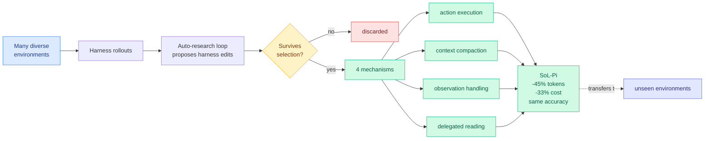

# SoL-Pi: the harness searches for its own improvements, and the saving is dollars per hour

**Source:** HuggingFace Daily Papers, 2026-09-18 · [arXiv 2609.20519](https://arxiv.org/abs/2609.20519) · [raw](../../raw/huggingface/2026-09-18-sol-pi-recursively-scaling-auto-research-loops-for-efficient.md)

## TL;DR

SoL-Pi applies recursive self-improvement **at the harness layer instead of the model layer**. Rather than training a better agent, it runs automated research loops that propose and test harness changes across a large and deliberately diverse set of environments, then keeps what survives selection. Four mechanisms survived: **action execution, context compaction, observation handling, and delegated reading**. On the 51-task EdgeBench evaluation, SoL-Pi matches the Pi harness's performance across both GPT-5.6 Sol and Opus 5 while cutting **recorded token traffic 44.7 to 49.0 percent and API cost by about a third**. The number that makes it concrete: **estimated savings of $8.75 to $13.50 per hour against the native Codex and Claude Code harnesses**, and $4.36 to $5.71 per hour against Pi.

## What is load-bearing here

**The transfer claim, not the saving.** Automated harness tuning that overfits its development environments is a well-known dead end: you get a harness that is excellent at the 20 tasks you searched over and mediocre everywhere else. SoL-Pi's argument is that **scaling the search across numerous and diverse environments is what converts local tuning into reusable improvement**, and the evidence is that the surviving mechanisms transfer beyond their development setting. That is the difference between a tuning script and a research loop.

**Token efficiency is framed as the enabler of recursion, not as the goal.** The paper's opening move is that as coding agents shift from supervised completion to unattended around-the-clock exploration, their work becomes long trajectories of reasoning, tool use and feedback. **Token efficiency therefore gates how much recursive self-improvement you can afford to run.** Halving token traffic does not just save money, it doubles how many improvement loops fit in the same budget. That is a compounding argument and it is the most interesting claim in the paper.

**The four surviving mechanisms are a finding in themselves.** Out of an open-ended search, what survived is not exotic. It is compaction, how observations get handled, how actions get executed, and delegating reading to a subordinate call. **Three of those four are context-budget mechanisms.** An unconstrained automated search over harness design converged on managing the context window.

## How this relates to prior wiki pages

**It and [the component ablation (09-18)](2026-09-18-harness-design-component-ablation.md) arrived the same day and agree.** That study fixed the execution loop and varied planning, action space and context management by hand across 176 settings, finding context management's value comes almost entirely from preventing context-overflow failures and that rule-based elision staged before LLM summarization is the strongest strategy. **SoL-Pi's automated search, with no such prior, independently surfaced context compaction and observation handling among its four survivors.** Manual ablation and automated search landing on the same components is the strongest form of agreement available on a question this under-measured.

**It advances [agent-harness-engineering.md](agent-harness-engineering.md)'s 09-13 split of the objective.** That entry recorded the harness objective splitting into three, with the prefix identified as a cost centre nobody was searching. SoL-Pi searches it, and prices the result per hour. **This page has carried cost-per-success since 08-28; dollars per hour of unattended operation is a different and more operationally useful denominator**, because it is the number that decides whether an always-on agent is affordable.

**It is the strongest evidence yet for the page's 09-11 "harness synthesis ships" claim.** That entry recorded harness synthesis moving from proposal to working system. SoL-Pi reports production-level outcomes from automated harness discovery, with transfer, against two frontier models. **The remaining question the page should now carry: does the discovered harness keep transferring when the model changes?** The component ablation published the same day says three of four harness components change their optimal setting across models, which is a direct reason to doubt that a harness discovered against Sol and Opus 5 stays optimal against their successors.

## Gaps

EdgeBench is 51 tasks and one benchmark. The token-traffic reduction is "recorded token traffic," which is not obviously the same as billed tokens once cache-hit pricing is applied, and the paper does not separate them. **The dollar-per-hour figures are estimates against list pricing**, so they move with every provider price change. The auto-research loop's own compute cost is not netted against the savings anywhere visible, which matters because the paper's central argument is about affordability of recursion. And there is no ablation of the four mechanisms against each other, so the split of the 45 percent between compaction, observation handling, action execution and delegated reading is unknown.

## Industrial implication

The framing to take is that **harness cost is now a searchable surface with a published return**. A third off API cost with matched accuracy, arrived at automatically, means the manual harness-tuning craft that has dominated practitioner discussion for six months has a mechanical competitor. For anyone running agents unattended, the per-hour figure is the right unit and it is large: $8.75 to $13.50 an hour against native harnesses compounds to real money on a fleet. The caution is the transfer question above. **A harness discovered by search is tuned to the models it was searched against, and the same-day ablation says that tuning does not survive a model swap.** The durable asset is the search loop, not the harness it produced.

## Related pages

- [agent-harness-engineering.md](agent-harness-engineering.md)
- [Harness design component ablation (09-18)](2026-09-18-harness-design-component-ablation.md)
- [self-evolving-agents.md](self-evolving-agents.md)
