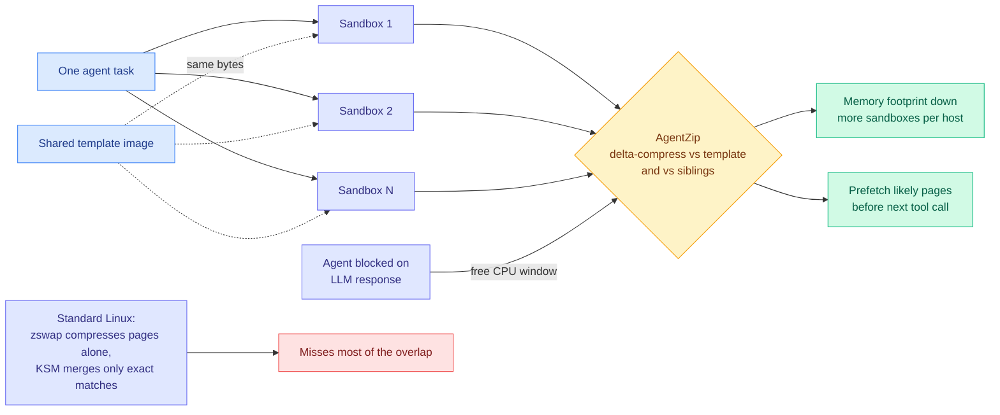

# AgentZip: 8.7x less sandbox memory, because sibling agents are nearly the same machine

**Date ingested:** 2026-09-19
**Paper:** *Memory Compression for High-Fanout Agent Sandboxes* · [arXiv 2609.11294](https://arxiv.org/abs/2609.11294)
**Authors:** Mengming Li, Ceyu Xu, Qijun Zhang, Jiangnan Yu, Xiangfeng Sun, Haohui Mai, Zhiyao Xie (HKUST)
**Source:** X home feed via [@rohanpaul_ai](https://x.com/rohanpaul_ai/status/2101120427435446358), with the paper's first page read directly from the attached image
**Raw:** [raw/twitter/feed/2026-09-19-morning-ranked.json](../../raw/twitter/feed/2026-09-19-morning-ranked.json) · image `raw/twitter/images/2026-09-19/2101120427435446358-0.png`

## TL;DR

When one agent task fans out into many sandboxes, the standard mental model is that they are independent workers. They are not. They boot from the same template, install the same libraries, read the same files and run similar commands, so their memory is largely the same bytes. AgentZip is the first memory-compression system built specifically for agent sandboxes, and it exploits two kinds of redundancy that generic tooling misses: **template-relative** (every sandbox is a copy-on-write clone of one base image) and **cross-sandbox** (siblings run similar commands, load the same libraries, and touch the same files). Headline result: **sandbox-owned memory down by up to 8.7x, against 2.1x for the stock Linux configuration.** Aggressive compression normally costs up to a **3.1x** slowdown; restore-time prefetching plus agent-execution-aware scheduling bring that to **1.40x** while keeping nearly all of the saving.

## The mechanism

Two design choices carry the result. The first is **what to compress against**: generic page compression treats each page as an isolated blob and generic dedup (KSM-style) merges only byte-identical pages, so both miss near-duplicate state that differs in a few fields. Delta-compressing against the template captures that. The second is **when to do it**: compression is CPU-expensive, and an agent sandbox spends most of its wall clock blocked on an LLM call with the CPU idle. AgentZip puts the expensive work in the one window where it is free. That is a scheduling insight about the shape of agentic workloads rather than a compression insight, and it is the more transferable half.

## How this relates to prior wiki state

**It is the systems-layer instance of a claim the wiki has so far only made at the model layer.** The [Elo-per-token result (09-15)](../inference-efficiency/2026-09-15-elo-per-token-agent-test-time-scaling.md), which converts within-task quality at each token budget into a cross-task Elo and finds the budget where a marginal token stops beating an independent sample, showed that re-slicing a fixed 100M-token budget into parallel sessions at that cap buys **+264 Elo over one long session**. That is an argument *for* width, for running many agents in parallel. AgentZip prices the thing that argument ignores: **width has a memory cost on the host, and most of it is redundant, compressible 8.7x against 2.1x for stock Linux.** The two compose into a sharper statement than either alone. Parallelism is the right call on quality per token, and it is much cheaper on infrastructure than a naive accounting suggests, because sibling sandboxes are nearly the same machine.

**It is also the third state-bloat result of the fortnight**, alongside [SKILL.state (09-19)](2026-09-19-skill-state-mutable-agent-state.md) cutting a single agent's prompt footprint 16x at 100 turns and **[SoL-Pi (09-18)](2026-09-18-sol-pi-recursive-harness-research-loops.md)** halving token traffic in a self-improving research loop. Prompt, loop, and host memory. Same disease, three organs.

## What the paper names that the social summary did not

The abstract frames prior work as wrong on **three axes at once**, which is a cleaner statement of the contribution than "it compresses better":

- **How to compress** — generic schemes cannot exploit similarity across *non-identical* pages, so near-duplicate state slips past both page compression and same-page merging.
- **What to compress** — existing systems control page-fault overhead through conservative page selection, which limits scope. AgentZip broadens the scope to any page with a profitable representation and moves overhead control to **restore-time prefetching** instead.
- **When to compress** — existing systems fire on memory pressure, blind to what the agent is doing. AgentZip aligns expensive compression with **LLM waiting periods** so it never competes with foreground tool execution.

The paper also makes clear this covers both halves of agentic workloads: **RL training**, where one task samples tens of independent trajectories for a reward model to score, and **inference**, where multi-agent workflows run candidate sessions concurrently and filter for the best. Both are high-fanout in the same way.

The circulating social summary put the duplicated share at **88.55%**. The paper's own headline is the compression ratio, and that is the number to quote.

## Gaps

- **1.40x is still a 40% slowdown.** "Reduced from 3.1x" is true and also means aggressive compression is not free. Whether 8.7x memory for 1.4x latency is a good trade depends on whether your host is memory-bound or latency-bound, which the paper cannot answer for you.
- The restore prefetcher's **hit rate is the load-bearing hidden number**. A miss costs a page fault at exactly the latency-sensitive moment, right when the LLM returns and the agent wants to act.
- Only the first page was read directly here. The tail-latency distribution, the workload mix behind "up to 8.7x," and how well the Linux baseline was tuned all need checking against the full text.
- **The technique's budget comes from inference being slow.** Its free-CPU window shrinks as models get faster, so this is a result with a shelf life.
