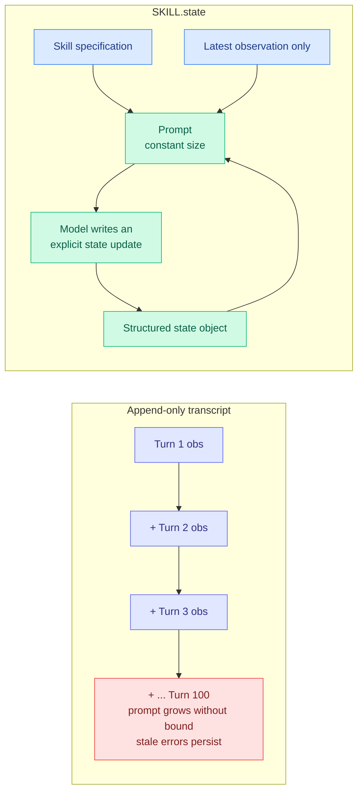

# SKILL.state: replacing the agent's transcript with a state object, and cutting tokens 16x

**Date ingested:** 2026-09-19
**Source:** X home feed via [@beamnxw](https://x.com/beamnxw/status/2101018409802580300) (Google paper, reported second-hand)
**Raw:** [raw/twitter/feed/2026-09-19-morning-ranked.json](../../raw/twitter/feed/2026-09-19-morning-ranked.json)

> **Evidence caveat, stated up front:** this page is reconstructed from a social post describing a Google paper, not from the paper itself. The mechanism is coherent and the reported figure is specific, but the numbers are second-hand and should carry a discount until the paper is read directly.

## TL;DR

Almost every agent runtime in production keeps an **append-only transcript**: each tool call and each observation is concatenated onto an ever-growing prompt. That has two costs, one obvious and one not. The obvious one is that prompt length, and therefore price and latency, grows without bound over a long run. The non-obvious one is **context poisoning**: an early wrong observation stays in the window forever and keeps influencing the model long after it has been superseded. SKILL.state replaces the transcript with an explicit **mutable state object**. The model sees only the skill specification, the latest observation, and a structured state it updates deliberately. Reported result: **context-poisoning failures eliminated and cumulative token usage down 16x at 100 execution turns**, with a prompt footprint that is constant rather than growing.

## The change

The design move is to make **forgetting explicit**. In an append-only log nothing is ever removed, so the model must learn to ignore stale content, and it does that imperfectly. With a state object, superseding a fact is a write, and the old value is gone. The token saving is a consequence of that design rather than the goal of it, which is the part worth holding onto: the 16x did not come from a compression algorithm, it came from deciding that history is not the same thing as state.

## How this relates to prior wiki state

**This is the third distinct mechanism in a month for the same problem, which crosses this wiki's threshold for naming a pattern.** [Agent memory](agent-memory.md) has been tracking the general failure, and the specific instances now line up: **[SoL-Pi (09-18)](2026-09-18-sol-pi-recursive-harness-research-loops.md)** halved token traffic in a self-improving research loop and showed the saving compounds because it doubles how many improvement iterations fit in one budget; **[AgentZip (09-19)](2026-09-19-agentzip-sibling-sandbox-memory.md)** compresses sibling agent sandboxes against their shared template and cuts sandbox-owned memory up to 8.7x, against 2.1x for stock Linux; and SKILL.state keeps a single agent's own prompt footprint constant across a hundred turns. **Three attacks on agent state bloat at three different layers, the loop, the machine, and the prompt, all in a fortnight.** None of them cites the others. The pattern is that agent context has become the dominant cost term in long-horizon runs, and the field noticed simultaneously.

**It also puts a number on something the harness thread has asserted qualitatively.** The [agent-harness-engineering page](agent-harness-engineering.md) has argued since 08-13 that harness design, not model choice, is the dominant variable in agent cost. The [09-18 empirical harness study](2026-09-18-harness-design-component-ablation.md) made that concrete by showing three of its four findings were conditional on which model was running, meaning hand-tuned harnesses are misconfigured for the models they now serve. SKILL.state is the same claim with a clean mechanism attached: **one architectural decision inside the harness, made without touching the model, is worth 16x on tokens.**

## Gaps

- Reconstructed from a social post. The 16x figure, the 100-turn horizon, and the context-poisoning claim all need checking against the paper.
- "Eliminated" is doing a lot of work. Context poisoning through a state object is harder but not impossible: a wrong value written into state persists exactly as stubbornly as a wrong observation in a log, and arguably more so because it now carries authority.
- No reported accuracy comparison. Constant-size prompts could easily cost task success on problems that genuinely need the full history, and the interesting number is the token saving at matched success rate.
- The skill specification has to be written. This is harness engineering work that moves effort from run time to design time rather than removing it.
