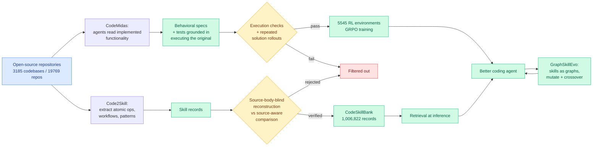

# Four papers, one substrate: source code is now where agent capability comes from

**Date:** 2026-09-21
**Topic:** agentic-systems
**Sources:**
- **CodeMidas** · HuggingFace + Kurate cs.AI #6, cross-source confirmed · [arXiv 2609.22068](https://arxiv.org/abs/2609.22068) · [raw](../../raw/huggingface/2026-09-21-codemidas-scaling-agentic-coding-rl-environments-from-code-i.md)
- **Code2Skill / CodeSkillBank** · HuggingFace · [arXiv 2609.05571](https://arxiv.org/abs/2609.05571) · [raw](../../raw/huggingface/2026-09-21-grounded-skill-synthesis-from-code-at-scale-for-agentic-inte.md)
- **GraphSkillEvo** · HuggingFace · [arXiv 2609.21749](https://arxiv.org/abs/2609.21749) · [raw](../../raw/huggingface/2026-09-21-graphskillevo-evolutionary-optimization-of-graph-structured.md)
- **SkillAA** · Kurate cs.AI #5 · [arXiv 2609.20455](https://arxiv.org/abs/2609.20455) · [raw](../../raw/kurate/2026-09-21-cs-ai.md)

---

## TL;DR

Four papers in one day take the same position from four angles: **the bottleneck on agent capability
is not the model, it is the supply of verified tasks and verified procedures, and the largest
untapped supply of both is source code that already exists.** CodeMidas turns implemented
functionality in open repositories into executable reinforcement-learning environments using the
source as its only task-specific input, producing **5,545 training tasks from 3,185 codebases across
23 languages**, and training on them lifts a model on all five benchmarks tried, including
**+11.7 percent on issue repair, +17 percent on whole-program construction, +8.5 percent on terminal
work**. Code2Skill does the retrieval-side version: it converts code units into implementation-anchored
records of atomic operations, composite workflows and recurring patterns, verifies each by
reconstructing it with the source body hidden and comparing against the original, and produces
**1,006,822 accepted skill records from 19,769 repositories**, worth **+11.7 percent on average
across 72 protocol-matched evaluations**. GraphSkillEvo and SkillAA attack what happens after you
have the skills: represent them as graphs rather than prose, and evolve or repair them under
validation.

---

---

## CodeMidas: the verifier problem, solved by execution

Training a coding agent with reinforcement learning needs two things that are hard to get together:
diverse tasks, and a verifier that reliably says whether the agent succeeded. The standard approach
mines **development artifacts**, meaning issues and commits, because an issue plus its fixing commit
plus its test is a ready-made task with a ready-made verifier. The limitation is that this restricts
you to work somebody already did and wrote down.

CodeMidas takes the opposite input: **the implemented functionality itself, with the source as the
only task-specific input.** An agent explores what a piece of code does, writes a behavioral
specification for it, constructs tests by executing the original, and then the candidate task is
filtered by execution checks and repeated solution rollouts before it is admitted. The insight is
that a working implementation is already an oracle. You do not need someone to have filed a bug;
you need the code to run.

The interesting design decision is that **agentic compute is spent at every stage of environment
construction**, not just at training time. This is a cost claim in disguise: it moves expensive
model calls from the inner RL loop, where they are paid every episode, to a one-time dataset
construction pass, where they are amortised across every future training run. The result, trained
on MiMo-V2.5 with GRPO (group relative policy optimization, an RL method that scores a batch of
sampled answers against each other rather than against a learned value model), improves all five
benchmarks. Trajectory analysis reports the trained agent explores the codebase more and
self-verifies more diversely, which is the behavioural signature you want and the weakest part of
the evidence, since it is measured rather than caused.

**Cross-source note.** CodeMidas appears in both today's HuggingFace Daily Papers and this week's
Kurate cs.AI top 20 (#6, ai_rating 6.5/10). That is the first HuggingFace-Kurate overlap this wiki
has recorded in a fortnight. The caveat is important: **every Kurate entry this week still carries
`score=1200` and `win_rate=0.0%`**, meaning the three-LLM tournament has not run against this
cohort, so the Kurate board is a recency-ordered arXiv feed and not a quality ranking. The overlap
is real but it is two recency feeds agreeing, not a popularity signal and a quality signal agreeing.
It should be read as weaker evidence than the cross-source rule normally implies.

---

## Code2Skill: a million verified skills, and a verification trick worth stealing

Code2Skill's contribution is less the scale than the **verification protocol**, which is the part
the skill-library literature has been weakest on. A skill extracted from code is only useful if it
faithfully describes what the code does, and the obvious check, asking a model whether the
description matches, is circular. Code2Skill instead runs **source-body-blind reconstruction**:
hide the implementation, ask the model to reconstruct it from the skill record alone, then compare
against the original with the source available. A record that does not let you rebuild the thing it
describes is rejected.

Applied to 19,769 popular, actively maintained repositories, this yields 1,006,822 accepted records
carrying workflow, boundary, provenance and source-evidence metadata. Across 72 protocol-matched
evaluations over nine model settings and eight benchmarks, retrieval-augmented models improve by
**11.7 percent on average** and win in **57 of 72** cases, and **beat trajectory-derived skill banks
on all seven shared benchmarks**.

That last comparison is the one that matters, because it inverts the field's ordering. Trajectory-derived
skills come from an agent actually doing the task and are therefore assumed to be better grounded.
Code2Skill's claim is that repository-derived skills are better **before the agent has accumulated
experience**, which makes them a cold-start asset rather than a replacement.

The paper also slips in a datapoint with an uncomfortable implication: **skills synthesized from
tested AI-generated code pass at 93.50 percent against 93.00 percent for human-written code.** The
authors frame this as evidence the pipeline scales with the growing volume of AI-written software.
It is also, read less charitably, a small piece of the recursive-training-loop problem showing up in
a place nobody was looking for it, and the same problem [today's scientific-judgment collapse
result](../responsible-ai/2026-09-21-scientific-judgment-collapse.md) documents in peer review.

---

## GraphSkillEvo and SkillAA: what to do after you have a million skills

Both papers attack the representation and maintenance problem that the two above create.

**GraphSkillEvo** argues that skills written as unstructured natural language have two defects: they
lack workflow-level structure, so a model has to infer the control flow from prose, and the search
space of free-form text is too large for optimization to work in. Its fix is to represent a skill as
a **graph**, with nodes as execution steps carrying operational guidance and directed edges as
context-dependent transitions, then run population-based evolutionary optimization over that space
with mutation and crossover operators. Against SkillOpt, the strong iterative-self-refinement
baseline, it improves average accuracy by **4.01 percent on GPT-5.4-nano and 1.76 percent on
GPT-5.4**. The size of that gap is the finding: **the structured representation helps the weaker
model roughly twice as much**, which is consistent with the idea that explicit workflow structure
substitutes for the reasoning the larger model can already do itself.

**SkillAA** (Kurate cs.AI #5, not in HuggingFace today) closes the loop on maintenance:
attribution-guided skill-graph updating with targeted validation and rollback. When a skill changes
and performance moves, attribute the change, validate it in a targeted way, and roll it back if it
did not help. That is the missing operational half of every skill-library paper this quarter.

---

## Relation to prior wiki pages

**Establishes a pattern at N=4 and the pattern has a name: the agent's asset is a verified corpus,
not a model.** This wiki logged [Gavel (09-16)](../ai-routing/2026-09-16-gavel-native-skill-routing-frozen-llm.md),
which reads a skill-routing signal out of a frozen agent model's mid-layer hidden states with two
linear maps and so makes skill *selection* free, and recorded at the time that it opened a fifth
routing level, the skill library. That result quietly assumed a skill library exists. Today four
papers are about building one, verifying it, structuring it and repairing it. The routing question
and the supply question are now visibly two halves of one system, and the supply side is where the
work moved.

**Extends the harness thread.** [Harness choice costs, not success
(09-17)](2026-09-17-harness-choice-costs-not-success.md) found across seven models and three
harnesses that harness choice moves cost far more than it moves success, and [the 09-18 component
ablation](2026-09-18-harness-design-component-ablation.md) found the optimal setting of three of
four harness components flips depending on the backbone. GraphSkillEvo's result is the same shape
one level down: the value of structured procedural guidance depends on which model is reading it,
and it is larger for the weaker one. Both point the same way. **Scaffolding is a substitute for
capability, so its value is inversely proportional to the capability of the thing it scaffolds**,
which means every harness and skill result has a shelf life set by the next model release.

**Feeds the recursive self-improvement cluster.** [ScientistTwo
(09-20)](2026-09-20-scientisttwo-recursive-self-improvement.md) and the Kurate self-improvement
entries this week (ScienceBuddy #7, RSIAgent #10, Designer-RSI #18) all need a source of verified
tasks to improve against. CodeMidas is the most concrete answer yet to where that supply comes from,
and it comes from outside the loop, which is what makes it safe from the collapse dynamics that
affect self-generated task distributions.

---

## Gaps

- **CodeMidas reports no cost.** "Allocates agentic compute to every stage of environment
  construction" across 3,185 codebases is a large bill and the paper does not price it. Without a
  dollar figure per admitted task, the amortisation argument above is an argument rather than a
  result.
- **Code2Skill's verification is model-checked, not execution-checked.** Source-body-blind
  reconstruction is a clever protocol, but the judge of whether the reconstruction matches is still
  a model. CodeMidas's execution-grounded filter is strictly stronger and the two papers do not
  compare.
- **All four report accuracy deltas, none reports retrieval cost at serving time.** A million-record
  skill bank has an index, a latency and a memory footprint, and the routing question of *which*
  skills to retrieve for a given task is exactly the expensive estimation problem [Pandora's Router
  (08-25)](../ai-routing/2026-08-25-pandoras-router-costly-value-estimation.md) formalised.
- **GraphSkillEvo's gains are small in absolute terms** (1.76 percent on the stronger model) and
  evolutionary search over a population of skill graphs is not cheap. Accuracy per search-dollar is
  not reported.

---

## Related pages

- [Agent harness engineering](agent-harness-engineering.md)
- [Gavel: native skill routing from a frozen LLM (09-16)](../ai-routing/2026-09-16-gavel-native-skill-routing-frozen-llm.md)
- [Harness choice costs, not success (09-17)](2026-09-17-harness-choice-costs-not-success.md)
- [Harness design component ablation (09-18)](2026-09-18-harness-design-component-ablation.md)
- [COBRA skills and RobustSGPO harness search (09-13)](2026-09-13-cobra-skills-robustsgpo-harness-search.md)
- [ScientistTwo: recursive self-improvement (09-20)](2026-09-20-scientisttwo-recursive-self-improvement.md)
- [Scientific-judgment collapse (09-21)](../responsible-ai/2026-09-21-scientific-judgment-collapse.md)
