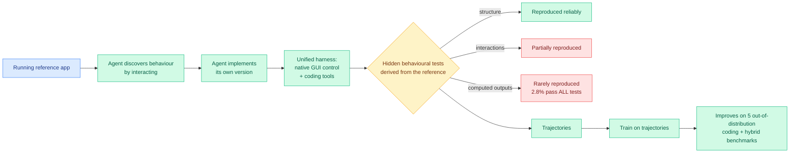

# Computer-use agents get graded properly, and the score is 2.8 percent

**Date:** 2026-09-21
**Topic:** agentic-systems
**Sources:**
- **RecreationWorld / RecreationBench** · HuggingFace · [arXiv 2609.22000](https://arxiv.org/abs/2609.22000) · [raw](../../raw/huggingface/2026-09-21-recreationworld-scalable-and-verifiable-environments-for-hyb.md)
- **MintAct** · HuggingFace · [arXiv 2609.22083](https://arxiv.org/abs/2609.22083) · [raw](../../raw/huggingface/2026-09-21-mintact-a-unified-visual-agent-for-digital-environments.md)

---

## TL;DR

Two papers on computer-use agents landed together and they read as the two halves of one argument.
**RecreationWorld** builds the harder evaluation: give an agent a running reference application and
require it to discover the behaviour and rebuild it faithfully, with no prescribed workflow, across
Ubuntu, macOS, Windows, Android and Web, with the running reference acting as the oracle for hidden
behavioural tests. The headline result is the useful one and it is brutal. **GPT-6 Astra leads at
58.1 percent overall but passes all programmatic tests on just 2.8 percent of tasks.** Agents
reproduce static interface structure reliably, interactions and computed outputs much less so, and
the applications they generate are smaller and more monolithic than the references. **MintAct**
builds the cheaper model: one family of vision-language models at 2B, 4B and 8B that unifies UI
grounding, multi-step navigation across mobile, desktop and web, and visual tool use, matching
per-domain specialists across all of them and reaching **48.9 on OSWorld-Verified** at comparable
size.

---

---

## The 58.1 versus 2.8 gap is the finding

Everything else in RecreationWorld is scaffolding for that pair of numbers. An overall score of 58.1
percent, on a partial-credit aggregate, next to a 2.8 percent rate of passing every programmatic
test on a task, says the aggregate score is measuring something close to *how much of the visible
surface did it copy* rather than *does the thing work*. The qualitative breakdown confirms it:
static interface structure is reproduced reliably, interactions less so, computed outputs least.

This is the strongest version yet of a complaint this wiki has been logging for a quarter, that
benchmark aggregates on agentic tasks are dominated by the easy sub-parts. It also makes
RecreationWorld useful in a way most benchmarks are not, because both numbers are published side by
side, so the gap itself is a reportable quantity.

The design choice that earns the result is **using a running reference as the oracle.** Nobody hand-writes
the answer key. The reference application is executed to generate hidden behavioural tests, and
reference-grounded programmatic and visual assertions cover action-conditioned outcomes at several
interaction depths, each validated on the reference and by human reviewers before the 250-task suite
is frozen. This is the same structural idea as [today's
CodeMidas](2026-09-21-code-as-agent-substrate.md), which turns implemented functionality into RL
environments using the source as its only task-specific input: **a working artifact is already an
oracle, and the expensive part of building an evaluation is realising that.** Two independent groups
made that move on the same day, one for training and one for evaluation.

The trajectories also transfer. Models trained on RecreationWorld trajectories improve across five
out-of-distribution coding and hybrid computer-use benchmarks and, notably, **more frequently verify
their rendered outputs**, which is a behaviour change rather than a score change.

---

## MintAct: the cost side

MintAct's claim is unification at small scale. Rather than a grounding specialist plus a navigation
specialist plus a tool-use model, one family at 2B, 4B and 8B matches the per-domain specialists
across all three capabilities, reaching 48.9 on OSWorld-Verified at comparable model size. The
infrastructure is the substance: hundreds of concurrent environment instances across heterogeneous
per-domain backends serving both trajectory collection and online RL, with an asynchronous training
framework that keeps explicit control over the cross-domain training distribution and stays stable
under noisy environment feedback and off-policy drift.

The efficiency reading is that **explicit control over the cross-domain mixture is what buys the
unification.** That is a routing claim at training time: the interesting parameter is not the loss,
it is which domain each batch is drawn from and who decides.

---

## Relation to prior wiki pages

**Confirms the harness-versus-model split at a new granularity.** [Harness choice costs, not success
(09-17)](2026-09-17-harness-choice-costs-not-success.md) found across seven models and three
harnesses that harness choice moves cost far more than success. RecreationWorld's unified harness
with native GUI control plus coding tools is exactly the "interleaved rather than stacked" design
that result implies, and its 2.8 percent full-pass rate says the remaining headroom is in the model
rather than in the harness for this task class, which is the first clean counterexample to the
harness-dominates reading.

**Sits next to the [SWE-Bench Pro Verified
(09-10)](2026-09-10-swe-bench-pro-verified.md) and [Benchmark Radar
(09-14)](2026-09-14-benchmark-radar.md) thread** on evaluation integrity. The distinctive
contribution here is publishing the aggregate and the all-tests-pass rate together. That should
become standard, and the digest files it as a prediction.

---

## Gaps

- **RecreationWorld's task is recreation, which is unusual.** Rebuilding a known application is a
  cleanly verifiable task precisely because a reference exists, and most real computer-use work has
  no reference. The transfer evidence to five out-of-distribution benchmarks is the paper's answer
  and it is a reasonable one, but the generalisation claim rests on it entirely.
- **No cost reporting on either paper.** Long-horizon computer-use agents are among the most
  expensive things to run, and neither paper reports dollars or tokens per task.
- **MintAct's "matches per-domain specialists" needs the specialist list.** Matching a weak
  specialist is a different claim from matching a strong one, and the abstract does not name them.

---

## Related pages

- [Agent harness engineering](agent-harness-engineering.md)
- [Code as agent substrate (09-21)](2026-09-21-code-as-agent-substrate.md)
- [Harness choice costs, not success (09-17)](2026-09-17-harness-choice-costs-not-success.md)
- [SWE-Bench Pro Verified (09-10)](2026-09-10-swe-bench-pro-verified.md)
- [Benchmark Radar (09-14)](2026-09-14-benchmark-radar.md)
