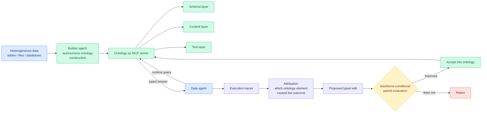

# EvoOntology: put the semantic layer behind an MCP server and let the agent query it instead of reading it

**Date:** 2026-09-21
**Topic:** agentic-systems
**Source:** HuggingFace Daily Papers + Kurate cs.AI #2 (cross-source present, see caveat) · [arXiv 2609.15779](https://arxiv.org/abs/2609.15779) · [code](https://github.com/ruc-datalab/EvoOntology) · [raw](../../raw/huggingface/2026-09-21-evoontology-a-self-evolving-ontology-layer-for-data-agents.md)

---

## TL;DR

A data agent is an agent that answers natural-language questions over tables, files and databases.
Its structural problem is what the paper calls the **agent-data gap**: the data lives outside the
agent, and the agent only sees thin handles onto it, column names and file paths, through generic
tools. The two existing answers are both bad at scale. Let the agent explore the raw sources, and
it burns context wandering. Inject a hand-written semantic layer into the prompt, and you pay
someone to write it, it does not fit in the window past a certain size, and it does not adapt to
how a particular agent actually behaves. EvoOntology's move is to stop treating the semantic layer
as **prompt content** and start treating it as a **queryable service**: the ontology is exposed as
an MCP server with a schema layer, a content layer and a tool layer, so the agent asks it questions
at runtime. A builder agent constructs it autonomously, and a self-evolution loop refines it through
attribution-guided typed edits that are only accepted after a **backbone-conditional paired
evaluation**. Across three data-agent benchmarks and four LLM backbones it beats both strong
baselines and existing semantic-layer approaches.

---

---

## The two ideas worth extracting

**Querying beats injecting, and the reason is a token-budget argument.** A semantic layer pasted
into the prompt costs its full size on every single call, whether or not the agent needs any of it,
and it is capped by the context window. A semantic layer behind a tool costs only the part the agent
asks for. This is the same trade this wiki logged in [SKILL.state
(09-19)](2026-09-19-skill-state-mutable-agent-state.md), which replaced an agent's growing
transcript with a state object and cut cumulative token use 16x at 100 turns by making the context
a thing you query rather than a thing you carry. Two papers in three days making the same structural
move on different content. **The pattern is: anything an agent needs occasionally should be a tool
call, not a prompt prefix.** The counterweight, and the paper does not address it, is that a prompt
prefix is cacheable and a tool call is a round trip, so the token saving may be bought with latency
and with a lost prefix-cache hit, which is exactly the trade [prefix-stable KV caching
(09-13)](../inference-efficiency/2026-09-13-prefix-stable-kv-caching-claude-md.md) was about.

**Backbone-conditional paired evaluation is the honest part.** An edit to the ontology is accepted
only if it improves things *for the specific backbone model in use*, evaluated pairwise. That is an
explicit admission that the optimal semantic layer is model-dependent, and it is the same finding
the harness literature reached independently: [the 09-18 component
ablation](2026-09-18-harness-design-component-ablation.md) found three of four harness components
flip their optimal setting across backbones, and [today's
GraphSkillEvo](2026-09-21-code-as-agent-substrate.md) found structured skills help a small model
roughly twice as much as a large one. Three results, one conclusion: **scaffolding does not transfer
across models, so every scaffold is a recurring cost tied to a model version, not an asset.**

---

## Cross-source status, stated precisely

EvoOntology appears in both today's HuggingFace Daily Papers and this week's Kurate cs.AI leaderboard
at #2 (ai_rating 5.0/10). Under this wiki's cross-source rule that would make it high conviction.
It should be discounted, and the reason is on the leaderboard itself: **every Kurate entry this week
carries `score=1200` and `win_rate=0.0%`**, which means the three-LLM tournament has not been run
against this cohort and the board is ordered by recency rather than by quality. The overlap is two
recency-ordered feeds agreeing, not a popularity signal and a quality signal agreeing. Real, but
weaker than the rule assumes.

---

## Gaps

- **No cost accounting for the runtime queries.** The token saving from not injecting the layer is
  the whole argument, and it is not measured against the added tool-call round trips and the lost
  prefix-cache reuse.
- **Builder-agent cost is unpriced.** Autonomous ontology construction over large heterogeneous
  sources is an expensive one-time pass, and the self-evolution loop makes it a recurring one.
- **Three benchmarks, four backbones, no ablation of the MCP framing itself.** The obvious control
  is the same ontology injected as prompt content rather than served as a tool. Without it, the gain
  could be the ontology's quality rather than the delivery mechanism.

---

## Related pages

- [Agent memory](agent-memory.md)
- [SKILL.state: mutable agent state (09-19)](2026-09-19-skill-state-mutable-agent-state.md)
- [Code as agent substrate (09-21)](2026-09-21-code-as-agent-substrate.md)
- [Harness design component ablation (09-18)](2026-09-18-harness-design-component-ablation.md)
- [Prefix-stable KV caching (09-13)](../inference-efficiency/2026-09-13-prefix-stable-kv-caching-claude-md.md)
