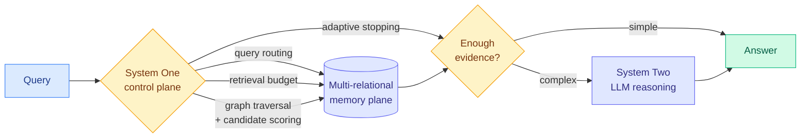

# Jev-Mem: System-One-Controlled Agentic Memory for Efficient AI Agents (2026-09-22)

**Cross-source confirmed via social.** HuggingFace Daily Papers plus a week-long X ecosystem cluster around the same decision-primitive framing.

**TL;DR.** Agentic memory systems put an expensive autoregressive LLM on the critical path of every memory operation: deciding what to store, how to relate it, what to retrieve, when to stop. Jev-Mem argues most of those decisions do not need generation at all. It splits the memory system into a fast **System-One control plane** that makes the routing and budget decisions, a structured multi-relational **memory plane**, and a **System-Two reasoning plane** invoked only for genuine synthesis. On LoCoMo it reports an LLM-as-a-Judge score of **0.777 (an 11.0% relative gain over the strongest baseline)** while cutting memory construction to **158 s (6.6x faster than the fastest competing system)** and average query latency to **0.93 s (a 36.7% reduction)**.

## What the System-One plane actually decides

This is the part worth reading closely, because the list is a routing taxonomy in disguise. During **construction** the controller governs memory typing and relational organization. During **retrieval** it performs, all without generating text:

- **query routing** (which store, which relation to follow)
- **retrieval-budget allocation** (how much to spend on this query)
- **graph traversal** decisions
- **candidate scoring**
- **adaptive stopping** (when the evidence is sufficient)

System Two is invoked only for complex reasoning and answer synthesis.

## Why the numbers are the interesting part

The accuracy gain and the efficiency gain arrive together, which is unusual. Most efficiency work on agentic memory trades quality for latency. Here the claim is that the expensive component was being used for decisions it was bad at anyway: an LLM asked "should I keep searching?" produces a verbose justification and a noisy answer, where a typed classifier produces a probability. **The 6.6x construction speedup is the bigger practical number**, because memory construction is the cost that scales with corpus size rather than with query volume, and it is the reason most agentic-memory systems are not deployed on long histories.

## Relation to prior wiki knowledge

**This is the decision-primitive thesis arriving in the peer-reviewed literature, and the timing is the story.** [`llm-routing.md`](../ai-routing/llm-routing.md) has tracked the hosted decision model since 09-16 through six days of vendor claims, open clones, a 160-project ecosystem census and a calibration failure, and complained repeatedly that the category had **no paper**. The [09-19 prediction](../daily-digest/2026-09/2026-09-19.md) set a 30-day deadline for TypeSafe to publish a benchmark or paper. That deadline is still unmet by the vendor, but an *independent academic group* has now published a system built on the same System-One/System-Two split with real benchmark numbers. **The concept entered the literature before its originator documented it**, which is a strong signal the framing is doing real work rather than marketing work.

**It also lands the argument this page has been running about where the router lives.** [`agent-memory.md`](agent-memory.md) records the field's drift toward graph-structured memory with an LLM orchestrating traversal. Jev-Mem says the orchestration is the expensive part and it is separable. That is the same claim [Gavel (09-16)](../ai-routing/2026-09-16-gavel-native-skill-routing-frozen-llm.md) makes for skill selection, except Gavel reads the signal out of the agent model's own hidden states for free while Jev-Mem uses a dedicated lightweight controller. **The head-to-head the routing page has asked for three times now has a third venue to be run in, and this one has a public benchmark attached.**

**Retrieval-budget allocation connects to the test-time compute thread.** [`../inference-efficiency/test-time-compute-allocation.md`](../inference-efficiency/test-time-compute-allocation.md) covers rationing inference compute across queries. Jev-Mem applies the same logic one level down, rationing *retrieval* rather than *generation*, and adaptive stopping is the retrieval analogue of an early-exit policy.

## Gaps

LoCoMo is a single conversational-memory benchmark and it is the friendly case for this design: long histories, factual recall, bounded question types. The paper does not report what happens when the System-One controller is wrong, which matters because a bad adaptive-stopping decision silently truncates evidence rather than producing a visible error. **Given the [09-21 finding](../ai-routing/2026-09-21-jev-calibration-reckoning.md) that this model class reports near-constant confidence and cannot gate reliably, and the [09-22 Milvus result](../ai-routing/2026-09-22-decision-model-benchmark-ladder-and-routing-tax.md) showing 18.8% of gold-relevant documents filtered out at a 0.5 threshold, adaptive stopping is precisely the operation where a miscalibrated controller does the most damage.** No calibration analysis is reported. There is also no ablation isolating how much of the 11.0% gain comes from the control plane versus from the multi-relational memory structure, which are independent contributions bundled into one result.

## Industrial implication

If the construction-time number holds, agentic memory becomes affordable on histories where it currently is not, and the natural place this ships is coding-agent session memory and customer-support transcript stores. The architectural lesson generalizes past memory: **any place an agent stack uses an LLM to make a bounded choice is a candidate for the same split**, and the tool-selection and compaction paths are the obvious next two.

## Source

Raw: [`raw/huggingface/2026-09-22-jev-mem-system-one-controlled-agentic-memory-for-efficient-a.md`](../../raw/huggingface/2026-09-22-jev-mem-system-one-controlled-agentic-memory-for-efficient-a.md) · Paper: [arXiv 2609.23986](https://arxiv.org/abs/2609.23986)

## Related

- [`agent-memory.md`](agent-memory.md)
- [`../ai-routing/llm-routing.md`](../ai-routing/llm-routing.md)
- [`../ai-routing/2026-09-22-decision-model-benchmark-ladder-and-routing-tax.md`](../ai-routing/2026-09-22-decision-model-benchmark-ladder-and-routing-tax.md)
- [`../inference-efficiency/test-time-compute-allocation.md`](../inference-efficiency/test-time-compute-allocation.md)
