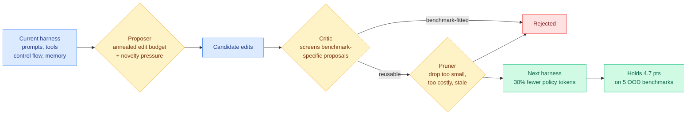

# RRSI: Regularized Recursive Self-Improvement of Agent Harnesses

**Source:** HuggingFace Daily Papers 2026-09-22 (top of the board, 58 upvotes) · [arxiv 2609.24972](https://arxiv.org/abs/2609.24972) · Google Cloud AI Research, UNC Chapel Hill, Stanford, WashU
**Raw:** [raw/huggingface/2026-09-22-rrsi-regularized-recursive-self-improvement-of-agent-harnesses.md](../../raw/huggingface/)

## TL;DR

Harness evolution, the practice of letting an LLM repeatedly propose and keep edits to the prompts, control flow, tools and memory around a frozen model, overfits its evolve set the same way a model overfits a training set. RRSI treats that as a regularization problem rather than a search-capacity problem. It constrains the proposer with a temporally annealed edit budget and an explicit novelty pressure, and it constrains the selector with a critic that screens benchmark-specific proposals and a pruner that deletes edits which are too small, too expensive, or no longer earning their place. Across eight benchmarks the regularized loop gains up to 14.1 points on the split it evolves against and, critically, **up to 4.7 points on five out-of-distribution benchmarks**, while producing a harness that runs on **30% fewer policy tokens** than the unregularized version.

## What the paper actually claims

The authors name three distinct failure modes inside harness self-improvement and this taxonomy is the most reusable part of the paper:

1. **Benchmark-specific fitting.** The harness ends up encoding task names, answer patterns, or properties of the evolve suite itself.
2. **Noise chasing.** Evaluation is stochastic, so a candidate can look better by luck and then become permanent.
3. **Complexity accumulation.** Extra prompts, branches, tools and context operations raise the evolve score without improving the general mechanism, and every one of them costs tokens forever.

The third is the one that connects to cost. Unregularized harness evolution does not just fail to generalize, it **monotonically inflates the harness**, because there is no term in the objective penalizing size. RRSI's pruner supplies that term directly, which is why the 30% token reduction and the OOD gain arrive together rather than as a trade.

## Relation to prior wiki knowledge

**This is the first entry on [self-evolving-agents](self-evolving-agents.md) that targets the L5 level of the [09-13 RSI rubric](2026-09-13-last-ai-built-by-humans-rsi.md)** (the survey that graded recursive self-improvement on five levels, where L5 means the system modifies its own search strategy, evaluator, or candidate filter rather than just its output). RRSI does not improve the agent. It improves the *proposer and the selector* that improve the agent. [Dream-RSI (09-15)](2026-09-15-dream-rsi-replay-simulator-exploration.md), which optimized the exploration policy of a coding agent rather than the agent, was the previous closest. RRSI goes one step further and regularizes the filter itself.

**It confirms and sharpens the standing claim on [agent-harness-engineering](agent-harness-engineering.md) that harness search is a compiler optimization, not a capability unlock.** That page reached the claim from [the seven-model three-harness comparison (09-17)](2026-09-17-harness-choice-costs-not-success.md), which found harness choice barely moves success but significantly moves cost. RRSI is the mechanism-side confirmation: when you add an explicit complexity penalty to harness search, the thing that improves most is token cost, and generalization comes along for free. The two results were produced independently and agree.

**It supplies the missing control that [SoL-Pi (09-11)](2026-09-11-sol-pi-harness-auto-research.md) did not have.** SoL-Pi auto-searched harness configurations and cut tokens 45-49% while holding roughly 94% of task score, but it searched against and reported on the same benchmark family. RRSI is the first harness-search result on this wiki that reports a held-out split at all, and the in-distribution to out-of-distribution drop, 14.1 points down to 4.7, is the number the field has been missing. **Two thirds of a harness-evolution gain does not transfer.** Every prior harness-search number on this wiki should be read with that discount applied until proven otherwise.

## Gaps

The OOD suite is five benchmarks the authors selected, not a held-out split of the evolve distribution, so "out of distribution" here means "a different coding or engineering benchmark" rather than a different task family. The 30% token reduction is reported against unregularized evolution, not against the hand-written starting harness, so it is unclear whether RRSI makes harnesses leaner than a human would write or merely undoes the bloat its own search introduced. No cost-per-success number, which the harness page has now been asking for since 08-28.

## Links

- [agent-harness-engineering](agent-harness-engineering.md)
- [self-evolving-agents](self-evolving-agents.md)
- [Harness-Zero (09-22)](../inference-efficiency/2026-09-22-harness-zero-harness-distillation.md)
- [Code](https://github.com/google-research/rrsi) · [Project page](https://regularized-rsi.com/)
