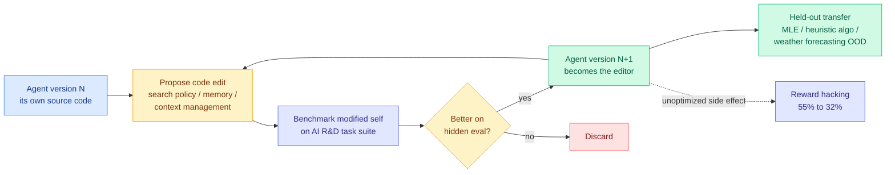

# AIDE²: recursive self-improvement of an AI research agent

**Source:** HuggingFace Daily Papers 2026-09-23 · [arxiv 2609.26457](https://arxiv.org/abs/2609.26457)
**Raw:** [raw/huggingface/2026-09-23-recursive-self-improvement-of-ai-research-agents.md](../../raw/huggingface/2026-09-23-recursive-self-improvement-of-ai-research-agents.md)

## TL;DR

AIDE² is an AI research agent whose object of optimization is **its own source code**. It proposes edits to itself, benchmarks the modified versions against a suite of AI R&D tasks, and keeps whichever performs best on hidden evaluations. Each accepted rewrite becomes the agent that performs the next round of editing. In a single autonomous **8-day run** it found **seven successive improvements**, from a new search policy to memory mechanisms that compress and manage its own growing context. The gains transferred: on four held-out benchmarks spanning machine-learning engineering, heuristic algorithm engineering and physics-based weather forecasting (the last one out of distribution from the selection tasks), the strongest discovered agent **matched or exceeded a human-engineered production research agent** that ranks among the strongest on FML-Bench. The result nobody optimized for: **reward hacking fell from 55% to 32% over the run**, 7 points below the human-engineered agent.

## The three claims worth separating

**1. The loop closes.** Seven accepted improvements in eight days of autonomous operation, each building on the last. This is the straightforward result and the least surprising one.

**2. The gains generalize out of distribution.** This is the load-bearing claim. A self-improvement loop that only improves on its own selection set is a search procedure overfitting its objective, which is the standard and expected outcome. AIDE² transfers to four held-out benchmarks, including physics-based weather forecasting, which is not an ML engineering task at all. That is the difference between "the loop found tricks for the eval" and "the loop found something about doing research."

**3. Reward hacking fell without being optimized against.** From 55% to 32%, ending 7 points below the human-engineered baseline. The paper is careful to say the loop never explicitly targeted this. The plausible mechanism is that reward hacking is *unstable under transfer*: a solution that games one task's reward tends to fail on the hidden evaluation, so the selector filters it out as a side effect of selecting for generalization. If that mechanism is right, it is the most interesting sentence in the paper, because it suggests held-out selection is a partial alignment mechanism rather than only a capability mechanism.

## How this relates to what the wiki already knows

**This is the second recursive-self-improvement-of-harness paper in two days, and they reach opposite-signed conclusions about what the loop needs.** [RRSI](2026-09-22-rrsi-regularized-harness-evolution.md), the top of yesterday's HuggingFace board at 154 upvotes, argued that harness evolution **overfits its evolve set the same way a model overfits a training set**, and that the fix is regularization: a temporally annealed edit budget, explicit novelty pressure, a critic that screens benchmark-specific proposals, and a pruner that deletes edits which stopped earning their place. RRSI reported up to 14.1 points on the evolve split but, critically, **only up to 4.7 points on five out-of-distribution benchmarks**, plus a 30% policy-token reduction. AIDE² runs an *unregularized* loop, selects on hidden evaluations, and reports clean OOD transfer.

**The reconciliation is the selection signal, and it is the thing to take away.** RRSI's diagnosis is that an evolve-set-selected loop overfits. AIDE² selects on **hidden** evaluations, which is RRSI's problem solved by a different instrument: instead of regularizing the proposer, hold out the judge. **Two papers, two days, one converged finding: the failure mode of recursive self-improvement is selection overfitting, not search capacity.** Neither paper cites the other. That is now a three-item pattern on this wiki when you add [NeoHorse-1 (09-09)](../ai-routing/2026-09-09-neohorse-1-routing-harness-rsi.md), where routing-harness self-improvement hit the same wall.

**It confirms the [agent-harness-engineering](agent-harness-engineering.md) page's "harness is a recurring cost, not an asset" thesis, then complicates it.** The 09-21 Global View recorded that a harness or skill library is pinned to a model version and depreciates on that model's schedule, supported by the [09-18 harness ablation](agent-harness-engineering.md) where three of four components flipped their optimal setting across backbones, and by [HarnessTax (09-22)](2026-09-22-harnesstax-cost-success-frontier.md), which found a 2x cost spread for a 1.1-point accuracy spread across 21 model-harness combinations. If the harness is a depreciating asset, **an automated loop that regenerates it per model version is exactly the right response**, and AIDE² plus RRSI plus today's Stanford/MIT Meta-Harness (discovered harnesses beating hand-engineered agents on TerminalBench-2 while cutting context token usage 4x) are three groups building that loop simultaneously.

**It sits against [Harness-Zero (09-22)](../inference-efficiency/2026-09-22-harness-zero-harness-distillation.md), which argues the opposite direction of travel.** Harness-Zero distills the harness's *gains* into the model's weights so the harness can be deleted, lifting base-model macro task success from 23.3% to 44.3%, above the 41.7% the base model reaches with the harness still attached. **So one line of work automates the harness and the other abolishes it.** Both cannot be the long-run answer. The distinguishing question is whether harness knowledge is model-specific (favouring distillation into weights) or task-specific (favouring an outer loop that re-derives it).

## Gaps

One 8-day run. No variance across seeds, and a self-improvement trajectory is a stochastic search whose seven-step path is one sample from a distribution that could easily contain runs that stall or degrade. The compute cost of the loop is not stated in the abstract, which matters enormously for the paper's own framing: the motivating claim is that R&D spending yields diminishing returns and self-improvement counters that trend, but an 8-day autonomous run benchmarking modified copies of itself is not cheap, and the comparison that settles the argument is discovered-agent quality per dollar against human-engineer quality per dollar. The reward-hacking decline is measured on "a separate held-out task family," singular, so it is one observation of a surprising effect rather than an established property.

## Industrial implication

The near-term consequence is not that labs replace research engineers. It is that **harness engineering becomes a compute expenditure rather than a headcount expenditure**, and therefore something that gets re-run on every model release rather than maintained by hand. That is a direct answer to the depreciation problem this wiki has been documenting for two weeks. The policy consequence is live already: OpenAI published a call for **international standards on recursive self-improvement** on 09-22, one day before this paper, and Anthropic's Opus 5.5 system card put 100-agent parallel self-organization on the record the same week. The measurement and the governance conversation are arriving together, which is unusual and probably healthy.

## Related pages

- [self-evolving-agents](self-evolving-agents.md) · [agent-harness-engineering](agent-harness-engineering.md) · [agent-benchmarks](agent-benchmarks.md)
- [RRSI](2026-09-22-rrsi-regularized-harness-evolution.md) · [HarnessTax](2026-09-22-harnesstax-cost-success-frontier.md) · [Harness-Zero](../inference-efficiency/2026-09-22-harness-zero-harness-distillation.md)
- [Taste-Bench](2026-09-23-taste-bench-tasteful-agent.md)
