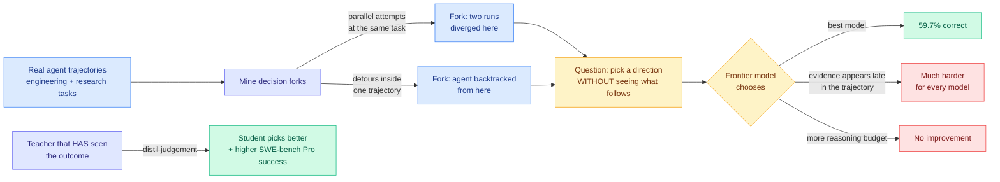

# The Tasteful Agent: measuring the decisions an agent makes on the way to an answer

**Source:** HuggingFace Daily Papers 2026-09-23 · [arxiv 2609.25804](https://arxiv.org/abs/2609.25804)
**Raw:** [raw/huggingface/2026-09-23-the-tasteful-agent-measuring-and-improving-taste-in-long-hor.md](../../raw/huggingface/2026-09-23-the-tasteful-agent-measuring-and-improving-taste-in-long-hor.md)

## TL;DR

Every agent benchmark on this wiki scores the end of a run. Taste-Bench scores the **forks in the middle**. The authors mine decision points automatically out of real agent trajectories, places where several directions were genuinely available and one of them led to a better outcome, then ask a model to pick, without showing it what happened afterwards. They call the ability to pick well an agent's **taste**. The best frontier model gets **59.7%**. Two findings sharpen that number. Forks whose deciding evidence appears **later in the trajectory** are much harder for every model, and **a larger reasoning budget does not help**. Taste is trainable though: distilling the judgement of a teacher that has already seen the outcome into a student improves the student's fork choices on unseen tasks and lifts end-to-end success on held-out SWE-bench Pro tasks.

## What problem this actually addresses

Long-horizon agents accumulate their outcome from a chain of choices: which hypothesis to test, which implementation to build on, which failing test to chase first. End-to-end benchmarks fold all of those into one number, so a run that made four bad choices and one lucky recovery scores the same as a run that made five good ones. That makes end-to-end scores nearly useless as a training signal for the decision policy, because the credit assignment across the chain is missing.

The construction is the contribution. **Forks are mined automatically, with no human annotation**, from two sources: parallel attempts at the same task that diverged at a specific point, and detours inside a single trajectory where the agent went down a path and came back. Both give a ground-truth label for free, because the later part of the trajectory reveals which branch paid off. Withholding that later part from the evaluated model is what turns it into a question.

## Why the two findings matter more than the 59.7%

**"Larger reasoning budget does not improve accuracy" is the load-bearing result.** Everything else in agentic systems this year has been an argument about where to spend compute. This says there is a class of decision where spending more does nothing, which means the deficit is not search depth. It is either missing information or a missing prior about what usually works, and those need different fixes.

**"Forks whose deciding evidence appears later are much harder" names the mechanism.** A fork is only answerable from what came before it. If the discriminating evidence is downstream, the model is being asked to predict the consequence of a choice rather than recognise a known-good pattern. That is exactly the capability an unbounded reasoning budget cannot manufacture from an under-informative prefix.

## How this relates to what the wiki already knows

**It is the missing measurement for the harness thread.** [HarnessTax (09-22)](2026-09-22-harnesstax-cost-success-frontier.md) priced 21 model-harness combinations and found cost moving 2x while success moved 1.1 points, concluding that the harness buys cost rather than capability on those tasks. [The 09-18 harness component ablation](2026-09-18-harness-design-component-ablation.md) found context management's value comes almost entirely from preventing overflow failures. Both studies measure the harness by its effect on the final score. **Taste-Bench measures the thing the harness is actually shaping, which is what the agent sees at each fork, and it does so without waiting for the run to finish.** If a harness improves fork accuracy, that is a capability claim; if it does not, the harness is doing cost work, which is what HarnessTax found.

**It sits directly against today's AIDE² result.** [AIDE² (09-23)](2026-09-23-aide2-recursive-self-improvement.md) discovered seven successive self-improvements over an 8-day run, including a new search policy and memory mechanisms. A search policy is a fork-choosing policy. **Taste-Bench is the instrument that would say whether AIDE²'s discovered search policy actually improved its taste or merely improved its throughput, and neither paper ran the other's test.** That is the cheapest high-value follow-up on either page.

**The distillation result connects two threads the wiki keeps separately.** Distilling a hindsight-informed teacher into a student is [on-policy distillation](../inference-efficiency/knowledge-distillation.md) applied to a decision policy rather than a token distribution, and it is the same shape as [Perplexity's OPSD result today](../inference-efficiency/2026-09-23-perplexity-opsd-tool-call-distillation.md), where hints constructed from tool-call errors are distilled back into the model and cut tool-call failures by 21%. **Two independent groups on the same day used a teacher that has seen the outcome to fix a policy that has not.** That is a pattern worth naming: hindsight is becoming a distillation source in its own right.

## Gaps

The forks are mined from trajectories that existing agents produced, so the benchmark inherits those agents' distribution of mistakes. A fork the current generation never reaches cannot appear in the suite. The 59.7% has no human baseline reported, so it is unclear whether the remaining 40% is hard for anybody or specifically hard for models. And the automatic mining labels a branch "better" by its outcome in that run, which conflates a good decision with a lucky one on any task with meaningful variance.

## Related pages

- [agent-benchmarks](agent-benchmarks.md) · [agent-harness-engineering](agent-harness-engineering.md) · [self-evolving-agents](self-evolving-agents.md)
- [knowledge-distillation](../inference-efficiency/knowledge-distillation.md) · [test-time-compute-allocation](../inference-efficiency/test-time-compute-allocation.md)
- [Daily digest 2026-09-23](../daily-digest/2026-09/2026-09-23.md)
