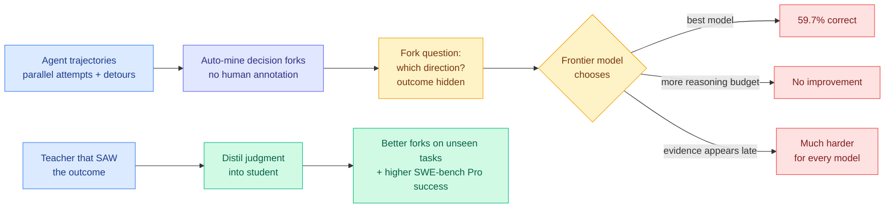

# Taste-Bench: measuring the decision quality of a long-horizon agent, and distilling it

**Source:** HuggingFace Daily Papers 2026-09-23 · [arxiv 2609.25804](https://arxiv.org/abs/2609.25804)
**Raw:** [raw/huggingface/2026-09-23-the-tasteful-agent-measuring-and-improving-taste-in-long-hor.md](../../raw/huggingface/2026-09-23-the-tasteful-agent-measuring-and-improving-taste-in-long-hor.md)

## TL;DR

Every agent benchmark on this wiki measures whether the run succeeded. None of them measures whether the *decisions along the way* were good, and on a long-horizon task the decisions are what determine the outcome. Taste-Bench isolates that. It mines **decision forks** automatically from real agent trajectories, points where several directions were available and one led to a better outcome, then asks a model to choose **without seeing what happened after the fork**. The forks come from parallel attempts at the same task and from detours inside a single trajectory, so no human annotation is needed. Three findings: **the best frontier model gets only 59.7%**; **forks whose deciding evidence appears later in the trajectory are much harder for every model**; and **a larger reasoning budget does not help**. Taste is nonetheless trainable, by distilling the judgment of a teacher that has seen the outcome into a student, which improves decisions on unseen tasks and lifts end-to-end success on held-out SWE-bench Pro tasks.

## The two results that matter

**More thinking does not buy better judgment.** This is the finding with teeth. The entire deployed practice of "set effort to high on the hard parts" assumes reasoning budget converts into decision quality. Taste-Bench says that on decision forks it does not. The plausible reason is that a fork is not an inference problem, it is a *prediction* problem about a future the model cannot observe, and no amount of deliberation over the visible prefix recovers information that is not in the prefix. That interpretation is supported directly by the second finding: forks whose deciding evidence arrives *later in the trajectory* are hardest for everyone. The model is being asked to guess what it will learn.

**Taste is distillable even though it is not thinkable.** A teacher with outcome access has information the student structurally cannot have at decision time, and distilling that teacher transfers something that generalizes to unseen tasks and improves end-to-end success. This is privileged-information distillation, and it works here.

## How this relates to what the wiki already knows

**The distillation result runs straight into this wiki's standing warning about privileged teachers.** [Privileged, but Biased (08-10)](../inference-efficiency/knowledge-distillation.md) found that a teacher shown the reference solution pulls the student toward that one trajectory rather than toward correctness, and that the apparent gains were largely a difficulty artifact on easy benchmarks. Taste-Bench's teacher is privileged in exactly that sense: it has seen the outcome. **The difference is that here the privileged information is about which branch worked, not about the answer itself, so the student is learning a selection policy rather than memorizing a path.** Whether that distinction survives contact with the 08-10 critique is genuinely open, and the fact that the gains do transfer to held-out SWE-bench Pro is the main evidence that it does.

**It gives [Cal-OPD (09-21)](../inference-efficiency/2026-09-21-cal-opd-calibrated-discrepancy.md) a natural next target.** Cal-OPD estimates how much of a teacher-student gap is the teacher's own noise (by perturbing what the teacher knows) and trains only on the remaining 52-65%. A taste teacher's outcome knowledge is precisely the kind of privileged signal whose transferable fraction is unclear, and the [09-21 Looking Ahead](../daily-digest/2026-09/2026-09-21.md) predicted Cal-OPD would be run on hard agentic settings within 90 days with gains shrinking by more than half. Taste distillation is that setting.

**59.7% is the number to set beside the agent-benchmark inflation thread.** [KernelBench-M (09-22)](../hardware/2026-09-22-kernelbench-m-mutation-analysis.md) found the official GPU-kernel checker misses 16.9% of witnessed faults deterministically, and 78.6% of precision faults. RecreationWorld reported 58.1% aggregate against a 2.8% all-tests-pass rate. **Three measurement results in a fortnight all pointing the same way: agentic scores are dominated by the easy sub-parts, and the moment you isolate the hard component the number collapses toward chance.** A frontier model at 59.7% on a binary-ish fork choice is barely above a coin flip weighted by any prior.

**It supplies the missing evaluation for the self-improvement loops.** [AIDE² (today)](2026-09-23-aide2-recursive-self-improvement.md) discovered a new *search policy* as one of its seven self-improvements, and [RRSI (09-22)](2026-09-22-rrsi-regularized-harness-evolution.md) regularizes which harness edits to keep. Both are, at bottom, taste problems: which branch to pursue. Neither has a way to measure decision quality independent of final success. Taste-Bench is that instrument, and it should be run on the discovered agents.

## Gaps

The fork-mining procedure defines "the better direction" by observed outcome, which conflates decision quality with luck: on a stochastic task, the branch that happened to work is not always the branch that *should* have been chosen, and mining from parallel attempts inherits that noise directly. There is no reported human agreement rate on the mined forks, so the benchmark's own ceiling is unknown, and a 59.7% frontier score is hard to interpret without knowing whether a careful human expert gets 95% or 65%. The benchmark is built from engineering and research trajectories only. And the claim that reasoning budget does not help would be much stronger with the budget sweep shown rather than asserted.

## Industrial implication

If decision quality is orthogonal to reasoning budget, then the deployed knob everyone reaches for first, effort level, is the wrong knob for the failures that actually kill long-horizon runs, and the money currently spent on high-effort settings during exploratory phases is largely wasted. The actionable version: **spend the budget on breadth (parallel attempts, which is where the forks come from) rather than depth at any single fork.** That is also the cheaper option per unit of information, and it happens to be what the 100-parallel-agent results in Anthropic's Opus 5.5 system card are implicitly testing.

## Related pages

- [agent-benchmarks](agent-benchmarks.md) · [agent-harness-engineering](agent-harness-engineering.md) · [knowledge-distillation](../inference-efficiency/knowledge-distillation.md)
- [AIDE²](2026-09-23-aide2-recursive-self-improvement.md) · [RRSI](2026-09-22-rrsi-regularized-harness-evolution.md) · [KernelBench-M](../hardware/2026-09-22-kernelbench-m-mutation-analysis.md)
