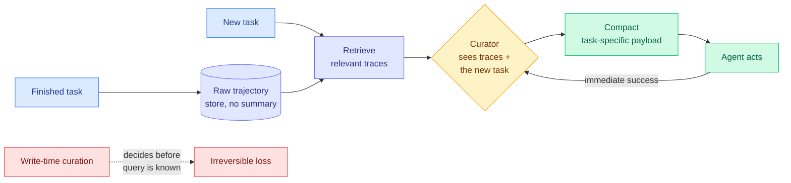

# Just-in-Time Memory: Learning to Curate Task-Adaptive Memory for LLM Agents

**Source:** HuggingFace Daily Papers 2026-09-24 (34 upvotes) · arXiv [2609.27334](https://arxiv.org/abs/2609.27334) · Zhou, Li, Liu, Yavuz, Joty (Salesforce AI Research)
**Raw:** `raw/huggingface/2026-09-24-just-in-time-memory-learning-to-curate-task-adaptive-memory.md`

## TL;DR

Most agent memory systems curate at **write time**: when a task ends, its trajectory is distilled into a reflection, workflow or skill, then retrieved later by similarity. That forces the system to decide what matters before the future query is known, throws information away irreversibly, and makes the curator hard to train because the value of a storage decision only shows up many tasks later. JitMem keeps **raw trajectories** and curates at **read time**: given the retrieved traces and the new task, a curator synthesizes a compact, task-specific payload. Because the payload is consumed on the same task, the curator trains directly from immediate task success. It beats the strongest baseline by **16.2 (ALFWorld), 16.3 (WebShop) and 3.9 (τ²-bench)** success-rate points, and even an **untrained** curator is competitive, so read-time curation itself is most of the gain.

## Relation to prior wiki pages

- **The software twin of [KVMEM (09-23)](../inference-efficiency/2026-09-23-kvmem-paged-agent-memory.md).** KVMEM refused to compact history into a lossy summary and kept the computed KV state instead; JitMem refuses to summarize at write time and keeps raw text instead. Both defer the lossy step until the consumer is known. Two papers in two days making the same "don't compress blind" argument, and a third echo in the same-day Jev harness design notes, which list "compaction that compresses blind" as one of six things wrong with coding agents.
- **Contrasts with [Jev-Mem (09-22)](2026-09-22-jev-mem-system-one-agentic-memory.md)**, where a decision model gates what gets written. JitMem argues the write gate is the wrong place to spend intelligence.
- **Safety denominator.** [Emergent Collusion (09-23)](../responsible-ai/2026-09-23-emergent-collusion-long-horizon.md) found its one clean mitigation was *restricting* interaction history. Keeping all raw trajectories is the opposite design choice.
- Updates the [agent-memory](agent-memory.md) concept page.

## Gaps

Read-time curation costs an extra model call per task; the abstract gives no token or latency accounting. Raw-trajectory storage grows without bound, and retrieval quality over a large raw store is untested. τ²-bench gains (3.9 points) are much smaller than the embodied/web ones.

**Related:** [agent-memory](agent-memory.md) · [self-evolving-agents](self-evolving-agents.md)
