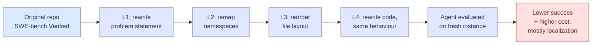

# Schrödinger's Code Repository: Have LLMs Learned SWE-bench or Memorized It?

**Source:** HuggingFace Daily Papers 2026-09-24 (15 upvotes) · arXiv [2609.27891](https://arxiv.org/abs/2609.27891) · Chen, Yang, Gu, Shi, Wan, Guan (SJTU)
**Raw:** `raw/huggingface/2026-09-24-schr-dinger-s-code-repository-have-llms-learned-swe-bench-or.md`

## TL;DR

Repository-level coding benchmarks are built from popular open-source repos, which are also in every model's training data. SchrodingerRepo treats the test repository as a **latent variable instantiated only when the agent enters the environment**: executable behaviour is preserved, but familiar cues are eroded through four escalating transformations (rewritten problem statement, namespace remapping, intra-file layout reordering, functionality-preserving code rewriting). On SWE-bench Verified and SWE-QA, removing familiar cues **consistently degrades performance and substantially increases interaction cost** across models, and the extra cost comes mainly from harder **repository exploration and localization**, meaning agents navigate by memory of the repo layout.

## Relation to prior wiki pages

- **Mechanism for yesterday's number.** [SWE-Bench Pro V2 (09-23)](2026-09-23-swe-bench-pro-v2-contamination-gap.md) measured Claude Opus 5 at **99.4% public versus 81.6% private**, a 17.8-point gap Scale attributed to training-time exposure. SchrodingerRepo shows *where* exposure pays: in finding the right file, not in writing the fix. Two papers in two days, one measuring the gap, one locating it.
- **Cost, not just accuracy.** The [HarnessTax (09-22)](2026-09-22-harnesstax-cost-success-frontier.md) result compressed success across 21 model-harness pairs into a 1.1-point band and found cost varied 5x. If memorized layouts shorten exploration, public-split cost numbers are *also* contaminated, and every harness cost comparison on SWE-bench is optimistic.
- **Fifth subfield in the [agent-benchmarks](agent-benchmarks.md) measurement-crisis thread** logged across 09-16 to 09-23 (kernel oracles, decision-model ladder, SWE-Bench Pro V2, Taste-Bench).

## Gaps

No headline degradation numbers in the abstract. It is unclear how much of the drop comes from L1 (problem statement rewrite, which also changes difficulty) versus L2-L4 (pure cue erosion). Code rewriting at L4 can introduce subtle non-equivalences that tests miss.

**Related:** [agent-benchmarks](agent-benchmarks.md) · [agent-harness-engineering](agent-harness-engineering.md)
