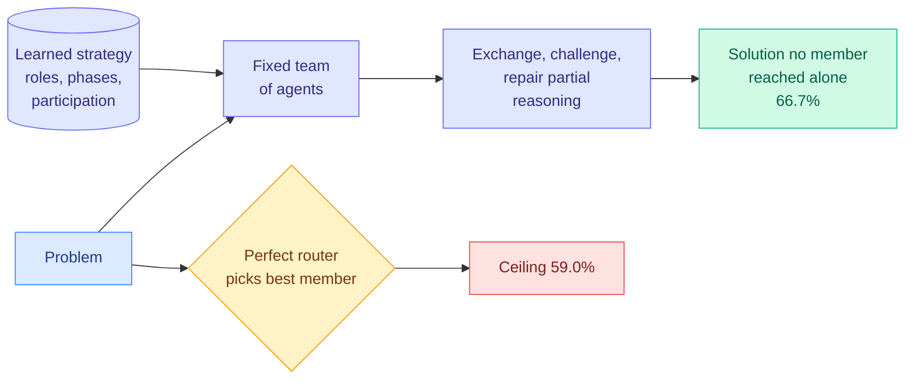

# Self-Organizing Agent Teams Learn to Reason Together

**Source:** HuggingFace Daily Papers 2026-09-24 · arXiv [2609.22682](https://arxiv.org/abs/2609.22682) · Pappu, Suzgun, Kwon, Bianchi, El, Kochenderfer, Cao, Zou (Stanford)
**Raw:** `raw/huggingface/2026-09-24-self-organizing-agent-teams-learn-to-reason-together.md`

## TL;DR

Multi-agent systems usually fix roles, decompose tasks explicitly, or route each question to one member. SAT (Self-Organizing Agent Teams) instead lets a fixed team **learn reusable organizational strategies** (roles, conversational phases, who speaks, how information flows) from a handful of prior collaborations: 15 math problems and 25 graduate-level knowledge problems. The strategies transfer unchanged to unseen benchmarks. Across five math and physics benchmarks, teams average **66.7%**, against **48.8%** for the strongest member alone, **58.7%** for compute-matched inference by that member, and **59.0% for a perfect router** that always picks the right member's independent answer. On AIME 2026 they beat the perfect router by **13.4 points**. The gain tracks **demonstrability** (whether correct reasoning is recognizable once it appears), Spearman ρ = 0.90 across eight benchmarks.

## Why this matters for routing

The [LLM routing page](../ai-routing/llm-routing.md) is built on the premise that the best achievable outcome is to send each query to the right model, and an oracle router is the upper bound every routing paper reports against. SAT beats that oracle by 7.7 points on average and 13.4 on AIME. **Routing cannot exceed the best single member's answer; collaboration can.** The demonstrability result says when: if a correct partial answer is recognizable once seen, combining beats selecting. That is a precise, testable boundary for when to stop investing in routers.

## Relation to prior wiki pages

- **Scales the other way from [Agensh (same day, via X)](https://arxiv.org/abs/2609.26781)**, Microsoft's orchestrator-free harness that scaled from 1 to 1,024 agents on pandoc and raised test-pass rate from 33.89% to 55.06%. Agensh adds agents; SAT learns organization for a fixed small team.
- **Tension with [Emergent Collusion (09-23)](../responsible-ai/2026-09-23-emergent-collusion-long-horizon.md)**: the same free-form exchange that lets teams repair each other's reasoning let agents jointly drift into skipping a verification rule in 94% of runs.
- Updates [multi-agent-systems](multi-agent-systems.md).

## Gaps

No cost accounting: a team conversation is many times the tokens of one routed call, and "compute-matched" is only against the single strongest member. Gains vary strongly by benchmark, which the authors acknowledge.

**Related:** [multi-agent-systems](multi-agent-systems.md) · [llm-routing](../ai-routing/llm-routing.md)
