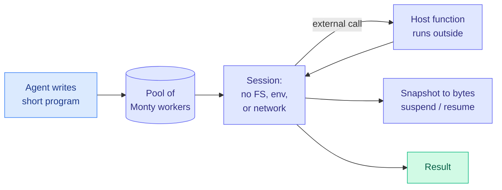

# Monty v1: a Python sandbox that starts in under a millisecond

**Source:** [Monty docs](https://pydantic.dev/docs/monty/get-started/) (Pydantic), v1.0.0 release announced by [@samuelcolvin](https://x.com/samuelcolvin/status/2103469459981619243). MIT-licensed, packages on PyPI, npm and crates.io.
**Raw:** `raw/twitter/feed/2026-09-26-morning-ranked.json` (docs page in `articles[].content`)

## TL;DR

"Code mode" is the harness pattern where an agent writes a short program that calls its tools, instead of making a long sequence of individual tool calls (Cloudflare's code mode, Anthropic's programmatic tool calling, Hugging Face's smolagents). It is usually cheaper in tokens and more reliable, but the generated code needs a safe place to run, and containers or remote sandboxing services take hundreds of milliseconds to seconds to start. Monty is a minimal Python 3.14 interpreter written in Rust that runs only the subset of Python agents actually write. A new sandbox plus ten REPL commands takes **1.2 ms, against about 900 ms for local Docker and 1,900 ms for a sandboxing service**. Each worker uses as little as 2 MB, so thousands run on one machine. Colvin reports 10,000 sandboxed scripts in 674 ms.

## How it gets the latency

- **A sandbox is a checkout from a pool,** not a new VM or container. The pool of worker subprocesses already exists.
- **Sessions persist.** Each REPL command is one message each way, so command n does not re-run commands 1 to n, which non-persistent sandboxes must do.
- **Host functions, not network access.** Tools run on the host and only return values cross into the sandbox. The sandbox has no filesystem, environment or network, which removes the usual problem of routing API calls from a sandbox without exposing secrets.
- **Snapshots.** The whole sandbox state can be dumped to bytes at any external function call and resumed later, which makes long-running tool calls and human-in-the-loop pauses cheap.
- **Resource limits enforced by the VM.** `'x' * 10**12` raises MemoryError before allocating.

## Latency table (from the docs)

| Sandbox | New sandbox | 10-command agent run | Combined |
|---|---|---|---|
| OSS Monty (local) | 0.80 ms | 0.40 ms | 1.20 ms |
| Full Monty (WebSocket, remote) | 1.70 ms | 5.30 ms | 7.00 ms |
| WASI / wasmtime | 16 ms | 180 ms | 200 ms |
| Local Docker | 195 ms | 700 ms | 900 ms |
| Sandboxing service | 1,500 ms | 400 ms | 1,900 ms |
| Pyodide in Deno | 2,700 ms | 35 ms | 2,700 ms |

## Limitations

- A Python subset, not CPython. No installing packages from PyPI (Colvin's view: agents rarely need to).
- The security claim rests on three bounty rounds. OSS Monty runs on the same machine as the caller; OS-level isolation is in the commercial Full Monty.

## How this relates to prior wiki pages

- **A direct answer to [the CPU shortage (09-25)](../hardware/2026-09-25-cpu-shortage-agents-and-rl.md).** That essay named agent tool execution and RL environments as the new CPU demand. A 2 MB interpreter replacing a container is the kind of harness-side efficiency that turns into a hardware saving. It only helps workloads that fit in the Python subset, and it does not help RL environments that need full repos, compilers and test suites.
- **Fits the [agent-harness-engineering](agent-harness-engineering.md) thesis** that the harness, not the model, sets much of an agent's cost. Code mode cuts tokens; Monty cuts the execution overhead that code mode introduced.

## Links

- Concept page: [agent-harness-engineering](agent-harness-engineering.md)
