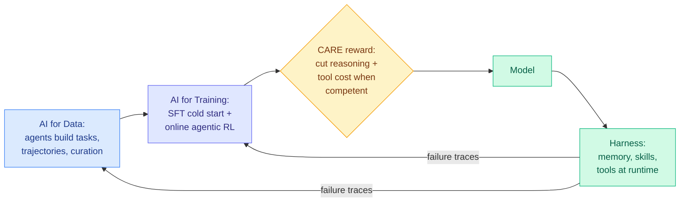

# Qwen-Planner-Agent: a closed-loop AI-for-AI framework for mobile planner agents

**Source:** arXiv [2609.29892](https://arxiv.org/abs/2609.29892) (Qwen team). HuggingFace Daily Papers (09-25, 9 upvotes) and Kurate cs.AI weekly #20, so cross-source confirmed (HF + Kurate).
**Raw:** `raw/huggingface/2026-09-25-qwen-planner-agent-a-closed-loop-ai-for-ai-framework-for-rea.md`, `raw/kurate/2026-09-26-cs-ai.md`

## TL;DR

A mobile planner agent has to carry out long, multi-step tasks on a phone: open apps, chain tool calls, remember what it did. Building one is slow because real-device interaction is expensive and long-horizon tasks fail in many ways. The Qwen team builds the agent with agents. One shared "action, feedback, verification" contract connects three loops. **AI for Data** uses specialized agents to create tasks, collect trajectories, curate and rebalance training data, and use training feedback to steer the next round of data, with humans gating the flywheel. **AI for Training** does a supervised planning cold start and then online agentic RL across hybrid environments, with a new reward scheme, CARE (Competence-Aware Reward-and-Advantage Engineering), that penalizes unnecessary reasoning and tool calls once the model is competent at a task. **Model-harness co-evolution** feeds structured failure traces from runtime back into both the model and the harness (its memory, skills and tools). The result tops MobilePA-Bench and improves on non-mobile agent benchmarks while largely keeping general capability.

## Key points

- **The efficiency hook is CARE.** Reward shaping that scales the cost penalty on reasoning tokens and tool calls with the model's competence on a task. The agent is allowed to think hard on tasks it has not mastered and is pushed to be terse on ones it has. The abstract claims reduced reasoning and tool-use cost with task performance preserved, but gives no numbers.
- **Model and harness are trained as one system.** Failure traces are preserved and routed to both, instead of treating the harness as a fixed wrapper around a model.
- **Human-gated flywheel.** Agents do the data work; humans approve it.

## Gaps

- No cost numbers in the abstract, and MobilePA-Bench appears to be the team's own benchmark.
- Kurate's placement carries little weight this week: its three-LLM tournament has not scored any paper for weeks (every entry sits at the 1200 default), so rank #20 is effectively recency.

## How this relates to prior wiki pages

- **Joins the self-improvement cluster** on [self-evolving-agents](self-evolving-agents.md), and specifically the harness-plus-model co-design line in [agent-harness-engineering](agent-harness-engineering.md).
- **CARE is a training-time version of test-time compute allocation** (spend reasoning where it is needed), the theme of [test-time-compute-allocation](../inference-efficiency/test-time-compute-allocation.md). It shares the 09-25 HF list with Rufus-Air (an open eight-stage post-training recipe on GLM-4.5-Air), and both treat the pipeline's structure, not only the model, as the thing being engineered.

## Links

- Concept pages: [agent-harness-engineering](agent-harness-engineering.md) · [self-evolving-agents](self-evolving-agents.md)
