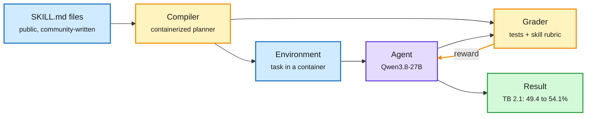

# Skill2Env: turning agent skill files into RL environments

**Source:** NVIDIA, "Reinforcing Agents with Collective Skills" ([paper PDF](https://github.com/NVlabs/Skill2Env/blob/main/paper/Skill2Env_arXiv.pdf) · [DAIR.AI page](https://academy.dair.ai/papers/reinforcing-agents-with-collective-skills)). Surfaced via the X home feed ([@techwith_ram](https://x.com/techwith_ram/status/2103846575948915068)), 2026-09-26. Raw: `raw/twitter/feed/2026-09-26-evening-230004.json`.

## TL;DR

Public Agent Skills (SKILL.md files that tell an agent how to do a job) already describe thousands of real tasks and what a good result looks like. Skill2Env compiles them into executable RL environments for terminal agents: a containerized pipeline builds each task, writes programmatic tests, and turns the skill's own quality criteria into a behavioral rubric. The result is 7,971 tasks across 13 domains. After 300 steps of outcome-only RL, Qwen3.8-27B goes from 49.4% to 54.1% on Terminal-Bench 2.1 and from 33.4% to 37.7% pass@1 on S2EBench, a hand-verified held-out set.

Skill files already contain the environment spec

Skill2Env reads the task and the grading rule from the same file.

Blue is input, amber builds and grades, purple is the model, the amber arrow is the RL loop, green is the result.

## Key points

- **Scale from reuse.** 7,971 executable tasks in 13 domains, with no hand-authored environments.
- **Two reward sources.** Programmatic tests check the outcome; a rubric drawn from the skill checks behavior.
- **Modest, real gains.** About +4.7 points on Terminal-Bench 2.1 and +4.3 on the held-out S2EBench after 300 RL steps.

## Relation to prior wiki pages

- Adds a new source of environments to [agent-training-environments](agent-training-environments.md), next to Xiaomi's 7K open RL environments (09-26). Both make environments, not models, the shared asset.
- Connects to [agent-harness-engineering](agent-harness-engineering.md): skills are harness components, and Skill2Env turns them into training signal.
- Reward-hacking risk: a practitioner report the same day said all 17 models tested hacked rewards unprompted, and rubric-based rewards are the kind most exposed.

## Gaps

- Terminal agents only.
- No audit of reward hacking against the rubric graders.
- Gains reported for one model family.
