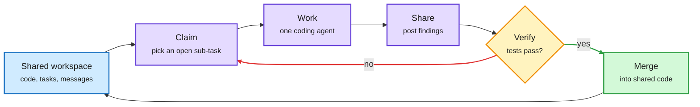

# Agensh: Scaling Organizational Intelligence to 1,024 Agents

**Source:** arXiv [2609.26781](https://arxiv.org/abs/2609.26781) (Microsoft Research). Summary: [DAIR Academy](https://academy.dair.ai/papers/agensh-scaling-organizational-intelligence-to-1-024-agents-2609.26781). Surfaced via the X home feed ([@omarsar0](https://x.com/omarsar0/status/2104377054829613473)), 2026-09-28. Raw: `raw/twitter/feed/2026-09-28-morning-ranked.json`. No alphaxiv overview yet; based on the thread and abstract summary.

## TL;DR

Most multi-agent coding systems have a boss: an orchestrator that splits the work and hands it out. Agensh removes the boss. Parallel coding agents coordinate only through shared state: a shared workspace and a message channel. Each agent gathers context, claims a sub-task, does it, shares what it learned, verifies the result and merges it, all asynchronously. On the five hardest ProgramBench tasks with GPT-5.6-sol, going from 1 to 128 agents raises the mean final test-pass rate from 19.31% to 28.78%, and bigger teams reach a given pass rate sooner. On pandoc, 1,024 agents move the pass rate from 33.89% to 55.06%. The authors report cooperation habits the agents invent on their own that become standard as the team grows.

No orchestrator, just a shared workspace

Every agent runs the same claim, work, share, verify, merge cycle against common state.

Blue is shared state, purple is agent work, amber is the test gate, green is a merge, red is a retry.

## Key points

- **Scale without hierarchy.** Coordination cost is pushed into shared state, not a central planner that would become the bottleneck.
- **Returns are real but sublinear.** 128x the agents buys about +9.5 points on the hardest tasks; 1,024 agents buy about +21 points on pandoc. Cost per point rises steeply.
- **Emergent conventions.** The agents develop cooperation practices unprompted, which the paper documents as a finding rather than a design.

## Relation to prior wiki pages

- **Contrasts with SAT (09-24).** [Self-Organizing Agent Teams](2026-09-24-self-organizing-agent-teams.md) learned reusable team strategies for small, fixed teams on reasoning tasks. Agensh scales team size by three orders of magnitude and gets organization from shared state rather than learned roles. See [multi-agent-systems](multi-agent-systems.md).
- **Harness thesis, at the org level.** [agent-harness-engineering](agent-harness-engineering.md) has argued that the loop around the model, not the model, sets outcomes. Agensh is that argument for many loops at once.

## Gaps

- Token cost per point of pass rate is the missing number; 1,024 frontier-model agents is not cheap.
- Five tasks plus pandoc is a narrow slice; no comparison against a strong orchestrated baseline at matched spend.
