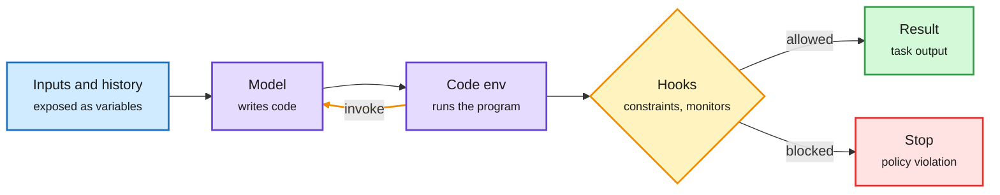

# JAZ: Harness as a Language, a Minimalist Agent Framework with Maximal Expressivity

**Source:** arXiv [2609.26891](https://arxiv.org/abs/2609.26891) (Zhening Li, Joshua Liu, Mateja Vukelic, Nicole Shen, Supriya Lall, Alex Zhang, Omar Khattab, Armando Solar-Lezama; MIT CSAIL). Surfaced via the X home feed ([@omarsar0](https://x.com/omarsar0/status/2103826930181308720)), 2026-09-26. Raw: `raw/twitter/feed/2026-09-27-evening-210705-ranked.json`. Background from the alphaxiv overview.

## TL;DR

Agent frameworks usually bolt on subsystems: a memory store with vector search, a reflection stage, a prompt optimizer. JAZ asks how much of that is needed. It exposes one primitive, `invoke`. The model writes code, can call `invoke` recursively to spawn sub-calls, and sees all its inputs and its own execution history as variables in the code environment. Memory and self-improvement stop being separate modules and become code the agent writes at runtime. Hooks enforce constraints and monitoring. With prompting only, JAZ beats Letta (MemGPT) by 8% at half the cost on the recall-heavy part of StuLife, and beats ACE (Agentic Context Engineering, a self-improvement method) by 4% on AppWorld at lower cost.

The harness is one function the model can call

Memory and self-improvement are programs the agent writes, not modules someone installed.

Blue is input, purple is the model and its code, amber is the hook gate and the recursive loop, green is output, red is a block.

## Key points

- **Generalizes CodeAct and Recursive Language Models:** code as the action space, plus recursive self-calls for inputs larger than one context window.
- **Cost falls because nothing runs unless the agent asks for it.** No always-on retrieval or reflection passes.
- **Governance moves to hooks.** The design keeps a place for enforced constraints even though the workflow is model-written.

## Relation to prior wiki pages

- **Same week, same direction as Just-in-Time Memory (09-24).** [JitMem](2026-09-24-just-in-time-memory.md) showed that summarizing a run when it ends throws away what the next task needs; it curates memory at read time instead. JAZ goes further and removes the memory subsystem entirely. See [agent-memory](agent-memory.md).
- **Harness minimalism.** [agent-harness-engineering](agent-harness-engineering.md) recorded on 09-22 "an argument for its own abolition." JAZ is the strongest benchmark evidence yet for that side: fewer fixed stages, better cost.

## Gaps

- Prompting-only results on two benchmarks; no RL-trained comparison.
- Model-written memory is only as auditable as the hooks. The same week's [trace-tampering paper](../responsible-ai/2026-09-28-agent-trace-tampering.md) shows why that matters.
