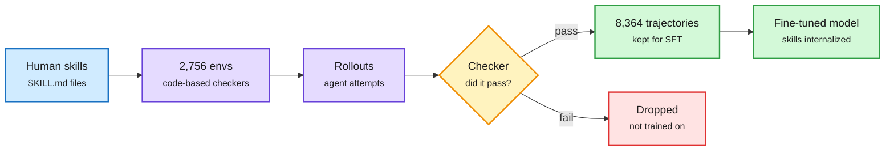

# SkillGym: Internalizing Human Skills into LLMs for Real-World Problem Solving

**Source:** arXiv [2609.27717](https://arxiv.org/abs/2609.27717). Summary: [DAIR Academy](https://academy.dair.ai/papers/skillgym-internalizing-human-skills-into-llms-for-real-world-problem-solving-2609.27717). Surfaced via the X home feed ([@dair_ai](https://x.com/dair_ai/status/2104339055194546595)), 2026-09-27. Raw: `raw/twitter/feed/2026-09-28-morning-ranked.json`. No alphaxiv overview yet.

## TL;DR

Agent Skills are human-written instruction files (SKILL.md) that an agent loads into context to do a job well. SkillGym turns them into training data instead. It converts human-written skills into 2,756 training environments with code-based checkers, collects 8,364 successful trajectories, and fine-tunes on them. Qwen3.5-35B-A3B running inside Claude Code gains 19.10 points on Terminal-Bench 2.1 and 28.13 points on skill-assisted SkillsBench v1.1, reaching 51.47%, above the reported scores for Claude Sonnet 4.6 and GPT-5.4 Mini. With no skills loaded, the trained model beats the base model that has the skills in its context.

Skills stop being prompt text and become weights

The trained model without skills beats the base model with them, so the context tokens are no longer needed.

Blue is the source skills, purple is environment building and rollouts, amber is the checker, green is what gets trained, red is discarded.

## Relation to prior wiki pages

- **Second paper in two days compiling skills into environments.** [Skill2Env (09-27)](2026-09-27-skill2env-skills-to-rl-environments.md) turned public skills into 7,971 RL tasks and gained about 4.7 points on Terminal-Bench 2.1 with outcome-only RL on Qwen3.8-27B. SkillGym uses rejection-sampled fine-tuning instead and reports a much larger 19.1-point gain, on a different base model. See [agent-training-environments](agent-training-environments.md).
- **A token-cost angle.** If skills can move from context into weights, the per-call prompt shrinks. This is the agent version of [parametric-context-internalization](../inference-efficiency/parametric-context-internalization.md).

## Gaps

- Comparisons to closed models use their reported scores, not matched harness runs.
- Whether internalized skills go stale when the underlying tool changes is untested.
