# AutoGym: Blueprint-First Generation of Verifiable Agent Gyms

**Source:** arXiv [2609.22592](https://arxiv.org/abs/2609.22592) (Aarati Andrea Noronha, Kavya Ravikumar, Carly Xiaoyu Lin; Amazon AGI). Surfaced via the X home feed ([@omarsar0](https://x.com/omarsar0/status/2104746239061586055)). Raw: `raw/twitter/feed/2026-09-29-morning-ranked.json` (abstract plus the DAIR.AI paper card).
**Date:** 2026-09-29

## TL;DR

An RL "gym" for agents is three things: a task, an executable environment to attempt it in, and a verifier that tells success from failure. Hand-built gyms are expensive and saturate; single-pass synthetic gyms are cheap but their difficulty is mostly cosmetic (convoluted phrasing a comparable model sees through), and correctness gets judged after the fact by unreliable LLM judges. AutoGym writes all three together from a small domain seed or from past model trajectories. The key move is **blueprint first**: specify the valid solution space, what the environment must contain, and how success will be verified before building the environment, so every task is solvable by construction. Explicit generation parameters then steer difficulty (10% of tasks land in the hard band at low settings, 39% at mid-to-hard settings), and an active curriculum shifts those parameters as the trained model improves. Cost is about $100 to $200 per 50-task batch at 20-way parallelism, with 86% of tasks retained after repair. The Agent World Model baseline is mostly easy for Claude Opus 4.6; AutoGym produces instances that still challenge frontier models.

```mermaid
flowchart LR
  S["Seed<br/><small>domain or old trajectories</small>"] --> B["Blueprint<br/><small>solutions + verify spec</small>"]
  K["Difficulty knobs<br/><small>depth, distractors, obfuscation</small>"] --> B
  B --> E["Environment<br/><small>built to the spec</small>"]
  E --> V["Verifier<br/><small>checks against blueprint</small>"]
  V --> T["Agent RL<br/><small>train and measure</small>"]
  T -->|pass rates| C["Curriculum<br/><small>recalibrates knobs</small>"]
  C -->|harder| K
  classDef input fill:#d0ebff,stroke:#1971c2,color:#1b1b1b,stroke-width:2px
  classDef core fill:#e5dbff,stroke:#6741d9,color:#1b1b1b,stroke-width:2px
  classDef loop fill:#fff3bf,stroke:#f08c00,color:#1b1b1b,stroke-width:2px
  classDef exit fill:#d3f9d8,stroke:#2f9e44,color:#1b1b1b,stroke-width:2px
  class S input
  class B,T core
  class K,C loop
  class E,V exit
  linkStyle 5,6 stroke:#f08c00,stroke-width:2px
```

Write the answer key before building the exam

Solvability is a construction step, so no LLM judge is needed afterwards.

Blue is the seed, purple is the blueprint and the trainee, amber is the difficulty loop, green is the gym that gets built.

## Key points

- **Blueprint first.** Solution space, environment requirements and verification criteria come before the environment. Solvability is a prerequisite, not a post-hoc check.
- **Difficulty as parameters.** Task topology, interaction depth, capability axes, question obfuscation and distractor composition are explicit knobs. Hard-band share: 10% at low settings, 39% at mid-to-hard.
- **Active curriculum.** Performance-informed calibration moves the parameter distribution as the model improves. Example: agents that applied a threshold from the wrong policy trigger more tasks with competing policies.
- **Cost.** About $100 to $200 per 50-task batch, 20-way parallel; 86% of tasks survive repair.
- **Baseline comparison.** Agent World Model's tasks are mostly easy for Claude Opus 4.6; AutoGym's reach the frontier in productivity and temporal-reasoning settings.

## How this relates to prior wiki pages

- **Answers two open questions on [agent-training-environments](agent-training-environments.md).** That page split the problem into supply (environments are scarce) and difficulty (the ones you have are too easy), and flagged that the 09-04 papers omitted build cost. AutoGym addresses both from one generator and publishes a cost per batch.
- **Contrasts with [Environment Evolution (09-04)](2026-09-04-environment-evolution-terminal-agents.md)**, which argued that on-policy co-evolution (mining the trained model's failures) starves once the model gets good, and validated difficulty across unrelated frontier models instead. AutoGym's curriculum is performance-informed, so it inherits some of that risk; its explicit knobs are the hedge.
- **Different input from [Terminal-Universe (09-04)](2026-09-04-terminal-universe-trajectories-to-environments.md)**, which reconstructs environments from logged trajectories. AutoGym can also start from trajectories but generates forward from a spec rather than replaying.
- **Third environment-generation result in three days**, after [Skill2Env (09-27)](2026-09-27-skill2env-skills-to-rl-environments.md) (public skills into about 8K terminal environments) and [SkillGym (09-28)](2026-09-28-skillgym-internalizing-skills.md) (2,756 skill environments with code checkers). Those two use human-written skills as the seed; AutoGym uses a domain seed plus a formal blueprint.
- Earlier synthesis work: [EnvFactory (05-20)](2026-05-20-envfactory-tool-use-agents-executable-environments.md) synthesized executable tool-use environments; [EvoEnv (05-15)](2026-05-15-evoenv-self-evolving-rl-via-environment-synthesis.md) evolved them.

## Gaps

- Captured material is the abstract and a paper card; no RL training gains were in what we read, so it is unclear how much a trained model improves.
- "Hard" is measured against specific frontier models; a difficulty axis defined by the trainee risks the starvation problem above.
- Only productivity and temporal-reasoning domains.
