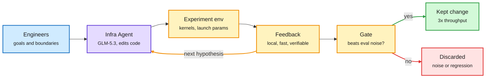

# Zhipu's Infra Agent and the outer RSI loop (plus RRSI's gate and ScientistTwo)

**Sources:** Import AI 474 (Jack Clark, 2026-09-28), section on Z.ai's post "Toward Recursive Self-Improvement: How GLM Built Its Own Inference Infrastructure" ([Import AI](https://importai.substack.com/p/import-ai-474-platonic-mindspace)); raw `raw/rss/2026-09-28-import-ai-import-ai-474-platonic-mindspace-tpus-in-space-zhipu-st.md`. Google Research [RRSI repository](https://github.com/google-research/rrsi). ScientistTwo, arXiv [2609.19644](https://arxiv.org/abs/2609.19644).
**Date:** 2026-09-29

## TL;DR

Zhipu (Z.ai) described how an **Infra Agent powered by GLM-5.3** did much of the work of taking GLM-5.3-Flash from initial model adaptation to production in under two weeks, ending at **3x the end-to-end throughput** of the starting baseline. Engineers set objectives and boundaries; the agent did analysis, hypotheses and code changes; the experimental environment returned feedback. Jack Clark calls this the "outer RSI loop" (recursive self-improvement through the lab's own infrastructure rather than the model's weights). Zhipu's lesson is about the feedback, not the agent: it must be **local** (tied to a specific launch parameter, kernel, input condition or code path), **cheap and timely** (short validation cycles), and **objectively verifiable** (reference implementations, tests, comparable metrics). Two neighbours make the same point from other angles. Google Research's RRSI repository keeps the model frozen, lets an agent rewrite prompts, tools, memory and control flow, and **keeps only changes that beat eval noise**; with Claude Opus 4.8 fixed it reports Terminal-Bench 2.1 74.2% to 80.2% and held-out SWE-bench Verified 82.0% to 83.8% (author-reported). ScientistTwo pushed past the published state of the art on 86 of 107 problems from accepted papers, averaging a 25.2% relative gain, and 9 human researchers judged the maturity of its work roughly equal to the originals.

The loop is only as fast as its feedback

Humans set the boundary; the agent iterates; a gate keeps only verified gains.

Blue is the human boundary, purple is the agent, amber is the feedback loop and gate, green is what ships, red is what gets dropped.

## Key points

**Zhipu Infra Agent**
- GLM-5.3-Flash: adaptation to production readiness in under two weeks; end-to-end throughput tripled vs the initial baseline.
- Division of labour: engineers define objectives and system boundaries; the agent handles analysis, hypotheses and code; the environment gives "layered, timely, and verifiable feedback."
- Three feedback rules: local, inexpensive and timely, objectively verifiable.
- Cultural note from the post: before GLM-4.7, internal use was partly obligation; now GLM-5.3 is "an indispensable daily coding partner" that is "moving steadily toward replacing us." Humans keep the higher-level design line "for a long time to come."

**RRSI repository (Google Research)**
- Frozen weights; the loop iterates prompts, tools, memory and control flow.
- Only changes that beat evaluation noise are kept.
- Claude Opus 4.8 fixed: Terminal-Bench 2.1 74.2% to 80.2%; held-out SWE-bench Verified 82.0% to 83.8%. Author-reported, not independently reproduced.

**ScientistTwo**
- 86 of 107 accepted-paper problems pushed past the reported state of the art, average 25.2% relative gain.
- 9 human researchers judged its research maturity roughly equal to the human originals.

## Why it matters

Inference-infrastructure tuning is the ideal target for this loop because it already has the three properties Zhipu lists: kernels and launch parameters are local, benchmarks are fast, and throughput is an objective number. That makes serving efficiency (a cost lever) one of the first places labs will automate, ahead of research taste. The flip side is that the gains are bounded by the verifier: a loop tuned against a throughput benchmark optimizes that benchmark.

## How this relates to prior wiki pages

- **Same mechanism, now in production at a lab.** [RRSI (09-22)](2026-09-22-rrsi-regularized-harness-evolution.md) showed that unconstrained harness evolution overfits (gains on the evolve split, losses of up to 4.4 points out of distribution) and fixed it with edit budgets, a critic and a pruner. The repo's "beat eval noise" gate is the same discipline. Zhipu's verifiable-feedback rule is the infrastructure version.
- **[ScientistTwo (09-20)](2026-09-20-scientisttwo-recursive-self-improvement.md)** was first read alongside Interconnects' argument that automating experiments is not the same as automating judgement. The 9-researcher maturity result is the strongest counterpoint so far, but it is still a judgement about outputs, not about choosing problems.
- **[AIDE² (09-23)](2026-09-23-aide2-recursive-self-improvement.md)** closed the loop on an agent's own source code; Zhipu closes it on the serving stack, a step closer to the lab's own speed.
- **[Qwen-Planner-Agent (09-26)](2026-09-26-qwen-planner-agent-ai-for-ai.md)** is the other Chinese lab using its model to do AI-for-AI engineering this week.
- **Serving target:** the same GLM-5.3 family's sparse-attention serving economics are on the [SemiAnalysis GLM-5.3 page (09-29)](../hardware/2026-09-29-semianalysis-glm53-sparse-attention-hbm.md).
- Concept pages: [self-evolving-agents](self-evolving-agents.md), [agent-harness-engineering](agent-harness-engineering.md).

## Gaps

- Zhipu's post is a narrative; the throughput baseline, hardware and the share of changes written by the agent are not quantified in what we read.
- RRSI repo numbers are author-reported.
- ScientistTwo's maturity judgement uses 9 raters; no inter-rater agreement was captured.
