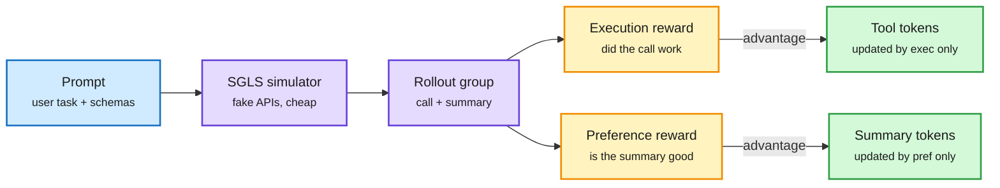

# SLCA-GRPO: Resolving Cross-Segment Credit Misattribution in Tool-Calling RL

**Source:** HuggingFace Daily Papers 2026-09-28 · arXiv [2609.29050](https://arxiv.org/abs/2609.29050) · [HF page](https://huggingface.co/papers/2609.29050)
**Raw:** `raw/huggingface/2026-09-28-slca-grpo-resolving-cross-segment-credit-misattribution-in-t.md`
**Date:** 2026-09-29

## TL;DR

A tool-calling agent's output has two different kinds of tokens: structured tool invocations (which API, which arguments) and a natural-language summary for the user. GRPO (group relative policy optimization, which scores each rollout against the others sampled for the same prompt) gives every token in a rollout the same scalar advantage. So a rollout with the right tool call but a clumsy summary gets its tool tokens punished, and noise from the summary leaks into the tool decision. The paper calls this cross-segment credit misattribution. **SLCA** (Segment-Locked Credit Assignment) computes separate advantages per segment inside the same group of rollouts, with no extra rollouts: an execution reward's advantage goes to the tool tokens, a preference reward's advantage goes to the summary tokens (Hierarchical Rewards, HierR). Training runs against a Schema-Guided LLM Simulator (SGLS) instead of real APIs. On a 7B backbone, under the same training budget, it beats GRPO, ToolPO and RLTR by +2.53 points in-domain, +1.36 on BFCL (the Berkeley Function-Calling Leaderboard) and +9.15 on τ²-Bench, with fewer redundant tool calls.

Each segment gets graded on its own job

Same rollouts, two advantages, locked to the tokens they describe.

Blue is the input, purple is rollout generation, amber is the two reward heads, green is where each gradient lands.

## Key points

- **Failure mode named:** a trajectory-level scalar advantage broadcast to heterogeneous segments is the dominant channel of credit contamination in tool-calling RL.
- **Fix without extra sampling:** segment-level advantages are computed within one GRPO group; no rollouts from intermediate states.
- **HierR:** execution advantages route to tool tokens, preference advantages route to summary tokens.
- **SGLS:** an LLM simulator guided by API schemas replaces real APIs, for cheap, stable exploration.
- **Results (7B):** +2.53 pp in-domain, +1.36 pp BFCL, +9.15 pp τ²-Bench vs GRPO, ToolPO and RLTR at matched budget; faster convergence; fewer redundant calls, so lower serving cost per task.

## How this relates to prior wiki pages

- **A new instance of the token-credit thread on [rl-for-llms](../llms-foundation-models/rl-for-llms.md).** [PACT (09-24)](../llms-foundation-models/2026-09-24-pact-token-credit-critic-alignment.md) derived axioms for token-level credit and showed credit is roughly sparse; [DELTA (05-23)](../llms-foundation-models/2026-05-23-delta-discriminative-token-credit-rlvr.md) reweighted tokens by how much they discriminate good from bad rollouts. SLCA uses structure rather than learned weights: the output grammar itself tells you which reward belongs to which tokens.
- **Same move as [RCCA (08-31)](../llms-foundation-models/2026-08-31-rubric-to-code-credit-assignment.md)**, which mapped rubric items to the code spans they grade. Both route a specific reward to the specific span it measures.
- **On [tool-calling](tool-calling.md):** the reduction in redundant calls matters next to [unnecessary tool availability (09-17)](2026-09-17-unnecessary-tool-availability.md), which found merely having an unneeded tool costs up to 76 points of answer rate. Training that separates the "should I call" decision from the prose is one route to fewer spurious calls.
- **Simulated APIs** carry the same risk flagged on [agent-training-environments](agent-training-environments.md): gains measured against an LLM simulator may not match real endpoints. The τ²-Bench jump is the evidence that some of it transfers.

## Gaps

- Only a 7B backbone; no scaling curve.
- The abstract does not say how the simulator's fidelity was checked against real APIs.
- Assumes a clean two-segment output; interleaved multi-call trajectories with reasoning in between are the harder case.
