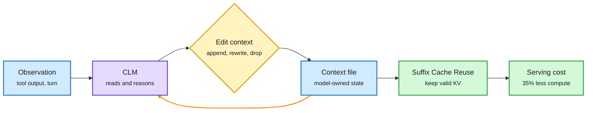

# Context Language Models: the Model Edits Its Own Context

**Source:** HuggingFace Daily Papers, listed 2026-09-30, and the author thread on X (cross-source confirmed via social) · [arXiv 2609.37725](https://arxiv.org/abs/2609.37725) · [author thread](https://x.com/RulinShao/status/2105282444270448647)
**Authors:** Rulin Shao, Hamish Ivison, Nathan Lambert, Mike Lewis, Wen-tau Yih, Luke Zettlemoyer, Pang Wei Koh and others (UW, Meta Superintelligence Labs, MIT, Trillium Labs)
**Raw:** [raw/huggingface/2026-09-30-context-language-models.md](../../raw/huggingface/2026-09-30-context-language-models.md)

## TL;DR

Agents today let an outside harness decide when to summarize, truncate or retrieve, using fixed rules or a short menu of tools. A Context Language Model (CLM) instead treats its own live context as a **file it can rewrite freely**: append, edit in place, delete, summarize, or leave itself notes. Multi-agent setups become several files. Built zero-shot from existing models, CLMs beat state-of-the-art context-management methods: **+11.4% accuracy with 21.5% fewer FLOPs on BrowseComp-Plus**, +5% with 59% fewer FLOPs on a 12-hour EdgeBench task, and 65% more improvement at equal compute on a 24-hour multi-repo agent swarm. The policy can be learned three ways: plain-language instructions, instructions evolved by a skill-optimization loop (+35.9 points held-out), or online RL (Qwen3.5-9B +47.6% on BrowseComp-Plus with 12% fewer FLOPs). The systems piece: arbitrary edits break prefix KV caching, so they co-design **Suffix Cache Reuse**, cutting server compute 35% versus stock SGLang at matched quality.

The context stops being a log and becomes a file

Editing in place saves tokens, but only Suffix Cache Reuse keeps the KV cache from paying for it.

Blue is state, purple is the model, amber is the edit loop, green is the serving fix and its saving.

## How it relates to prior wiki pages

- **The harness-to-model shift on [agent-harness-engineering](agent-harness-engineering.md) gets its strongest evidence.** The 09-28 entries (Jaz, harness as a language; AgentSH, a single primitive at 1,024 agents) shrank the harness. CLMs remove context policy from it entirely. The same-day practitioner essay amplified by Harrison Chase ("harness shifts from deciding to offering") is the product-side version.
- **On [agent-memory](agent-memory.md):** the 09-24 entry said "curate at read time"; CLMs curate continuously at write time, in-context. Compare [Memory Is a Derivation (09-30, arXiv 2609.36130)](https://arxiv.org/abs/2609.36130): 17-21% of compressed agent memories are unsupported by the history they claim to summarize. Model-written context edits need the same audit, and the CLM paper does not report one.
- **On [kv-cache](../inference-efficiency/kv-cache.md):** prefix caching assumes append-only context. Any system that edits history (CLMs, Mutable Transcripts on this week's Kurate list) needs suffix reuse or pays full re-prefill. This is a serving primitive vLLM and SGLang do not ship.
- **Social framing was overstated.** Engagement accounts called it "the end of RAG and LangChain." The authors claim a bitter-lesson result for context policies, which is narrower and better supported.

## Links

- Concepts: [Agent harness engineering](agent-harness-engineering.md) · [Agent memory](agent-memory.md) · [KV cache](../inference-efficiency/kv-cache.md)
- Digest: [2026-10-01](../daily-digest/2026-10/2026-10-01.md)
