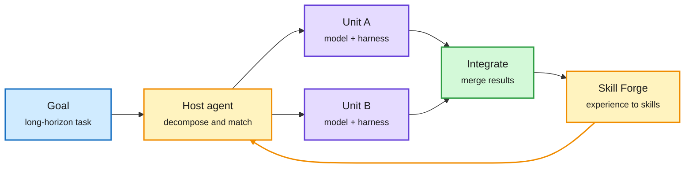

# Raven: The Harness of Harnesses

**Source:** HuggingFace Daily Papers, listed 2026-09-30 (457 upvotes, #1 of the day) · [arXiv 2609.33439](https://arxiv.org/abs/2609.33439)
**Raw:** [raw/huggingface/2026-09-30-raven-the-harness-of-harnesses-for-composable-agentic-intell.md](../../raw/huggingface/2026-09-30-raven-the-harness-of-harnesses-for-composable-agentic-intell.md)

## TL;DR

Hand-built harnesses (the prompts, tools, memory and control loop around a model) get harder to design as tasks get longer, and a harness tuned for one domain transfers poorly. Raven is an open-source multi-agent system that **builds and evolves a harness per model-and-domain pair automatically**, then treats each model-harness pair as a reusable unit. A Host Agent breaks a goal into subtasks, matches each to the best specialist unit, handles dependencies and merges results. A host archive and "EverOS" keep experience across tasks, and "Skill Forge" turns that experience into reusable procedures. The paper gives sufficient conditions under which composing units covers more tasks than any single agent under the same resource budget, and reports large gains over prior agent systems on long-horizon tasks. The abstract gives no specific numbers or cost accounting.

The unit of intelligence is model plus harness

Raven builds one harness per specialty, then a host routes subtasks to them.

Blue is the goal, amber is routing and the learning loop, purple is specialist units, green is the merged result.

## How it relates to prior wiki pages

- **The Host Agent is a router whose options are harnesses.** That is a new routing target for [llm-routing](../ai-routing/llm-routing.md), after model, reasoning effort, loop depth and speed tier.
- **On [agent-harness-engineering](agent-harness-engineering.md):** the 09-23 entry had three groups building harness-optimization loops and agreeing that agents overfit benchmarks when they rewrite their own harness. Google's RRSI (surfaced in the 10-01 Media Zone) adds rules against that. Raven evolves harnesses too and does not describe a guard against overfitting. Same open question as 09-23.
- **Tension with [Context Language Models](2026-10-01-context-language-models.md) (same day):** CLMs move context policy out of the harness into the model. Raven builds more, specialized harnesses. One says the harness thins out, the other says it multiplies. Both may be right at different layers: per-agent context control inside, orchestration outside.

## Links

- Concepts: [Agent harness engineering](agent-harness-engineering.md) · [Multi-agent systems](multi-agent-systems.md)
- Digest: [2026-10-01](../daily-digest/2026-10/2026-10-01.md)
