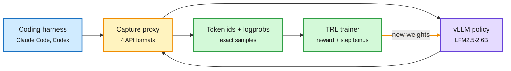

# Multi-Harness RL, ActiveSaddler, ProVer: Training Agents Where They Actually Run

**Sources:** [Hugging Face multi-harness RL guide](https://huggingface.co/spaces/FineEnvs/multi-harness-rl) (via [@huggingface](https://x.com/huggingface/status/2106034221005312448)) · HuggingFace Daily Papers 2026-10-02: [ActiveSaddler, arXiv 2610.00906](https://arxiv.org/abs/2610.00906) · X feed: [ProVer, arXiv 2609.36178](https://arxiv.org/abs/2609.36178) ([@omarsar0](https://x.com/omarsar0/status/2105930871534690714)) · [Long-Transduction, arXiv 2609.38712](https://arxiv.org/abs/2609.38712) (NVIDIA; [@dair_ai](https://x.com/dair_ai/status/2106047824093979033))
**Raw:** [ActiveSaddler](../../raw/huggingface/2026-10-02-activesaddler-automated-curriculum-learning-for-agent-harnes.md) · X feed captures in `raw/twitter/feed/` (private)

## TL;DR

The same model with the same weights scores **62% in one coding harness and 33% in another**. Hugging Face's guide makes that gap trainable without touching any harness: point Claude Code, Codex or OpenCode at a proxy instead of the model API. The proxy speaks all four API formats (OpenAI Chat and Responses, Anthropic Messages, Gemini) and records the exact token ids and log-probabilities vLLM sampled, which become RL training data. Trained across four harnesses, Liquid's LFM2.5-2.6B went **42% to 54%** and used **31% fewer tool calls** (a small bonus for shorter solutions). Training in OpenCode alone took OpenCode from 34% to 58% but did not transfer as well. Imitating 3,189 successful rollouts from Qwen3.8-27B plateaued at **47.5%**, below both RL runs. Everything is open (proxy in OpenEnv, trainer in TRL, tasks, data, seven models).

**ActiveSaddler** optimizes the harness instead of the model, and adds the missing piece: which scenarios to learn from. It treats recurring failures as bandit arms, estimates learning progress per failure pattern, and balances revisiting known weaknesses with exploring new scenarios. Pass@1 rises **4.4 points on GAIA2 and 7.5 on Terminal-Bench 2.0** over the same optimizer with a fixed scenario order. **ProVer** fixes credit assignment in agent RL: GRPO gives every token the same advantage; ProVer has a judge name the segment that separated success from failure, then measures that segment's value by sampling continuations before and after it (+9.91% at 2B, +7.12% at 4B over GRPO). **Long-Transduction** (NVIDIA) shows why harness discipline matters: on simple repetitive work, accuracy falls 62.8% from 4K to 128K context.

Train behind the harness, not inside it

A recording proxy turns any coding agent into an RL environment.

Blue is the unmodified harness, amber the proxy, purple the policy being trained, green the data and trainer.

## How it relates to prior wiki pages

- **The harness is now a training variable, not just an inference wrapper.** The [harness engineering page](agent-harness-engineering.md) tracked harnesses as inference-time scaffolds (Raven 10-01 builds one per model; Mid-Harness 10-02 adds a verifier). Multi-harness RL trains the model across many; ActiveSaddler trains the harness with a curriculum.
- **Imitation plateaus again.** The 47.5% SFT ceiling below RL matches the distillation thread's caution: copying a bigger model's successes is not the same as practicing. Contrast with Finetuning with Sampling (10-03), which argues SFT can match RL if the data is reshaped toward the student's own distribution.
- **Cost angle:** 31% fewer tool calls is a direct serving-cost cut from a reward term.

## Related

[Agent harness engineering](agent-harness-engineering.md) · [Agent training environments](agent-training-environments.md) · [RL for LLMs](../llms-foundation-models/rl-for-llms.md)
