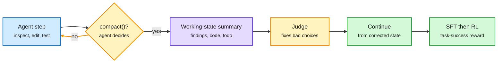

# AutoCompact: learning when to compact context

**TL;DR.** Coding agents usually compact (summarize and drop old history) when the context window hits a fixed threshold. AutoCompact (SMU, NTU, Harvard; arXiv 2610.02163) adds a `compact()` action and trains the agent to decide **when** to call it, **what** working state to keep, and **how** to continue afterward. Training data comes from running the base agent while a judge reviews each compaction decision, summary and post-compaction action, and replaces flawed ones *before they execute*, so every trajectory continues from corrected state. SFT on those trajectories, then RL with task-success reward trains coding and compaction jointly. Result: **+9.2 points on SWE-bench Verified, +5.0 on SWE-PolyBench Verified**, and the gain holds even with a **256K window that never overflows**. Compaction helps as a thinking tool, not only as overflow control.

Compaction becomes a policy action, not a length trigger

A judge fixes bad compactions mid-trajectory, so the training data shows how to resume well.

Blue is the agent's normal work, amber the compaction decision and judge, purple the summary, green the training output.

## Key findings

- Compaction replaces earlier history with a model-written `# Auto Context Summary`; the original task stays in context.
- The three linked decisions (timing, summary content, following the summary) are trained together. Prior approaches trained on summaries alone, so agents often ignored the summary and repeated searches.
- +9.2 / +5.0 absolute pass-rate gains over the base model, across every tested inference budget, with a 16K window (overflow forces fallback compaction) and a 256K window (never overflows).
- The authors frame it as model-harness co-design: the harness supplies the mechanism, the model learns when to invoke it.

## How this relates to prior wiki pages

- **Third paper in four days moving context policy into the model.** Context Language Models ([10-01](2026-10-01-context-language-models.md)) let the model edit its context as a file (+11.4% BrowseComp-Plus, 21.5% fewer FLOPs). FOCUS ([10-03](../inference-efficiency/2026-10-03-kv-streams-and-focus-context-compaction.md)) chose which interaction units to keep, training-free, cutting peak context 48%. AutoCompact adds the learned *timing*. Elvis Saravia's framing of the series, "AutoHarness, then AutoContext, now AutoCompact", names the pattern: harness functions migrating into weights.
- **Pairs with KV-streams (10-03)**, which made dropping turns cheap in the live vLLM cache during agent RL (~2x training). AutoCompact decides when to drop; KV-streams makes the drop free of re-prefill. Neither paper uses the other.
- **Confirms the "state beats history" result** from yesterday's Berkeley paper (a frontier model scored 9 of 40 on long agent logs, 40 of 40 when given current state): the 256K no-overflow gain says long stale history hurts even when it fits.
- Updates [agent-memory](agent-memory.md) and [agent-harness-engineering](agent-harness-engineering.md).

## Gaps

- One base model family, coding only. Robustness across harnesses (Claude Code style vs mini-SWE-agent) is untested; the multi-harness RL result of 10-03 (same weights, 62% vs 33% by harness) suggests it matters.
- No accounting of the cache cost: every compaction invalidates the prefix cache. With cache reads 90%+ of agent input tokens, frequent learned compaction could raise the bill even as it raises accuracy.

**Raw source:** X Following feed, 2026-10-03 ([@omarsar0](https://x.com/omarsar0/status/2106416745686995025)); paper linked above.
