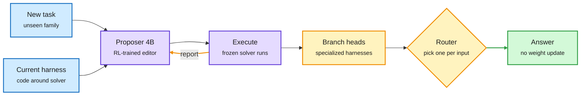

# Harness Learning and Mixture of Self-Improving Branches

**TL;DR.** Two papers from the US Saturday X feed push harness optimization (automatically rewriting the code around a frozen model: its loop, tools, retrieval and checks) one step further. **Harness Learning** (CMU, Stanford, JHU; arXiv 2609.35738) stops searching harnesses per task and instead *trains the editor*: a proposer model reads the task, the current harness and an execution report, writes a code edit, and is rewarded with the revised harness's score. A trained **4B proposer beats its 35B teacher** at single-step revision on Reasoning Gym, including task families held out of training, and a proposer trained on HotpotQA keeps improving harnesses on MuSiQue and 2WikiMultihopQA. **Mixture of Self-Improving Branches** (Meta, Duke, UC; arXiv 2609.37834) attacks the other weakness of Meta-Harness-style search, a single search path that converges to one local optimum: it splits search into branches with their own development subsets and proposal policies, then **routes each new input to one branch's best harness**. Relative gains over Meta-Harness: **+34.8% on Olympiad math** (46.0% to 62.0% with Gemini 3 Flash), +11.6% Terminal-Bench 2.0, +3.8% SWE-bench Lite.

Two upgrades to the harness-rewrite loop

One trains the editor once; the other keeps several harnesses and routes between them.

Blue is input, purple the learned editor and frozen solver, amber the branch-and-route layer, green the result.

## Harness Learning (2609.35738)

- **Framing.** Meta-learning over programs. Harness revisions play the role weight updates play in gradient-based adaptation. The solver never changes, during training or at test time.
- **Training.** Optional SFT on teacher revisions, then RL where the reward is the task score of the revised harness.
- **Transfer.** Revision quality improves on Reasoning Gym families excluded from both SFT and RL. Single-step, the 4B proposer beats the 35B teacher on average. HotpotQA-trained proposers transfer to MuSiQue and 2WikiMultihopQA.
- **Where the gain comes from.** Most of the unseen-task gain comes from RL cutting the share of proposals that produce a broken or zero-scoring harness. SFT alone barely moves that rate. In other words, RL mostly teaches the proposer *not to break the program*.
- **What it learns.** On reasoning tasks the dominant learned structure is an interpreter loop that delegates computation to code. On QA, RL keeps multi-hop retrieval and passes retrieved passages straight to the answer call.
- **Caveat.** Multi-round improvement holds for policies trained on single revisions; training on revision sequences helps only in some settings.

## Mixture of Self-Improving Branches (2609.37834)

- **Problem.** Meta-Harness (iterative code generation plus evaluation) uses one fixed development set and one proposal policy, so evolution follows a single trajectory.
- **Mechanism.** Each branch keeps the development cases its leading harnesses solve better than other branches, drops cases every branch already solves, and rewrites its own proposal policy from its own search history. Branches specialize: in math, one learned to verify answers, the other to build full derivations.
- **Deployment.** A router, configured on development data only, picks one branch head per input before execution.
- **Results.** +34.8% relative on Olympiad math, +11.6% Terminal-Bench 2.0, +3.8% SWE-bench Lite over Meta-Harness.

## How this relates to prior wiki pages

- **Extends the harness-optimization line** on [agent-harness-engineering](agent-harness-engineering.md): Meta-Harness code-space search ([08-25](2026-08-25-meta-harness-code-space-optimization.md)), RRSI's five regularization rules against harness overfitting ([09-22](2026-09-22-rrsi-regularized-harness-evolution.md)), MILO co-evolving harness and search strategy ([10-02](2026-10-02-mid-harness-action-scaling-milo.md)), ActiveSaddler's curriculum ([10-03](2026-10-03-multi-harness-rl-activesaddler-prover.md)). All of those *search* per benchmark. Harness Learning is the first on this page to *amortize* the search into a trained proposer that transfers, the same move RouteFM (10-03) made for routers.
- **Confirms Raven (10-01)**, which auto-built a harness per model and domain and routed subtasks between them ([page](2026-10-01-raven-harness-of-harnesses.md)). Mixture of Self-Improving Branches is the second paper in four days to conclude "keep several harnesses, route between them" instead of crowning one. Routing has moved from choosing models to choosing programs.
- **Answers the 09-23 overfitting worry** in a different way from RRSI: transfer to held-out task families is the evaluation criterion itself, not a regularizer bolted on.
- **Small editor, big solver.** A 4B proposer beating a 35B teacher fits the decision-model pattern on [llm-routing](../ai-routing/llm-routing.md): the control layer does not need a frontier model.

## Open questions

- Harness Learning tests reasoning and multi-hop QA, not long-horizon coding agents, where harnesses are thousands of lines. Does a small proposer scale to that?
- Neither paper prices the search. Mixture of Self-Improving Branches runs several branches; how many execution tokens does +34.8% cost against one Meta-Harness run?
- Can the two compose: a trained proposer per branch, with a router on top?

**Raw source:** X Following feed captures of 2026-10-03 ([@omarsar0](https://x.com/omarsar0/status/2106529236068819394), [@rohanpaul_ai](https://x.com/rohanpaul_ai/status/2106515279627137521)); papers linked above.
