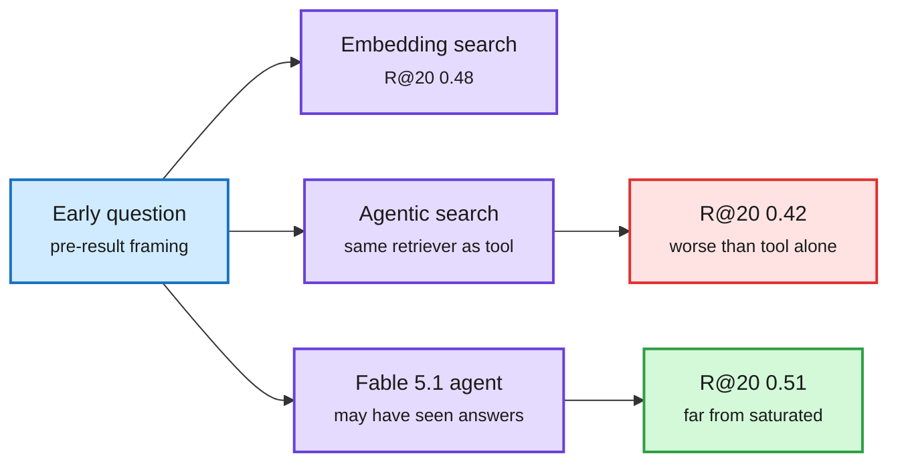

# ScholarCatalyst: a benchmark for research taste

**TL;DR.** Stanford, UW, CMU, AI2, MIT and SNU (Kim, Lee, Neubig, Koh, Khattab, Choi, Finn and others; arXiv 2610.02202) asked **184 lead authors of 207 recent CS papers** to label which earlier papers did, or could have, advanced their project, each with a rationale. The task: given the research question as it stood *before* the project, retrieve those "catalyst papers" from the literature available at the time. **Agentic search does no better than plain embedding retrieval (0.42 vs 0.48 Recall@20)**, even though the agent calls that same retriever as a tool. An agent on Claude Fable 5.1, which may have seen the finished papers in training, reaches only **0.51**.

The agent adds steps but not taste

Wrapping the retriever in an agent loop lowered recall.

Blue is the query, purple the retrieval systems, red the regression, green the best (still low) score.

## How this relates to prior wiki pages

- **Same finding as Taste-Bench (09-23)**, where the best frontier model chose the better research fork 59.7% of the time and more reasoning budget did not help ([page](2026-09-23-taste-bench-tasteful-agent.md)). Two independent benchmarks now say research judgment is the bottleneck for auto-research agents, not tool access.
- **Cost angle:** the agent loop spent more tokens for lower recall. A harness that adds steps without adding judgment is pure cost, the HarnessTax (09-22) lesson in a new domain. See [agent-benchmarks](agent-benchmarks.md).

**Raw source:** X Following feed, 2026-10-03 ([@yoonholeee](https://x.com/yoonholeee/status/2106036734798725577)).
