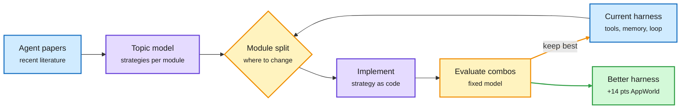

# ScholarEvolve: the literature as a harness search space

**TL;DR.** Harness optimizers (a meta coding agent that rewrites the code around a frozen model: its tool use, memory handling and task loop) usually propose edits from the agent's own failure logs. That makes them reactive: they can only try fixes the meta agent already knows. ScholarEvolve (Microsoft and UC Santa Barbara; arXiv 2609.40169) adds a second source of ideas, the published agent literature. It splits the harness into functional modules (tool use, memory management, task execution), runs topic modeling over recent agent papers to extract distinct improvement strategies per module, implements those strategies, and tests combinations. New papers can be added over time, so research becomes a stream of candidate harness updates. With the model held fixed, **Qwen3.5-27B goal completion on AppWorld Challenge rises from 49.6% to 63.6%**, and **GPT-5.4-mini pass@1 on Tau2-Bench Telecom rises from 72.7% to 81.9%**.

Papers become candidate patches

The meta agent no longer has to invent every fix; it reads what others already found.

Blue is input, purple is the generation step, amber is the selection loop, green is the result.

## Key points

- **The problem it names:** reactive evolution. A meta agent that edits from observed failures explores only the neighborhood of fixes it already knows.
- **The mechanism:** literature as the search space. Topic modeling clusters recent papers into distinct strategies per harness module, so the search covers ideas the meta agent would not propose on its own.
- **Lifelong by design:** adding a new paper adds new candidates. Improvement does not need a failure to trigger it.
- **Results:** +14.0 points goal completion on AppWorld Challenge (Qwen3.5-27B), +9.2 points pass@1 on Tau2-Bench Telecom (GPT-5.4-mini). The model never changes.

## Gaps

- No cost accounting in the abstract: implementing and evaluating strategy combinations is a search over many harness variants, and the token bill matters.
- Two benchmarks and two models. Whether literature-derived strategies transfer beyond tool-use benchmarks (to coding agents on SWE-bench, for example) is untested.
- Topic modeling decides what counts as a "distinct" strategy; a bad clustering silently narrows the search.

## How it relates to prior wiki pages

- **Fourth harness-optimization paper in two days.** [Harness Learning and Mixture of Self-Improving Branches (10-04)](2026-10-04-harness-learning-and-branch-routing.md) trained the editor (a 4B proposer beating its 35B teacher) and split search into routed branches. [ActiveSaddler (10-03 digest)](../daily-digest/2026-10/2026-10-03.md) adapted the training scenarios with a bandit over failure patterns. ScholarEvolve changes the third input: where the candidate edits come from. Editor, scenarios, branches, sources: each paper attacks a different weakness of the same Meta-Harness-style loop.
- **Extends** [agent harness engineering](agent-harness-engineering.md): the concept page's "harness over weights" thesis now has a literature-driven variant, and the wiki itself is an instance of the idea (a knowledge base that turns papers into actionable changes).
- **Contrast with** [ScholarCatalyst (10-04)](2026-10-04-scholarcatalyst-research-taste-retrieval.md), which found agentic search no better than plain embedding retrieval at finding the papers that actually unlock a project. ScholarEvolve assumes the right papers are found; ScholarCatalyst says finding them is the hard part.

Raw: X feed capture `raw/twitter/feed/2026-10-04-afternoon-ranked.json` (gitignored), paper abstract via arXiv.
