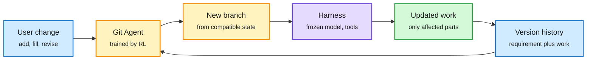

# GitHarness, and why more memory stops helping

**TL;DR.** Two papers on what a harness (the code around a fixed model: context, memory, tools, execution) can and cannot learn.

1. **GitHarness** (arXiv 2609.36789). Users change requirements mid-task: they fill gaps, add new asks, or revise old ones. Agents then either carry stale work forward or rewrite everything. GitHarness stores each requirement state with its matching work as a **Git-style commit**. A trainable Git Agent decides which past version still fits and **branches from it**, so the harness drops obsolete work and redoes only what changed. The Git Agent is trained with black-box RL at the interface, with the harness and task model frozen. On the new MTAgentBench (math, text-to-SQL, agentic search, software engineering, research synthesis) it **beat plain continuation in all 30 tested settings** and, in one coding setup, used **73.6% fewer tokens while scoring higher**.
2. **Harness Evolution as Learning** (arXiv 2609.36892). Treats harness self-improvement for personal agents as a learning problem with approximation, generalization and optimization error. The empirical findings: **written rules work for style but not for state** (a stated spending-total rule still failed 44% of the time; code that kept the total failed 0%). **Memory has a sweet spot**: with Claude Haiku 4.5, preference violations fell from 77% with no memory to 20% at 10 lines, then rose to about 25% with longer memories. Agents that rewrite memory from user complaints improve early, then stall near **48% violations, against 7.1% when simply told every preference**.

Branch from the last version that still fits

A requirement change triggers a checkout, not a rewrite or a blind continue.

Blue is input and history, amber is the version decision, purple is the unchanged harness, green is the updated work.

## How this relates to prior wiki pages

- **Same "state beats history" lesson as AutoCompact (10-04)** and the Berkeley long-log result cited there (a frontier model scored 9/40 on long agent logs, 40/40 given current state). GitHarness makes "current valid state" an explicit, versioned object; the 73.6% token cut is the cost face of the same idea.
- **Puts a ceiling on self-evolving harnesses.** Harness Learning and harness routing ([10-04](2026-10-04-harness-learning-and-branch-routing.md)) showed harness edits can be learned and routed. This theory paper says personalization through harness edits saturates: memory notes help to about 10 lines, then hurt, and complaint-driven rewrites stall far above the "just tell it" floor. Use code for anything the agent must count or track.
- **RRSI (Google, via The Decoder, 10-04)** found self-improving agents memorize their test tasks, and regularizing the improvement step lifts unseen-benchmark scores by up to 4.7 points with about 30% fewer tokens. Together with this paper: self-improvement needs a generalization term, not just more iterations.
- Updates [agent-memory](agent-memory.md), [agent-harness-engineering](agent-harness-engineering.md) and [self-evolving-agents](self-evolving-agents.md).

## Gaps

- GitHarness's 73.6% token cut is one setup; average savings across the 30 settings are not in the captured material.
- The memory sweet spot is shown with Haiku 4.5; larger models may tolerate longer memories.

**Raw source:** X Following feed, 2026-10-04 evening and 2026-10-05 morning ([@rohanpaul_ai](https://x.com/rohanpaul_ai/status/2106793231489110380), [@rohanpaul_ai](https://x.com/rohanpaul_ai/status/2106781194616803778)); abstracts from arXiv.
