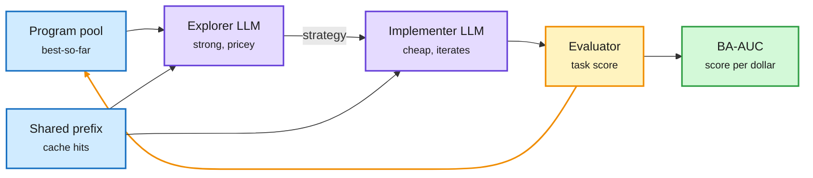

# FrugalEvo: AlphaEvolve-style search scored per dollar

**Source:** HuggingFace Daily Papers, 2026-10-05 · [arXiv 2610.03675](https://arxiv.org/abs/2610.03675) · raw: [raw/huggingface/2026-10-05-frugalevo-towards-cost-aware-llm-guided-program-evolution.md](../../raw/huggingface/2026-10-05-frugalevo-towards-cost-aware-llm-guided-program-evolution.md)

**TL;DR.** LLM-guided program evolution (AlphaEvolve, OpenEvolve and kin) is usually judged by gain after a fixed number of iterations. FrugalEvo judges gain per dollar. A strong, expensive model proposes strategies; a cheap model implements and refines the code. The harness and prompts are arranged so evolution steps share long prefixes, raising prompt-cache hits. A new metric, BA-AUC, is the area under the best-so-far score curve over cumulative LLM spend up to a budget. Across 10 math and systems optimization tasks it matches or beats OpenEvolve, ShinkaEvolve, AdaEvolve and EvoX on final quality and wins BA-AUC on 9. On circle packing it sets a new best for $1.68 (GPT-5.6 Terra + Luna) or $0.55 (GLM-5.3 + Flash), against multi-agent systems like CORAL and SwarmResearch at about $50.

Expensive model plans, cheap model types, the cache does the rest

Prefix-shared prompts turn most of each step into cache reads.

Blue are the pool and cached prefix, purple are the two models, amber is the evaluate-and-loop step, green is the cost-aware metric.

## How it relates to prior wiki pages
- **A routing paper in disguise**: plan-with-big, execute-with-small is the same split as cascade routing on the [LLM routing](../ai-routing/llm-routing.md) page, applied inside a search loop.
- **Confirms the 10-05 cost-unit thread**: Beyond Token Savings (10-05) argued dollars and seconds per finished task, not tokens, are the right scoreboard. BA-AUC is that scoreboard for evolutionary search.
- **Counter-evidence to swarm spend**: beating ~$50 multi-agent systems for under $2 matches Ord's finding (see [swarm scaling](2026-10-06-swarm-scaling-speed-not-capability.md)) that swarms buy speed at a token premium.
- Cache-aware prompt layout echoes Kepler (10-04: 97.37% cache reads in an agent benchmark bill).

## Gaps
- Circle packing and similar tasks have cheap evaluators; costs will look different where evaluation dominates.
- The explorer/implementer split is fixed, not learned.

## Related
[Agent harness engineering](agent-harness-engineering.md) · [Self-evolving agents](self-evolving-agents.md) · [Daily digest 2026-10-06](../daily-digest/2026-10/2026-10-06.md)
