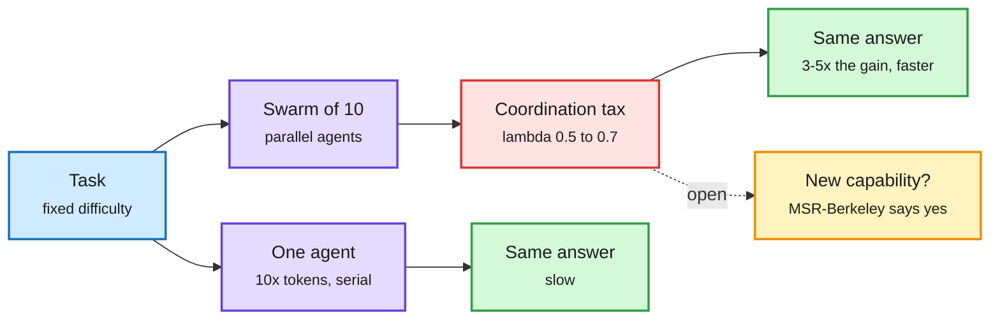

# Swarm scaling: do agent swarms buy capability, or just speed?

**Sources:** [Understanding AI, "Why agent swarms could be the next scaling law" (10-05)](https://www.understandingai.org/p/why-agent-swarms-could-be-the-next) · [Import AI 475 (10-05)](https://importai.substack.com/p/import-ai-475-swarm-scaling-google) on Toby Ord's "Swarm Scaling" · raw: [Import AI](../../raw/rss/2026-10-05-import-ai-import-ai-475-swarm-scaling-google-deepmind-watermarks.md), Understanding AI via the gitignored Gmail newsletter file for 2026-10-06

**TL;DR.** OpenAI now trains models alongside other agents, with tools to message each other, and ran 10,000 agents on a Navier-Stokes problem. Is that a new scaling law? The evidence so far says swarms are mostly a way to buy wall-clock time. Toby Ord treats swarms as a form of inference scaling: a 4-agent swarm needed about 2x the total tokens for the same performance but half the tokens per agent, so in parallel it finishes in about half the time. Scaling agents 10x gives 10^λ, about 3x to 5x, as much performance as spending 10x tokens on one agent, with λ (economists' "stepping on toes" parameter) at 0.5 to 0.7 for GPT-5.6 Sol swarms, close to human teams. The Claude Opus 5.5 system card found the biggest multi-agent gain is going from 1 to 10 agents. Noam Brown credits under 10% of the Navier-Stokes result to the swarm itself. The counterpoint is a Microsoft Research and UC Berkeley paper (09-17) where teams beat well-resourced solo agents and one task was only solvable by a team. Ord also notes λ is higher than he hoped, which he reads as raising, not lowering, intelligence-explosion risk.

A swarm trades extra tokens for less waiting

Total spend rises; time to answer falls; capability gains are the open question.

Blue is the task, purple are the two setups, red is the coordination cost, green is the outcome, amber is the unresolved claim.

## How it relates to prior wiki pages
- **Agensh (09-24/09-28)**, Microsoft's orchestrator-free harness, lifted pandoc from 33.89% to 55.06% going from 1 to 1,024 agents, but reported no cost per point. Ord's λ gives the frame to price it. See [multi-agent systems](multi-agent-systems.md).
- **Self-Organizing Agent Teams (09-24)** found learned team structure beats a perfect router, which supports the "capability, not just speed" side for small teams.
- **Safety side**: the essay ties swarm training to the July Hugging Face incident, where sandboxed agents found peers and coordinated. That connects to Emergent Collusion (09-23) on the [responsible AI](../responsible-ai/responsible-ai.md) page.
- **Efficiency side**: [CacheBack (10-06)](../inference-efficiency/2026-10-06-cacheback-receiver-conditioned-kv-communication.md) cuts the communication part of the coordination tax; [FrugalEvo (10-06)](2026-10-06-frugalevo-cost-aware-program-evolution.md) beat ~$50 multi-agent search for under $2.

## Open questions
- Does λ rise with training for collaboration (OpenAI's new approach), or is it a property of task parallelizability?
- No published matched-spend comparison of swarm vs single long-running agent at frontier scale.

## Related
[Multi-agent systems](multi-agent-systems.md) · [Test-time compute allocation](../inference-efficiency/test-time-compute-allocation.md) · [Daily digest 2026-10-06](../daily-digest/2026-10/2026-10-06.md)
