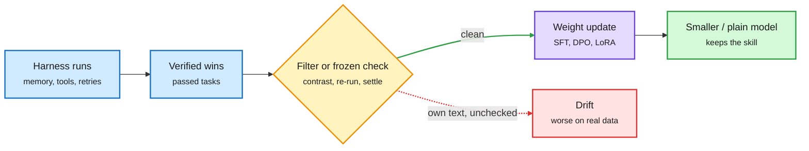

# Putting the harness back into the weights: HAD, RSR, ASCENT, and why self-updates go wrong

**Sources:** X Following feed + HuggingFace Daily Papers, 2026-10-06 US day · [Harness-Aware Distillation (HAD), arXiv 2610.02858](https://arxiv.org/abs/2610.02858) (via @omarsar0) · [Recursive Self-Rewrite (RSR), arXiv 2610.02826](https://arxiv.org/abs/2610.02826) (via X) · [ASCENT, arXiv 2610.05303](https://arxiv.org/abs/2610.05303) (HF) · [Self-Generated Feedback Destabilizes TTT, arXiv 2610.05076](https://arxiv.org/abs/2610.05076) (HF) · [SHIFT / Dynamic Harness Search, arXiv 2610.04137](https://arxiv.org/abs/2610.04137) (HF) · [PluginRSI, arXiv 2609.32423](https://arxiv.org/abs/2609.32423) (HF)
**Raw:** [ASCENT](../../raw/huggingface/2026-10-06-ascent-online-test-time-training-of-long-horizon-agents-via.md) · [TTT](../../raw/huggingface/2026-10-06-self-generated-feedback-destabilizes-test-time-training-a-ca.md) · [SHIFT](../../raw/huggingface/2026-10-06-dynamic-harness-search-building-multi-agent-systems-per-quer.md) · [PluginRSI](../../raw/huggingface/2026-10-06-pluginrsi-recursive-improvement-of-agent-harnesses-with-reus.md) · X feed `raw/twitter/feed/2026-10-0[67]-*-ranked.json` (gitignored)

## TL;DR

For months the [harness engineering](agent-harness-engineering.md) page tracked one move: freeze the model, improve the scaffold around it. Three papers this window run the move backwards. They let a harness (or the deployment stream) discover good behaviour, then **write that behaviour into the weights** so a smaller or harness-free model keeps it.

- **HAD** (distil only what the harness cannot supply). The same teacher is asked for an action with and without harness information (memory, tool logs). The student learns to prefer the "with" action; pairs that contradict harness records are dropped. No rewards or success labels. Plain on-policy distillation raised how often the student *looked* at harness info (65.7% to 73.1% on ALFWorld) but not success (43.1% to 43.5%). HAD's student hits **63.4% on unseen ALFWorld tasks vs 47.0% for the best baseline, beats its 8B teacher, and escapes 59.7% of stalls**.
- **RSR** (rewrite harness wins into general trajectories). Qwen-3.8-27B under three harnesses solves 759 of ~3K terminal tasks, 34.3% more than the best single harness. Raw trajectories are full of harness-specific prompts and control logic, so training on them directly *hurts* (53.4% pass@3). RSR distils each win into a runbook, screens for verifier and answer leakage, and re-executes it under a general harness in a fresh sandbox; only re-passing runs are kept. 2,001 wins become 11,094 training runs. **Terminal-Bench 2 pass@3 rises from 57.0% to 74.2%.**
- **ASCENT** (learn during deployment, safely). An agent sees a stream of related tasks, runs each once, and gets one verification signal. Imitating or reinforcing its own tokens destabilizes the policy. Instead a frozen copy of the model reads the verified trajectory as privileged hindsight and predicts next tokens along it; those predictions are distilled into persistent LoRA fast weights, with invalid-action turns removed. Success and efficiency rise as experience accumulates on ALFWorld, WebShop and AppWorld.

**The caution, same day.** *Self-Generated Feedback Destabilizes Test-Time Training* shows why ASCENT needs its frozen copy. Over 128K-token streams, updating on your own generated text worsens prediction on independent human text at 125M, 760M and 3B, and for Adam on Qwen3-4B. Using a frozen generator removes over 98% of the damage. Its fix, **Settlement**, tests each candidate update on independent real text before committing it.

Explore with the harness, keep it in the weights

Every working recipe puts a frozen or filtered check between experience and the update.

Blue is harness experience, amber is the check, purple is training, green is the cheaper model, red is the self-feedback failure.

## The search side, same list

- **SHIFT (Dynamic Harness Search)** builds a multi-agent harness *per query* without executing alternatives at inference: a local LLM "architect" learns a policy over harness-building actions plus a value function predicting accuracy minus execution cost, and MCTS plans with those predictions. ~80% mean accuracy over 9,193 tasks in six benchmarks, +7.2 points over the best of 17 baselines; a cheap mode beats every baseline with 32% fewer execution tokens. Choosing structure, instructions and tools jointly beats any one alone by up to 9.1 points.
- **PluginRSI** splits a harness into atomized plugins, improves each independently, and keeps them in a shared library. Evolved harnesses transfer to other solver models without re-optimization, and the library speeds later optimization.

## Relation to prior wiki pages

- **Pattern threshold crossed.** HAD, RSR and ASCENT are three papers in one window making the same claim: harness or deployment experience should be consolidated into weights, through a filtered teacher signal rather than raw imitation. The closest prior entry, [TaoLive Harness-Aware Training (08-28)](2026-08-28-taolive-harness-aware-training.md), trained a compact model to *tolerate* harness changes; this week's papers train it to *not need* parts of the harness.
- **Confirms the 10-06 finding that harness choice is model-specific** (GLM-5.2 scoring 23% vs 52% on SWE-bench Pro by harness). RSR's 34.3% union gain over the best single harness is the same fact used as a data source.
- **SHIFT is routing between programs**, continuing the [Mixture of Self-Improving Branches (10-04)](2026-10-04-harness-learning-and-branch-routing.md) line on [LLM routing](../ai-routing/llm-routing.md), now with an explicit cost term in the value function.
- **Self-feedback instability** connects to [self-evolving agents](self-evolving-agents.md): any loop where the model writes its own training data needs an independent check, the same lesson VeriHarness (10-05) drew for consensus verifiers.

## Gaps

- HAD reports ALFWorld-scale tasks with an 8B teacher; whether it holds on SWE-style long-horizon coding is untested.
- RSR's leakage critic is itself an LLM; how many leaked trajectories survive is not audited by humans.
- None reports the inference-cost saving from dropping harness components, which is the economic point.

## Related

[Agent harness engineering](agent-harness-engineering.md) · [Self-evolving agents](self-evolving-agents.md) · [Knowledge distillation](../inference-efficiency/knowledge-distillation.md) · [Parametric context internalization](../inference-efficiency/parametric-context-internalization.md)
