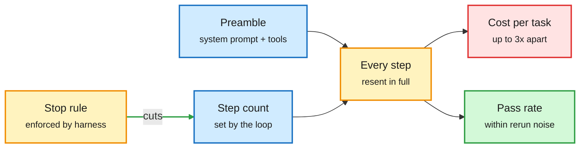

# What a harness buys: tokens, a stopping rule, and a variable (2026-10-08)

**Sources:** "What Does a Harness Buy? Tokens, Mostly" (Shandong University, [arXiv 2610.04433](https://arxiv.org/abs/2610.04433), via [@dair_ai](https://x.com/dair_ai/status/2107920656788767098) and [DAIR summary](https://academy.dair.ai/papers/what-does-a-harness-buy-tokens-mostly-2610.04433)); "Judged Useless, Queried Anyway" ([arXiv 2610.06191](https://arxiv.org/abs/2610.06191), [raw](../../raw/huggingface/2026-10-07-judged-useless-queried-anyway-tool-using-agents-rarely-turn.md)); "Harness as a Language" / JAZ (MIT, [arXiv 2609.26891](https://arxiv.org/abs/2609.26891), via [@rohanpaul_ai](https://x.com/rohanpaul_ai/status/2107810421097042199)); HERMES Dev-Primitives ([arXiv 2610.07832](https://arxiv.org/abs/2610.07832), [raw](../../raw/huggingface/2026-10-07-harness-engineering-for-software-engineering-via-modular-exe.md)); GUI-HARVEST ([arXiv 2610.00948](https://arxiv.org/abs/2610.00948), [raw](../../raw/huggingface/2026-10-07-gui-harvest-self-improving-gui-agents-through-evidence-drive.md)); EVISKILL ([arXiv 2610.05030](https://arxiv.org/abs/2610.05030), [raw](../../raw/huggingface/2026-10-07-eviskill-grounding-skill-evolution-in-replayable-evidence.md)).

**TL;DR.** The cleanest controlled study yet of harness effects says the harness mostly sets the bill, not the score. Five models, three production harnesses (Claude Code, mini-SWE-agent, OpenCode), SWE-bench Verified, with reruns to measure noise. On 447 tasks Claude Code and mini-SWE-agent are within 5 points. On a 45-task hard set, swapping harness flips 13% of tasks, exactly as many as rerunning the same harness. The only effect above noise is a loss (OpenCode, up to 9 points, half from its output cap). But **cost per task differs up to 3x**, set by the system prompt and tool schemas resent at every step, times the number of steps. A second paper shows where a harness *does* change behavior: agents call a dead tool's results "useless" 97-100% of the time yet keep calling it; prompting does not fix this, and only a harness-enforced rule (answer after five useless results) makes stopping follow evidence.

The harness writes the bill at step one

Preamble size times step count sets cost; score differences sit inside rerun noise.

Blue are the two cost drivers, amber the loop and the one lever that works, red the cost, green the score that barely moves.

## Key points

- **Statistical resolution matters.** At the observed discordance, 45 tasks detect a 13-point gap only half the time; 447 tasks resolve about 5 points. Many advertised harness gains are below that.
- **Cached-input pricing scales the bill but does not reorder harnesses.**
- **Judged Useless, Queried Anyway.** Seven agents, controlled source failures. Permission to answer from memory or a reasoning mode triggers early stops regardless of evidence; a stated budget pushes 7-8B models to stop at the deadline. Only the enforced integration step makes stopping evidence-driven; it raises failing-source success for every model and holds the stop point fixed when the budget doubles. Pre-registered replication on 300 new questions.
- **JAZ (Harness as a Language).** The agent sees its own prompt and history as Python variables it can search and pass to subagents by reference. A plain loop then beats Letta on long-range memory (69.9% vs 61.8% on StuLife) and ACE on self-improvement (74.2% vs 69.9% on AppWorld), each at under half the cost.
- **HERMES.** Each repository component gets a resident LLM ("Dev-Primitive"). +12.4% over matched harnesses on four SWE benchmarks; with Qwen3-8B primitives it stays within 4.5% of an all-GPT-5.6-Sol setup at 26.2% lower cost on Terminal-Bench 4.0.
- **GUI-HARVEST and EVISKILL** automate harness and skill edits from replayable evidence: +12.3 points for Qwen3-VL-32B on OSWorld-Verified; a frozen optimized harness lifts GPT-5 by 13.9 points on WindowsAgentArena.

## How this relates to prior wiki pages

- **Tension with the 10-06 harness-search entry in [agent harness engineering](agent-harness-engineering.md).** SelfSearch found a Codex-level harness for $4.03 and SHIFT reported +7.2 points. Today's noise floor says gains of that size need 447+ tasks and reruns to be believed. Treat single-run harness gains as unconfirmed.
- **Confirms Garry Tan's 10-06 claim** (lab harnesses are incentivized to burn tokens) with a measured mechanism: the preamble.
- **Extends [Beyond Token Savings (10-05)](../inference-efficiency/2026-10-05-context-compression-beyond-token-savings.md):** cost must be measured per task, not per token, and the harness preamble is a first-class cost term.
- **Agent-memory link:** JAZ joins the 08-2026 "RAG is broken" saved-reading cluster in [agent memory](agent-memory.md): pass context by reference, do not copy it.

## Gaps

- The harness study uses SWE-bench Verified only; terminal and web tasks may differ.
- JAZ comparisons are against two systems on two benchmarks.

## Related

[Agent harness engineering](agent-harness-engineering.md) · [Agent memory](agent-memory.md) · [Tool calling](tool-calling.md) · [Self-evolving agents](self-evolving-agents.md)
