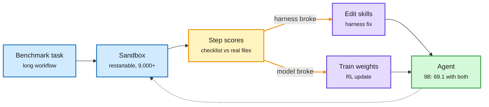

# Harness versus weights: HERMES, RSIGym, VERA, Recursive Game Creator (2026-10-09)

**Sources:** X home feed: HERMES / Dev-Primitives ([arXiv 2610.07832](https://arxiv.org/abs/2610.07832), via [@omarsar0](https://x.com/omarsar0/status/2108360049848717588), UIUC); RSIGym ([arXiv 2610.10310](https://arxiv.org/abs/2610.10310), via [@rohanpaul_ai](https://x.com/rohanpaul_ai/status/2108077761411846591), Evolvent AI and NUS); VERA ([arXiv 2610.05923](https://arxiv.org/abs/2610.05923), via [@rohanpaul_ai](https://x.com/rohanpaul_ai/status/2108264146202710372), NVIDIA). HuggingFace 2026-10-08 and Kurate cs.AI #9: Recursive Game Creator ([arXiv 2610.08621](https://arxiv.org/abs/2610.08621), [raw](../../raw/huggingface/2026-10-08-recursive-game-creator-an-agentic-product-level-experience-o.md)). Abstracts and curator summaries.

**TL;DR.** Four papers measure the same split: how much of an agent's result comes from the harness (the code around the model) versus the weights. **HERMES** gives every repository component its own resident LLM that knows that component's code and dependencies (a "Dev-Primitive"), wakes only the components a task needs, and maps test failures back to the components that must change. Same model, same effort setting: GPT-5.6 Sol goes from **6.5% to 31.0%** on whole-repository migration when Codex's harness is swapped for HERMES; +12.4 points on average over matched harnesses across four benchmarks; with strong activation and diagnosis models, **Qwen3-8B components come within 4.5 points of an all-GPT-5.6 Sol setup and cut Terminal-Bench 4.0 inference cost by 26.2%**. **RSIGym** lets frontier agents improve another model through budgeted services: Claude Opus 5 lifted Qwen3.5-35B-A3B-Base from 17.67% to 50.33% on SWE-bench Verified on $500 of services, and heavier training scored lower in 8 of 10 small tests than fixing the harness. **VERA** turns benchmarks into 9,000+ restartable sandboxes with per-step checklist scores and alternates model training with skill-file edits: a 9B agent scores 69.1 with both, 56.1 with skill edits alone, 43.3 with training alone. **Recursive Game Creator** (Designer, Builder, coding-native Player, Reviewer in a loop) reaches 77.89 on GameCraft-Bench and +34.1% strict success over the same-model baseline.

Most of the gain sits in the harness, but not all of it

VERA's split: alternate skill edits and training, guided by per-step scores.

Blue is the task and sandbox, amber the step-level diagnosis, purple the two kinds of fix, green the improved agent.

## Key points

- **This complicates 10-08's harness study.** Yesterday's controlled study found swapping among three mainstream coding harnesses moved scores no more than a rerun but moved cost per task up to 3x ([harness buys tokens](2026-10-08-harness-buys-tokens-and-stopping-rules.md)). HERMES moves the score 4.8x on one task class. The two fit if mainstream harnesses are near-equivalent and a structurally different harness (component-resident models plus dependency-aware activation) is not.
- **HERMES is a routing result in disguise.** Small resident models per component, a strong model only for activation and diagnosis: that is the planner/executor split FrugalEvo showed (10-06, strong proposer plus cheap implementer, under $2), applied inside a repository. The 26.2% cost cut is the cost-optimization angle.
- **VERA quantifies "half the gain".** Training alone or harness alone leaves about half the improvement unclaimed. That is the first number on this wiki for the joint optimum, and it supports RSIGym's "fix the harness first" from the other side.
- **Recursive Game Creator is the day's only HF + Kurate overlap**, but Kurate's tournament has not scored this week (every entry sits at the 1200 default), so the cross-source signal is weak.

## Gaps

- HERMES: per-component resident LLMs cost memory and setup; the abstract reports inference cost on one benchmark only.
- RSIGym: six frontier agents, one base model, small budgets.
- VERA: one medical research benchmark for the headline numbers.

## Related

[Agent harness engineering](agent-harness-engineering.md) · [Self-evolving agents](self-evolving-agents.md) · [Agent training environments](agent-training-environments.md) · [LLM routing](../ai-routing/llm-routing.md)
