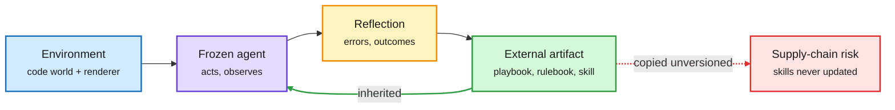

# Agent shorts: environments, self-improvement and oversight (2026-10-10)

**Sources:** HuggingFace Daily Papers 2026-10-09 (raw files under `raw/huggingface/2026-10-09-*`); Microsoft Research and Google Developers posts from the lab watcher ([raw](../../raw/labs/2026-10-10-015358-labs.md)); X home feed. Abstracts and posts.

**TL;DR.** The day's top HF paper (AgentGarten, 131 upvotes) and most of the top ten are agent papers. Three strands: environments are becoming code plus a learned renderer, self-improvement is moving into external rulebooks and playbooks while weights stay frozen, and oversight is shifting to monitoring what the agent actually did.

Weights stay frozen; the learning lives outside the model

Playbooks, rulebooks and skills carry the improvement from one run to the next.

Blue is the environment, purple the agent, amber reflection, green the reusable artifact, red the risk when artifacts spread as copies.

## Environments

- **AgentGarten** ([arXiv 2610.12374](https://arxiv.org/abs/2610.12374)): simulators and game engines hold persistent state and rules; a shared neural renderer (a video model distilled with "Adversarial Forcing" for real-time use) produces realistic observations. Agents improve by distilling each round into playbooks the next agents inherit, learning in about 4 rounds where a conventional RL agent needs millions of steps.
- **Trace2Env** ([arXiv 2610.06100](https://arxiv.org/abs/2610.06100)): when the real system is unavailable but interaction traces exist, build a "worldbook" and let a world-model agent play the environment; actions trained against it replay validly in the real system more often.
- **Learn2Play Bench** ([arXiv 2610.08215](https://arxiv.org/abs/2610.08215)): text games with novel rules. Keeping full action records beats summarizing them into rules; humans still peak higher; and with the backbone fixed, changing the harness raises scores while lowering inference cost.

## Self-improvement with frozen weights

- **Memento 3** ([arXiv 2610.11794](https://arxiv.org/abs/2610.11794)): a natural-language rulebook of revisable hypotheses, compiled to code for prediction and planning; updates are kept only if replay reproduces observed transitions exactly. Clears every level of all 25 public ARC-AGI-3 games using 44% of the human action count.
- **Station** ([arXiv 2610.08927](https://arxiv.org/abs/2610.08927)): a multi-agent "scientific ecosystem" with a supervisor and periodic meta-reflection rediscovers 62.7% of the findings of three withheld ICLR orals, vs 15.4% for Codex Multiagent-v2 and 14.4-20.6% for AI Scientist-v2. Contrast with Epoch's same-week test where agents reached 35% of a human method's gains at best ([unintended actions page](../responsible-ai/2026-10-10-anthropic-unintended-model-actions.md)).
- **Opera** ([arXiv 2609.33987](https://arxiv.org/abs/2609.33987)): a verbal critic that tracks each correction until resolved; +12.4 / +15.0 / +8.9 points on Terminal-Bench 2.1, a SWE-Bench Pro subset and DeepSWE, and its rollouts fine-tune Qwen3.5-9B by +10.2 points.
- **Agent Lightning v1.0** (Microsoft Research, [post](https://www.microsoft.com/en-us/research/blog/agent-lightning-v1-0-a-3500-line-lightweight-agentic-rl-framework-for-training-agents-with-real-harnesses/)): "Harnessed Agentic RL" trains the deployed harness unchanged through an LLM proxy, in about 3,500 lines on plain Kubernetes; Qwen3.5-9B SWE-bench Verified 41.8% to 56.4% with about 6,000 samples.

## Oversight and supply chain

- **Skill Constellations** ([arXiv 2610.11169](https://arxiv.org/abs/2610.11169)): the first dated copy network of SKILL.md files, 2,193,119 adoptions on GitHub. A few repos source almost all copies, stars do not identify them, and copies almost never pick up fixes from their source. Auditing the 100 repos its model ranks highest prevents 14.9% of later high-risk adoptions vs 0.5% for the 100 most starred.
- **Evidence-Grounded Behavior Graph** ([arXiv 2610.06406](https://arxiv.org/abs/2610.06406)): AgentMonBench plus a training-free graph that groups source-linked evidence into behaviors so a monitor can find which autonomous decisions need user review.
- **Accurate but Not Humble** ([arXiv 2610.12360](https://arxiv.org/abs/2610.12360)): agents often detect a knowledge conflict early and then drop it; higher task accuracy does not mean better communication of unresolved uncertainty.

## Related

[Self-evolving agents](self-evolving-agents.md) · [Agent training environments](agent-training-environments.md) · [Agent harness engineering](agent-harness-engineering.md) · [Agent benchmarks](agent-benchmarks.md)
