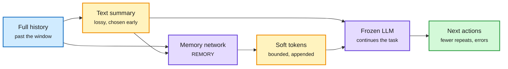

# Compaction is a bet: REMORY, incremental deep research, and the swarm essay (2026-10-10)

**Sources:** HuggingFace Daily Papers 2026-10-09: REMORY, Learning Residual Memory for Context Compaction ([arXiv 2610.11287](https://arxiv.org/abs/2610.11287), [raw](../../raw/huggingface/2026-10-09-remory-learning-residual-memory-for-context-compaction.md)); Incremental Open-Ended Deep Research with Structured Harness ([arXiv 2610.11566](https://arxiv.org/abs/2610.11566), [raw](../../raw/huggingface/2026-10-09-incremental-open-ended-deep-research-with-structured-harness.md)). Prime Intellect, [On the Nature of the Swarm](https://www.primeintellect.ai/blog/on-the-nature-of-the-swarm) (Konstantin Dunas, via [@vincentweisser](https://x.com/vincentweisser/status/2108665223293067613)) and the Prime Agent Rust rewrite ([@PrimeIntellect](https://x.com/vincentweisser/status/2108674740735164862)), X feed. Abstracts and article text.

**TL;DR.** Agents now run far past their 1M-token windows by *compacting*: summarize, hand off to a fresh context, continue. Prime Intellect's essay names the cost: **every compaction is a bet** on what will matter later, and the summarizer must decide before it knows. Writing notes to disk turns the question from "what must I remember" into "what must I know exists," but re-reading costs the very context that ran out, and whatever the previous agent *understood* is gone. The essay's conclusion: inference scaling ends in many agents (sub-agents and swarms), and Prime Agent demonstrated it by orchestrating 2,000+ agents across 10,000+ sandboxes for two weeks to rewrite itself in Rust. **REMORY** attacks the bet directly: a small network writes a bounded set of **soft memory tokens** appended after the text summary, trained so a frozen LLM's continuation matches what it would produce with full history. It approaches full-context quality on SummHay using **5.2% of input positions**, and cuts repeated tool outputs and tool errors on BrowseComp and Terminal-Bench 2.1 for Qwen3.8-27B and GLM-5.3-Flash. **Incremental-OEDR** keeps a research report as a structured evolving state and updates it instead of regenerating: 33% fewer tokens and 61% fewer search calls on DeepResearch Bench.

The summary gets a residual connection

Text summary carries what the agent chose to keep; soft tokens carry what it could not name.

Blue is the history, amber the two compressed carriers, purple the trained memory net and the frozen model, green the result.

## How it relates to the wiki

- **Answers the 10-04 open question from a different angle.** [AutoCompact (10-04)](2026-10-04-autocompact-learned-compaction.md) learned *when* to compact (+9.2 SWE-bench Verified). REMORY learns *what survives* beyond words. [Just-in-Time Memory (09-24)](2026-09-24-just-in-time-memory.md) argued to defer curation until the question is known; REMORY instead makes the early summary less lossy. Both reject blind compression. See [Agent memory](agent-memory.md).
- **Cost link to KV cache.** Soft tokens are a learned latent of the dropped history, close in spirit to [Context Memorization (05-20)](../inference-efficiency/2026-05-20-context-memorization-attention-state-memory.md). 5.2% of positions is a direct prefill and KV saving, and unlike a rewritten summary it does not have to be re-read from disk.
- **Swarm vs compaction.** The essay's case for swarms is that a sub-agent's fresh context is cheaper than rebuilding understanding after compaction. Anthropic shipped exactly that this week (Claude Managed Agents dynamic workflows, up to 1,000 sub-agents; one agent found at most 27 of 70 planted bugs, the workflow 66). The [multi-agent systems](multi-agent-systems.md) trend now has a capacity argument, not just a parallelism one.

## Gaps

- REMORY needs training per base model; transfer across model families is not shown.
- The swarm essay is an argument, not a measurement; Prime Agent's rewrite has no published cost.

## Related

[Agent memory](agent-memory.md) · [Multi-agent systems](multi-agent-systems.md) · [KV cache](../inference-efficiency/kv-cache.md) · [Agent harness engineering](agent-harness-engineering.md)
