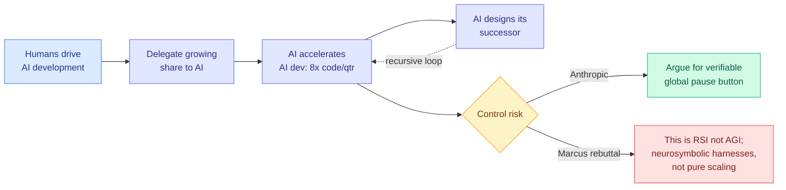

# Anthropic: "When AI builds itself" — recursive self-improvement and the case for a pause button

**TL;DR.** The Anthropic Institute published an essay arguing that AI is already accelerating AI development, and that the trend points toward recursive self-improvement (RSI): an AI capable of autonomously designing and developing its own, more capable successor. Its headline internal data point: Anthropic engineers now ship on average 8x as much code per quarter as they did across 2021-2025, and (per The Decoder's coverage) more than 80-90% of production code now comes from Claude. A second data point: on AI-research next-step decisions, shown a session where a human researcher took a wrong turn, "Mythos Preview" picked a better next move 64% of the time, up from 22% in 2024. Anthropic frames RSI as bringing enormous upside but also raising the risk of humans losing control, and uses it to argue for a verifiable, global development pause that it says it would join if other frontier labs demonstrably did the same.

**Source:** Anthropic Institute (via Twitter @AnthropicAI, @ns123abc, @_sholtodouglas, @eliebakouch; The Decoder; Gary Marcus)
**Links:** [Anthropic essay](https://www.anthropic.com/institute/recursive-self-improvement) · [The Decoder](https://the-decoder.com/anthropic-says-claude-now-writes-over-90-of-its-code-and-wants-the-world-to-have-an-ai-pause-button/) · [Gary Marcus rebuttal](https://garymarcus.substack.com/p/no-need-to-panic-about-anthropics)
**Raw:** [raw/rss/2026-06-05-the-decoder-anthropic-says-claude-now-writes-over-90-of-its-code-an.md](../../raw/rss/2026-06-05-the-decoder-anthropic-says-claude-now-writes-over-90-of-its-code-an.md) · [raw/rss/2026-06-05-marcus-on-ai-no-need-to-panic-about-anthropic-s-new-blog.md](../../raw/rss/2026-06-05-marcus-on-ai-no-need-to-panic-about-anthropic-s-new-blog.md) · [raw/twitter/2026-06-05-morning.md](../../raw/twitter/2026-06-05-morning.md)

## Key claims

- **8x code per quarter** for Anthropic engineers vs the 2021-2025 baseline; 80-90% of production code now Claude-written (per The Decoder).
- **AI-research decision quality:** Mythos Preview beat the human's next-step choice 64% of the time (up from 22% in 2024) on sessions where the researcher had taken a wrong turn.
- **Policy ask:** a *verifiable* global development pause, conditional on reciprocity from other frontier labs. RSI is "not inevitable" but "could come sooner than most institutions are prepared for."

## The pushback (and the caveats from inside)

**Gary Marcus** ("No need to panic"): the results show RSI-as-coding-tool, not AGI. His advisory: AGI (a machine doing anything a human can, autonomously) is *harder* than recursive self-improvement of code; the blog demonstrates faster coding under human control, not autonomous general capability. His sharper claim: this is a win for *neurosymbolic* systems (LLMs plus harnesses and symbolic tools), not for pure scaling, which he argues has "largely hit a wall" and is being "rescued" by symbolic scaffolding. He also reads the framing as a bait-and-switch: invoke loss-of-control fear, then show only faster coding.

**@eliebakouch** (HuggingFace), a sympathetic critic, flagged a methodology problem in the headline plot: it is unclear whether researchers were using the newest model (Opus 4.7) at each point, and the 4-week trailing average smooths out the step-change a new model release should produce, so the curve may overstate a smooth trend and hide discrete capability jumps. **@_sholtodouglas** (Anthropic) added the practitioner's view: he feels "IO-bandwidth limited managing concurrent threads," and expects the abstraction level to keep rising until models "only come to us for hard calls."

## Why this matters for the wiki

This is the industry-side bookend to today's research signal. While Anthropic argues AI is recursively accelerating AI, HuggingFace served a six-paper cluster on *self-evolving agents* whose keystone, [Rethinking Continual Experience Internalization](../agentic-systems/2026-06-05-continual-experience-internalization.md), found that naive iterative self-improvement **collapses** rather than compounds unless experience is principle-level, state-aligned, and stably internalized. The research community is documenting how brittle self-improvement actually is at the exact moment the industry narrative treats its acceleration as a smooth, possibly runaway trend. That gap, optimistic macro-trend vs measured micro-fragility, is the synthesis worth holding.

It also connects to the "end of free compute" thread (GitHub Copilot usage-based billing, Anthropic steering users to per-token API): the same 8x-productivity story is what makes per-token economics bite, because autonomous multi-hour agent sessions are exactly what blew up the all-you-can-eat subscription model.

## Related pages
- [../agentic-systems/2026-06-05-continual-experience-internalization.md](../agentic-systems/2026-06-05-continual-experience-internalization.md)
- [../responsible-ai/responsible-ai.md](../responsible-ai/responsible-ai.md)
