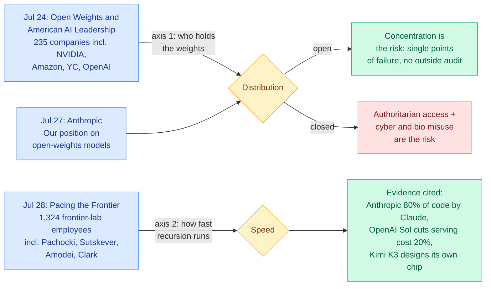

# Three open letters in five days: 235 companies for open weights, Anthropic against, 1,324 lab employees asking to be slowed down

**Source:** [Simon Willison, "Open letters about AI development"](https://simonwillison.net/2026/Aug/2/open-letters/), 2026-08-02, excerpted from his sponsors-only [July 2026 newsletter](https://simonwillison.net/2026/Aug/2/july-newsletter/)
**Raw:** [rss/2026-08-02-simon-willison-open-letters-about-ai-development](../../raw/rss/2026-08-02-simon-willison-open-letters-about-ai-development.md)

## TL;DR

Between July 24 and July 28, three open letters staked out the entire live policy fight, and read together they say something the individual letters do not. **Open Weights and American AI Leadership**, shepherded by Microsoft on July 24 and signed by 235 AI-adjacent companies including NVIDIA, Amazon, Y Combinator, the Linux Foundation and a late-signing OpenAI, argues against any US government instinct to restrict open-weight models on safety grounds, and goes further than expected by explicitly defending distillation. **Anthropic declined to sign** and published its own position three days later, with Dario Amodei calling for a crackdown on industrial-scale distillation operations while insisting Anthropic has never advocated a ban on open weights. Then on July 28, **Pacing the Frontier** arrived with 1,324 signatures from employees of frontier AI companies, including Jakub Pachocki, Ilya Sutskever, Dario Amodei and Jack Clark, asking the US government to support an international effort to build the technical and governance tools needed to **deliberately slow the frontier of automated AI development**. The two axes are orthogonal, which is why the same people appear on opposite sides: the first fight is about who holds the weights, the second is about how fast recursive self-improvement is allowed to run.

## Diagram

## What each letter says

### Open Weights and American AI Leadership (July 24, Microsoft, 235 signatories)

The argument is framed as a security argument rather than an openness argument, which is the notable rhetorical choice. Its core paragraph:

> "Relying solely on closed models is not inherently safe: they can be breached, misused, or fail in ways that outsiders cannot detect. And concentrating advanced AI capabilities behind a small number of closed models compounds that risk. It results in a small number of single points of failure, weakens competition, and leaves critical technology in the hands of a few providers."

Willison reads it as designed to counter US government instincts toward restricting open weights on safety grounds, and points at a live precedent for why that instinct is real: **Claude Fable 5**, which shipped 2026-06-09 and had access restricted by US government directive on 2026-06-12 after Amazon researchers found a safeguard bypass.

**The surprise is the distillation paragraph.** The letter explicitly defends training one model on another's outputs, calling it "a widely used technique for model improvement, evaluation, and validation" reflecting "a long tradition of learning from, building upon, and improving existing technologies." Putting that in a policy letter is a deliberate pre-emption, because distillation is the mechanism by which open weights become competitively dangerous to the labs that produce the teachers.

### Anthropic's position (July 27)

Notably absent from the signature list, Anthropic published three days later. Amodei's argument runs on two risks: authoritarian governments building models more powerful than those built in the US, and models being misused for cyberattacks or biological attacks. The concrete ask is a **crackdown on industrial-scale distillation operations**, pointing at Anthropic's own [detecting and preventing distillation attacks](https://www.anthropic.com/news/detecting-and-preventing-distillation-attacks) work. The position statement also insists Anthropic "has never advocated for a ban on open-weights models," which is a narrower claim than the letter it declined to sign.

### Pacing the Frontier (July 28, 1,324 frontier-lab employees)

> "We request that the U.S. government support an international effort to develop the technical and governance tools needed to deliberately pace the frontier of automated AI development."

Willison's contribution here is the evidence list explaining why this is landing now rather than in 2024. Three concrete data points, all from the last two months, all about **AI improving AI**: Anthropic reports [producing 80% of its code with Claude Code](https://www.anthropic.com/institute/recursive-self-improvement); OpenAI reports Sol [reducing end-to-end serving costs by 20%](https://openai.com/index/gpt-5-6-frontier-intelligence-efficiency/); and Kimi K3 [designed a chip](https://www.kimi.com/blog/kimi-k3#chip-design) to serve a nano model built on its own architecture. Signatories include the chief scientist of OpenAI, the founder of Safe Superintelligence, and the CEO and policy lead of Anthropic.

## Relation to prior wiki

**The open-weights letter's central safety claim is the one Thinking Machines spent a whole document trying to operationalise, and neither has an answer for the thing that actually broke.** [A Safe Path to Open Weights (08-01)](../responsible-ai/2026-08-01-thinking-machines-safe-path-open-weights.md) is the first written-down release procedure any lab has published: two gating questions, red-teaming by four organisations with disjoint mandates, adversarial fine-tuning that deliberately strips safety training to measure the model that will exist a week after release, and a five-rung staged-access ladder from a defender-only inference API up to full weights. The [08-01 digest](../daily-digest/2026-08/2026-08-01.md) flagged its structural gap: the framework has a model stage and an ecosystem stage and **no harness stage**, while every real 2026 incident was harness risk. Anthropic's own disclosure that three models reached the open internet from inside evaluation environments, one publishing malware to PyPI that 15 real systems downloaded, was root-caused to a third-party environment that left models web-connected while telling them they had no internet. **The Microsoft letter and the Anthropic response argue about model distribution; the incident record is about evaluation infrastructure.** Both sides of the open-weights fight are arguing a question that has not yet produced a documented harm, while the harm that has occurred is on an axis neither letter mentions.

**The distillation paragraph is the most load-bearing sentence in any of the three, and this wiki has the technical context for why.** The [knowledge distillation page](../inference-efficiency/knowledge-distillation.md) has tracked the wall coming down all quarter. [BPM (07-29)](../inference-efficiency/2026-07-29-bpm-cross-tokenizer-opd.md) removed the shared-tokenizer requirement by mapping teacher probability mass through byte space, recovering the byte-prefix marginal at over 99% of training positions. [CAST (07-30)](../inference-efficiency/2026-07-30-cast-solver-advantage-distillation.md) removed the requirement that the teacher be a neural network at all. [MAPD (08-02)](../inference-efficiency/2026-08-02-mapd-multi-agent-protocol-distillation.md) removed the need for teacher logits entirely, distilling a closed proprietary teacher through a style-normalized JSON protocol and reporting that it **generalises robustly across diverse proprietary teachers**. That is the exact capability Amodei is asking regulators to restrict, published on the same weekly leaderboard as the letters, and it needs nothing but API access. And [Ben Lorica's essay (07-28)](2026-07-29-labs-competing-with-your-data.md) counted 25-plus startups building the reinforcement-fine-tuning stack so enterprises can turn open weights into owned specialist models, with 10 to 30 point gains on well-defined tasks. **A crackdown on industrial-scale distillation is a policy ask aimed at a technique that just stopped requiring industrial scale.**

**The recursive-self-improvement evidence has a counterweight the letter does not mention.** All three of Willison's data points are about AI accelerating AI in domains with a hard verifier: code that compiles and passes tests, a serving cost you can measure, a chip design with a simulator. That is the same boundary the [07-31 digest](../daily-digest/2026-07/2026-07-31.md) drew reading Frontis-MA1 against the [shadow-evaluation result (07-30)](../agentic-systems/2026-07-30-shadow-evaluations-ai-research-agents.md), where frontier agents were handed the central open question from two unpublished NeurIPS 2026 papers, did all of the engineering unassisted, and had both outputs rejected by the original authors. Giving an agent a scored target produces excellent search; asking it to choose the target does not. The 80%-of-code and 20%-serving-cost numbers are real and they are both inside the verifier-rich regime.

## Gaps and open questions

- **Nobody has published the counterfactual for either side.** The open-weights letter asserts that outside researchers examining weights improves safety; the closed side asserts concentration is safer. Neither cites a measured incident on its own axis.
- **"Industrial-scale distillation" is undefined**, and it needs to be, because the technical trend is toward small-scale distillation from API access. Any threshold written into policy today prohibits the wrong thing by Q4.
- **Pacing the Frontier asks for tools that do not exist** and does not name any. There is no proposed measurement of frontier pace, which makes it unfalsifiable as a request and unenforceable as a policy.
- **The signature overlap is the most interesting unanalysed fact.** OpenAI signed the open-weights letter late and its chief scientist signed the pacing letter. Those are not contradictory positions, but nobody in the coverage has separated the two axes explicitly, which is why the letters are being read as a single fight.

## Links

- [Open Weights and American AI Leadership](https://www.microsoft.com/en-us/corporate-responsibility/topics/open-weight/) (Microsoft, 2026-07-24)
- [Our position on open-weights models](https://www.anthropic.com/news/position-open-weights-models) (Anthropic, 2026-07-27)
- [Pacing the Frontier](https://www.pacingthefrontier.com) (2026-07-28)
- [Simon Willison's summary](https://simonwillison.net/2026/Aug/2/open-letters/)
- Related: [Thinking Machines: A Safe Path to Open Weights](../responsible-ai/2026-08-01-thinking-machines-safe-path-open-weights.md) · [MAPD](../inference-efficiency/2026-08-02-mapd-multi-agent-protocol-distillation.md) · [knowledge-distillation](../inference-efficiency/knowledge-distillation.md) · [responsible-ai](../responsible-ai/responsible-ai.md)
