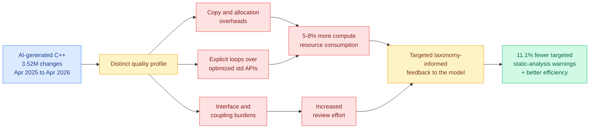

# Characterizing the Quality Profile of AI-Generated C++ in Production

**Source:** HuggingFace Daily Papers 2026-08-10 · [arXiv 2608.06640](https://arxiv.org/abs/2608.06640) · [raw](../../raw/huggingface/2026-08-10-characterizing-the-quality-profile-of-ai-generated-c-in-prod.md)
**Topic:** AI coding assistants, production code quality, compute cost

## TL;DR

The largest empirical study of AI-authored production code so far: **3.52 million code changes** in one enterprise's brownfield C++ codebase over twelve months, April 2025 to April 2026, at a company whose products serve billions of users daily and which already instruments every line deployed to production. AI-generated C++ has a **distinct and measurable quality profile**, not a random spread of defects: higher rates of interface and coupling burdens, copy and allocation overheads, and a preference for explicit loops over optimized standard-library APIs. The consequence is priced in two currencies the industry usually leaves unmeasured: more review effort, and a **5 to 8% increase in compute resource consumption**. Targeted, taxonomy-informed feedback to the model cuts the targeted static-analysis warnings by 11.1% and improves computational efficiency.

## Key findings

- **5 to 8% more compute consumed in production.** This is the number to carry. It converts a code-quality complaint into a recurring infrastructure line item, and it is measured at a scale where a few percent is a serious absolute figure.
- **The defects are systematic, not stochastic.** Copy and allocation overhead and explicit loops instead of standard-library algorithms are exactly the C++ habits that a model trained on average code would produce, and they are the habits that cost cycles rather than correctness.
- **Interface and coupling burdens are the maintainability tax.** These do not fail a test. They raise the cost of the next change, which is why they escape most AI-code-quality evaluations.
- **It is fixable with feedback, cheaply.** A taxonomy that names the specific failure classes, fed back to the model, cut targeted warnings 11.1% and improved efficiency. That is a prompt-and-lint-loop intervention, not a retraining program.
- **The observability is the contribution as much as the finding.** Most studies of AI code quality cannot see production. This one can, because the organization already instruments every deployed line, and the paper is explicit that this is what let it clear the measurement barrier.

## How this relates to prior wiki pages

**It is the production-side confirmation of a claim the wiki has so far only had in vendor form.** [Anthropic's "When AI builds itself"](../ai-industry/2026-04-21-anthropic-when-ai-builds-itself.md)-style reporting, and the broader velocity narrative, measure throughput: code shipped per engineer per quarter. This paper measures the other side of the ledger, and finds that the velocity gain carries a compute bill and a review bill. **Neither number appears in any vendor's accounting.**

**It closes a gap the wiki flagged in the AI-coding-quality thread: nobody was pricing the runtime.** Prior results on AI-generated code have been about correctness, security, or reviewer disagreement, including [Kilo's 10,643-model code-review dataset (08-04)](../ai-routing/2026-08-04-kilo-open-weight-code-review-routing.md), which found models agree on *what* is wrong far more than on *how bad* it is. This paper's contribution is orthogonal and blunter: independent of whether reviewers agree, the shipped code burns 5 to 8% more compute.

**It is the sharpest research-versus-industry item of the week for the optimization thesis.** The entire inference-efficiency literature on this wiki works to claw back single-digit and low-double-digit percentages of serving cost. This paper reports a 5 to 8% *increase* in compute consumption arriving from the other direction, via the tool everyone adopted for velocity. **An efficiency program and an AI-coding program can cancel each other out, and almost nobody is measuring both against one budget.**

## Gaps

One organization, one language, and the organization is anonymized, so there is no way to know how representative its C++ style guide, review culture or model choice are. "AI-generated" is attributed by the enterprise's own tooling, and the boundary between AI-authored and AI-assisted-then-human-edited is not clearly reported, which matters because the second category is probably the bulk of real usage. The 11.1% warning reduction is measured on the *targeted* warning classes, so it is not a claim about overall quality.

## Industrial implication

Any platform team running an AI coding assistant at scale should add two dashboards it almost certainly does not have: compute-per-request attributed to recently changed code paths, and a static-analysis warning taxonomy split by authorship. The intervention that worked here is cheap enough to be a quarter's work, and if the 5 to 8% figure replicates even loosely, the payback is immediate at any nontrivial serving footprint. Expect the first vendor to ship "efficiency-aware" code generation, meaning a model tuned against allocation and standard-library usage rather than only against unit tests, to have a real and easily demonstrated differentiator.

## Links

- [Kilo code-review routing dataset (08-04)](../ai-routing/2026-08-04-kilo-open-weight-code-review-routing.md)
- [Daily digest 2026-08-10](../daily-digest/2026-08/2026-08-10.md)
