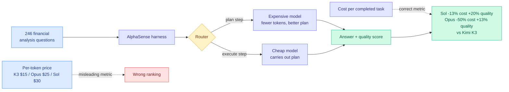

# Token Price Is Not Task Cost: The AlphaSense Study

**Source:** [The Information, 2026-08-13](https://www.theinformation.com/articles/anthropic-models-can-cheaper-use-chinese-ones-study-finds) (Laura Bratton) · [AlphaSense study](https://www.alpha-sense.com/resources/product-articles/frontier-ai-models-context/) · [raw](../../raw/rss/2026-08-13-the-information-anthropic-models-can-be-cheaper-to-use-than-chinese-one.md)

## TL;DR

The received wisdom is that open-weight Chinese models are dramatically cheaper than American frontier models, and the per-token price list supports it: Moonshot charges **$15 per million output tokens** for Kimi K3, against **$25** for Anthropic's Opus 4.8 and **$30** for OpenAI's GPT-5.6 Sol. AlphaSense, a financial search and market-research company, tested that assumption on its own workload: **246 financial analysis questions** requiring the models to work through earnings reports, investor call transcripts, SEC filings, and news, scored on answer quality including whether numbers came from the correct time frame and whether multiple analyst perspectives were represented.

The ranking inverts. **GPT-5.6 Sol cost about 13% less than Kimi K3 with a quality score about 20% higher. Opus 4.8 cost about half of Kimi K3 with a quality score 13% higher.** GLM-5.2 fared worse still, roughly twice Kimi K3's cost at lower quality. The mechanism is simple and is the whole point: the more capable models **use fewer tokens** to reach an answer, and the token count difference swamps the per-token price difference. In AlphaSense CEO Jack Kokko's words, the models that "look more expensive based on just their price per token actually ended up being less costly because they were more efficient in using tokens."

The second half of the story is the part most coverage skipped. Kokko says the best overall result does not come from picking a single winner. AlphaSense's production system uses **its own "harness" software containing a router** that picks a different model for different parts of a single query: a **smarter, more expensive model to plan** how a question should be answered, and a **smaller, cheaper model to execute** that plan. He reports this lowers cost per question significantly.

---

---

## Key claims

- **Per-token price ranks models incorrectly for task cost.** Sol at $30/MTok finished cheaper than K3 at $15/MTok on the same work. The gap between the two metrics is roughly 2x in the Opus case.
- **The mechanism is token efficiency, not discounting.** Smarter models take fewer steps and produce shorter paths to an answer. This is a capability-to-cost conversion, and it is why intelligence and price are not straightforwardly opposed.
- **Quality and cost moved together, not against each other**, in three of four comparisons. That is the counterintuitive result: the cheaper option was also the worse one.
- **The production answer is a router, not a model choice.** AlphaSense splits a single query across a planning model and an execution model inside its own harness.
- **This is contested, not settled.** Artificial Analysis, an independent benchmarking firm, ranks Kimi K3 and GLM 5.2 as *significantly cheaper* than the two US models for the same task set. Both cannot be right in general, which means the answer is workload-dependent.

## The counterargument the article carries

The piece is careful to state the limits, and they matter. Open weights can be **self-hosted**, which removes per-token pricing entirely for anyone with enough of their own accelerators, and that changes the arithmetic completely. Financial analysis is also a domain that rewards intelligence unusually heavily; the article explicitly notes that weaker open models may be entirely sufficient for simple work like summarizing emails. And the study comes from a company selling AI-powered research tools, tested on its own data, which is a real interest to note even if the methodology is sound.

## How this relates to prior wiki pages

**This is the industry-side confirmation of the exact claim [LLMRouter (08-14)](../ai-routing/2026-08-14-llmrouter-unified-routing-infrastructure.md) made in research on the same day.** LLMRouter formalized routing as a sequential decision process scored jointly on quality *and* inference cost, and found learned routers beat the strongest fixed-model baseline by 14.6% relative. AlphaSense is running that architecture in production, with the plan-versus-execute split as a concrete instantiation of routing within a multi-turn query. The convergence is close to exact: research publishes the cost-aware routing benchmark, and a production system independently reports the same design and the same conclusion, on the same day.

**It supplies the metric the wiki has been groping toward for two weeks.** [Grok 4.6's step efficiency (08-13)](2026-08-13-grok-4-6-step-efficiency.md) reported 53 steps against Claude Opus 5's 103 on agent workflows at 60% lower price, and yesterday's digest recommended stealing the metric "cost per completed task, not price per token." AlphaSense measured that metric rigorously across 246 tasks and four models and found it inverts the standard ranking. The recommendation has become an empirical result in one day.

**It explains the OpenRouter valuation more precisely than the funding coverage did.** [Stripe's ~$10B talks for OpenRouter (08-11)](2026-08-11-openrouter-stripe-router-frenzy.md) were framed as a bet that developers want cheaper models. The AlphaSense result reframes it: developers want the *cheapest completion*, which is a harder problem than picking the cheapest model, requires measurement infrastructure to solve, and is therefore worth far more as a product.

**And it complicates a story the wiki told earlier this month.** [Fable 5's slow adoption (08-13 RSS)](https://the-decoder.com/fable-5s-slow-adoption-suggests-corporate-willingness-to-pay-for-frontier-ai-has-hit-a-ceiling/) shows Anthropic's most capable model at only 6% of tokens sold, read as evidence that corporate willingness to pay for frontier capability has hit a ceiling. AlphaSense suggests part of that ceiling may be a **measurement failure** rather than a genuine value judgment: buyers comparing sticker prices per token will systematically under-buy capability that would have been cheaper in total. Whether the ceiling is real preference or bad accounting is now an open and testable question.

## Industrial implication

Any organization currently choosing models on a per-token price comparison is potentially optimizing the wrong objective, and the error is large enough (up to 2x in this study) to matter at scale. The concrete action is to instrument cost per completed task on a representative internal workload before committing to a model or a migration, because the answer is clearly workload-dependent given that Artificial Analysis reaches the opposite conclusion on its own task set. The second action is architectural: the plan-with-expensive, execute-with-cheap split is a specific, reproducible pattern that does not require any routing research to implement.

## Related pages

- [LLM Routing](../ai-routing/llm-routing.md)
- [LLMRouter (08-14)](../ai-routing/2026-08-14-llmrouter-unified-routing-infrastructure.md)
- [Grok 4.6 step efficiency (08-13)](2026-08-13-grok-4-6-step-efficiency.md)
- [OpenRouter / Stripe router frenzy (08-11)](2026-08-11-openrouter-stripe-router-frenzy.md)
- [DeepSeek Harness v0.1 and the price of a cache hit (08-14)](../inference-efficiency/2026-08-14-deepseek-harness-kv-cache-economics.md)
