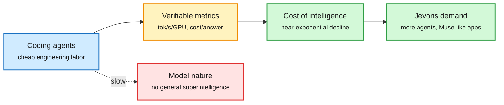

# Engineering acceleration, agent platforms, and the week's money (2026-10-10)

**Sources:** Nathan Lambert, [I expect rapid progress but not towards general superintelligence](https://www.interconnects.ai/p/i-expect-rapid-progress-but-not-towards) (Interconnects; [raw](../../raw/rss/2026-10-09-interconnects-ai-i-expect-rapid-progress-but-not-towards-general-superin.md)); AI Breakfast, AI Weekly and Last Week in AI #346 (Gmail, private); The Decoder and The Information via RSS (raw under `raw/rss/2026-10-09-*`, `raw/rss/2026-10-10-*`); OpenAI and NVIDIA lab posts ([raw](../../raw/labs/2026-10-10-015358-labs.md)).

**TL;DR.** Lambert's essay is the analytical frame for the week: agents will become superhuman *GPU engineers* within a few years because training and inference metrics (tokens per second per GPU, FLOPs per token, cost per answer) are verifiable and optimizable, so the effective cost of intelligence should fall near-exponentially, possibly faster than recent trends. That does not make models different in kind. Pretraining research on architecture and data selection may be automated in 2-3 years; outside math and code he does not expect superhuman traits. The industry news fits the efficiency half of that claim: GPT-6 became the free default for 1.2B weekly users, Google's new Gemini agent routes jobs to the cheapest model that clears the bar (including Anthropic's Claude), and Microsoft and NVIDIA pushed agents onto local hardware.

Verifiable metrics get optimized first

Lambert's split: the serving stack compounds fast, model nature changes slowly.

Blue is the driver, amber the optimizable target, green the predicted outcomes, red what he expects not to change.

## Key points

- **Lambert's specific claims.** Inference efficiency gains already cut serve cost 10-30% after launch at a fixed price point; the stack will compound; long-run gains come from accelerator-model co-design, where the GPU's flexibility matters during the exploration phase. RL environment vendors have crossed $100M-$1B revenue, but "lots of what they buy is frankly crap" and that is fixable.
- **Counter-evidence in the same week.** Epoch AI found agents with 3,000 GPU-hours reached at best 35% of a human method's gains; MMPostTrainBench agents made the model worse in 52.1% of cases. Epoch also estimated OpenAI's median researcher spent about $601/day on coding agents by mid-August (top 10% over $7,000/day), doubling monthly at list prices and "probably unsustainable."
- **GPT-6 for everyone.** Sol for paid tiers, Luna for Free and Go; "Intelligent UI" answers with streamed native components (forms, charts, buttons) compiled from a layout language, and GPT-6 Instant starts answering 44% sooner than GPT-5.6 Instant on web-search questions. No pricing or benchmark scores published.
- **Gemini agent (Gemini at Work 2026).** One cloud agent per objective that runs for hours or days; "coworker agents" get their own Workspace accounts, Drive and directory listing, attested identity and a gateway that enforces document-classification rules. **Smart Routing** to the cheapest qualifying model, routing to Claude alongside Gemini, and hard per-project spend caps that pause the agent.
- **Local agents.** Microsoft's on-device MAI Code 1.1 Flash (about 53 GB on a Surface Laptop Ultra) scores 70.8% on SWE-Bench Verified vs 72.6% for the cloud version, and Copilot will pick local or cloud per task by end of October; NVIDIA's RTX Spark laptops ship Oct 16 with Microsoft Execution Containers (OS-level agent sandboxes) now GA.

## Money and deals

- OpenAI is negotiating at least $30B at a $1.4T valuation while its annualized revenue is about $50B ([The Decoder](https://the-decoder.com/openai-revenue-keeps-surging-as-company-seeks-30-billion-in-fresh-capital/)).
- SoftBank's Son is seeking up to $100B from Gulf investors for AI bets ([The Information](https://www.theinformation.com/briefings/softbanks-son-seeks-100-billion-gulf-investors-ai-bets)).
- Atomic Machines (Jeff Holden) launched with $250M to micro-machine AI data-center parts; Mecka raised $60M from Sequoia for humanoid motion data; Ghost raised an $11M a16z seed for a $3,499 local agent box; Valar Atomics sued its own investor Day One after its $1B round.
- Cloudflare is acquiring Deno; the Deno runtime gets one more year of maintenance ([Simon Willison](https://simonwillison.net/2026/Oct/9/deno-is-joining-cloudflare/)).
- AMD's Lisa Su is reportedly heading to Korea to secure HBM4 from SK hynix and Samsung for the MI450 (432 GB per GPU) ramp ([X](https://x.com/StockSavvyShay/status/2108736986135900659)).

## Related

[Compute economics](../hardware/compute-economics.md) · [LLM routing](../ai-routing/llm-routing.md) · [Agent harness engineering](../agentic-systems/agent-harness-engineering.md)
