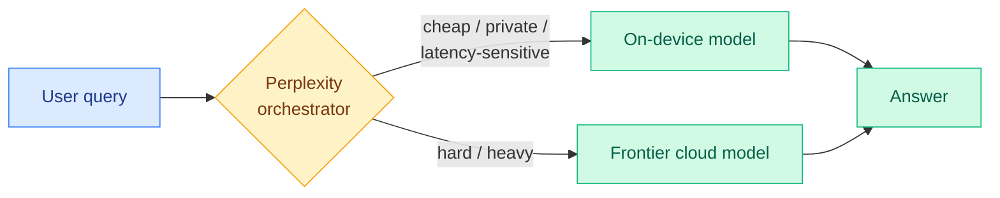

# Perplexity Hybrid Orchestrator: Deciding What Runs Locally vs in the Cloud

**Source:** RSS (The Decoder)
**Link:** [the-decoder.com/perplexity-announces-hybrid-ai-system…](https://the-decoder.com/perplexity-announces-hybrid-ai-system-that-decides-what-runs-locally-or-in-the-cloud/)
**Date:** 2026-06-03 (ingested 2026-06-04)
**Raw:** [raw/rss/2026-06-03-the-decoder-perplexity-announces-hybrid-ai-system-that-decides-what.md](../../raw/rss/2026-06-03-the-decoder-perplexity-announces-hybrid-ai-system-that-decides-what.md)
**Tier:** 1 (AI routing — local/cloud query routing)

## TL;DR

Perplexity announced an orchestrator that combines AI models running on the user's own machine with powerful cloud models, automatically deciding which task is processed where. It is a productized local-vs-cloud router: a routing decision over a compute-location axis rather than a model-quality axis.

## Diagram

## Key points

1. **Compute-location routing as a product.** The orchestrator decides per task whether to run on local models or escalate to cloud frontier models, automatically.
2. It is a consumer/prosumer-facing instance of the local-vs-cloud routing surface, not a research benchmark — the announcement is light on the decision mechanism.

## Relation to prior wiki state

This is the third major productized local-vs-cloud router the wiki has logged in a week, and it directly continues the **agent-on-the-PC routing thread**:
- **NVIDIA OpenShell (06-03)** does "smart local-to-cloud query routing" across seven local models (DeepSeek, Gemma, GLM, Kimi, MiniMax, Nemotron, Qwen).
- **Cloud-Device Hybrid Agents (05-29)** is the research framing of exactly this split.
- **Perplexity (today)** ships it to end users inside the Perplexity app.

The pattern named in the 06-03 Global View now has another data point: industry is racing to own the local-vs-cloud routing runtime (NVIDIA, Microsoft Windows AI Foundry, Nous Hermes, and now Perplexity), while the research side still has **no working benchmark for evaluating router decisions in production** (cost × latency × decision quality). Perplexity shipping a consumer router without a public evaluation of its routing quality is precisely the demos-not-numbers gap the prior digest flagged. See [llm-routing concept](llm-routing.md) and [Cloud-Device Hybrid Agents](2026-05-29-cloud-device-hybrid-agents.md).

## Why it matters

Local-vs-cloud is becoming the default routing axis for consumer AI, driven by privacy, latency, and cost. Whoever owns the orchestrator owns the user relationship and the cost structure. Perplexity entering here (against NVIDIA/Microsoft/Nous) raises the stakes on the missing evaluation layer: the market is being decided by product polish, not measured routing quality.

## Looking ahead

The falsifiable question: does anyone ship a *measured* local-vs-cloud routing benchmark (cost, latency, decision quality together) before the runtime market consolidates? If not within ~30-60 days, routing quality stays a black box and the winner is decided by distribution, not decision quality.

## Links

- [The Decoder article](https://the-decoder.com/perplexity-announces-hybrid-ai-system-that-decides-what-runs-locally-or-in-the-cloud/)
- Related: [Cloud-Device Hybrid Agents 2026-05-29](2026-05-29-cloud-device-hybrid-agents.md), [NVIDIA OpenShell (06-03 digest)](../daily-digest/2026-06/2026-06-03.md)
- Concept: [LLM routing](llm-routing.md)
