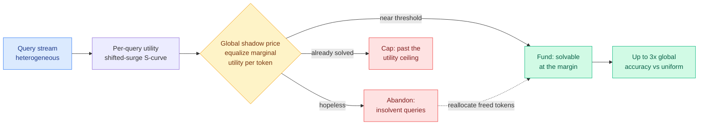

# The Shadow Price of Reasoning: CLEAR budget allocation

**TL;DR.** Most inference-time scaling work decides how long *one* query should think. CLEAR (Constrained Latent-utility Equilibrium Allocation for Reasoning, arxiv [2606.03092](https://arxiv.org/abs/2606.03092), Tencent HY Team + Zhejiang/Peking) asks the batch-level question: given a fixed total token budget and a stream of heterogeneous queries, how do you spread the budget across queries to maximize total accuracy? It treats this as a constrained economic optimization. Each query has an S-shaped compute-utility curve (more tokens help, but with a threshold below which they do nothing and a ceiling above which they stop helping). The optimal policy equalizes the *marginal utility per token* across all queries via a single global "shadow price," and the practical consequence is **rational abandonment**: cut off queries that cannot be solved within budget and pour those tokens into queries sitting right at their solvability threshold. In resource-scarce regimes CLEAR delivers up to 3x higher global accuracy than uniform per-query allocation.

## Key points

- **The frame is economics, not heuristics.** Inference budget allocation is posed as a global constrained optimization. The Lagrange multiplier on the budget constraint *is* the shadow price: the marginal accuracy you would buy with one more token. Optimality means every funded query is operating at the same marginal value per token.
- **Shifted-surge (S-shaped) utility.** Per-query accuracy vs tokens has three phases: a flat region below an emergence threshold (tokens wasted), a steep surge where the query becomes solvable, and a saturated ceiling. Uniform allocation ignores all of this and gives every query the same cap.
- **Rational abandonment is the operational move.** Queries whose surge threshold sits above the affordable budget are insolvent; CLEAR drops them and reallocates their tokens to queries near their emergence threshold, where each token buys the most accuracy.
- **Result.** Improves the Pareto frontier of total token cost vs mean accuracy across multiple reasoning tasks and traffic streams; up to 3x global accuracy over uniform allocation when the budget is tight.

## How this relates to prior wiki pages

- **This is a routing primitive on a new axis.** The [llm-routing](llm-routing.md) concept page tracks query-level, provider/tier, trajectory, and model-internal routing. CLEAR adds *cross-query budget routing*: the decision is not which model but how much of a shared compute pool each query gets, including the decision to serve zero. The alphaxiv overview places it explicitly alongside model-cascade routing and preference-based routing as efficient-inference resource management.
- **Sharpens the "more compute is not monotonically better" finding.** [Adaptive RePoT](../agentic-systems/2026-05-31-repot-recoverable-program-of-thought.md) (05-31) and the 05-29 hybrid cloud/device study both found extra compute can hurt. CLEAR formalizes the dual: under a *fixed* budget, compute spent on an insolvent query is compute stolen from a solvable one. The shadow price is the exchange rate.
- **Complements per-query length control.** Methods that compress one query's chain (length value heads, truncation) lower each query's position on its own S-curve; CLEAR sits above them and allocates across queries. The two compose: cheaper per-query curves make the budget go further.

## Gaps

- The S-curve per query must be estimated online from partial generations; the abstract does not say how accurately the emergence threshold can be predicted before the surge, which is exactly when the abandon/fund decision is made.
- Tested on reasoning tasks with verifiable answers; whether the utility model holds for open-ended generation (no clean accuracy signal) is open.
- Abandonment has a fairness/latency cost for the dropped user that a pure global-accuracy objective ignores.

**Raw source:** [raw/huggingface/2026-06-05-the-shadow-price-of-reasoning-economic-perspective-on-optima.md](../../raw/huggingface/2026-06-05-the-shadow-price-of-reasoning-economic-perspective-on-optima.md)
