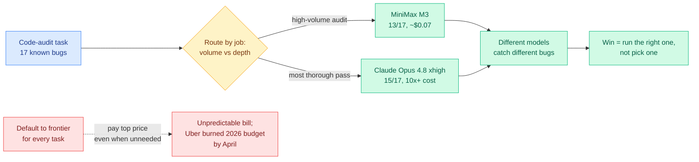

# Kilo Code Audit: MiniMax M3 vs Claude Opus 4.8, and the Case for Model-Task Routing

**Source:** Twitter (@kilocode) + Kilo blog · [We Audited the Same Codebase](https://blog.kilo.ai/p/we-audited-the-same-codebase-with) · [The GitHub Copilot Bill Came Due](https://blog.kilo.ai/p/the-github-copilot-bill-came-due)
**Raw:** [raw/twitter/2026-06-06-evening.md](../../raw/twitter/2026-06-06-evening.md) · [raw/twitter/2026-06-07-morning.md](../../raw/twitter/2026-06-07-morning.md)

## TL;DR

Kilo Code ran the same code-audit task (a TypeScript/Bun/SQLite webhook service with 17 pre-catalogued bugs as the answer key) against Claude Opus 4.8 at four reasoning levels and against MiniMax M3 at its default. MiniMax M3 found 13 of 17 bugs for about $0.07; the cheapest Claude run found the same 13 for $1.30; Claude at xhigh/max led the field at 15 of 17 but every Claude run cost at least 10x more. The sharper finding is qualitative: the cheap and expensive runs that tied at 13 did **not** catch the same 13. M3 flagged a secret-returning endpoint that Claude-medium missed; Claude-medium flagged an async-callback-inside-a-sync-transaction bug that M3 missed. The lesson Kilo draws is the routing thesis stated in production terms: match the model to the job, do not crown one model.

## Key points

- **Price gap is steep.** Claude Opus 4.8 is ~8x higher on input tokens and ~10x higher on output than MiniMax M3 (which shipped 2026-06-01). Cost-per-issue-found favors M3 by a wide margin; Claude at max was the most expensive per finding.
- **More reasoning is not monotonically better.** Claude at medium and high both caught an async-transaction bug that xhigh and max missed; Claude at max cost 67% more than xhigh on slightly fewer tokens for nothing better. This is the production echo of the wiki's recurring "more compute is not monotonically better" result.
- **Diversity, not dominance.** Because different models find different bugs, the value is in running the right model per job (or ensembling), which is precisely the routing problem.
- **The billing backdrop.** Kilo's companion piece: GitHub Copilot moved to usage-based billing on 2026-06-01 (seat price → monthly credit pool + pay-as-you-go), and a separate report had Uber burning its entire 2026 AI-coding budget by April, mostly on Claude Code and Cursor. A second Kilo datapoint: MiMo-V2.5-Pro clears 47.6% on Terminal Bench 2.0 at $4.92/run vs GPT-5.5's 74.2% at $72.63.

## How this relates to prior wiki knowledge

- **The production face of the routing thread.** The [LLM Routing](llm-routing.md) concept page tracks routing as a research surface with seven-plus addressable layers (model, adapter, expert, distillation loss, decoding head, latent code, reasoning-token budget). Kilo's audit is the field datapoint that grounds the topmost layer — *which model* — in real dollars and real bug coverage. It empirically validates the premise behind [TRACER](2026-04-17-tracer-llm-routing.md) (query-level model routing) and the [Netflix state-of-routing](2026-05-08-netflix-state-of-routing-model-serving.md) survey: a cheap capable model handles most jobs and the frontier model is reserved for the hard tail.
- **Diversity argues for ensembling, not just routing.** That different models catch disjoint bug sets echoes [Conductor](2026-05-11-conductor-sakana-orchestrating-frontier-models.md) (Sakana's RL orchestrator over frontier models) and [MAESTRO](2026-05-23-maestro-rl-orchestrated-model-skill-ensemble.md): the optimum may be an orchestrated ensemble, since no single model is Pareto-dominant on coverage.
- **Compute-scarcity demand side.** The Copilot-billing and Uber-budget facts are the demand-side mirror of [CLEAR](../inference-efficiency/2026-06-05-clear-shadow-price-reasoning-budget.md)'s thesis (ration a fixed token budget by marginal utility): when the bill is a moving target, routing-as-cost-control stops being a research nicety and becomes a line-item necessity.

## Research / industrial angle

The open lever is automatic, per-task model selection that knows *which* model is likely to catch *which* class of bug — coverage-aware routing rather than cost-aware routing alone. The audit is a single fixture (one webhook service, 17 bugs) so the coverage-diversity claim needs a larger benchmark, but the direction is clear: as open-weight models close the capability gap, the economically correct default is a router, not a single frontier model.

→ Concept page: [LLM Routing](llm-routing.md)
