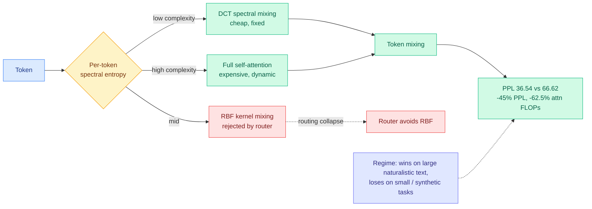

# Chiaroscuro Attention (CHIAR-Former): per-token operator routing by spectral entropy

**TL;DR.** Standard transformers run self-attention uniformly at every layer and token, even when the input needs no dynamic cross-token interaction. CHIAR-Former is a 4-layer hybrid that **routes each token to one of three mixing operators** based on its **per-token spectral entropy** (a theoretically justified complexity signal): DCT spectral mixing (cheap, fixed), RBF kernel mixing, or full self-attention (expensive, dynamic). A systematic ablation on WikiText-103 reveals **routing collapse**: the router consistently rejects RBF in favor of DCT and attention, showing spectral mixing and dynamic attention are complementary and *sufficient*. A purpose-built DCT+Attention-only variant hits **Val PPL 36.54 on WikiText-103, a 45% improvement over a full-attention baseline (66.62) at 62.5% fewer attention FLOPs**. The wins and the losses together map the operating regime: spectral routing pays off on large naturalistic text; full attention keeps the edge on small datasets and synthetic pattern tasks (ListOps).

## Key points

- **The routing signal is spectral entropy**, a per-token complexity measure that decides whether a token needs the expensive dynamic operator or a cheap fixed spectral transform.
- **Routing collapse is an honest negative result turned into a design rule.** Given three operators, the learned router uses only two (DCT + attention). The paper reads this as evidence that spectral mixing and attention are complementary and sufficient, and ships the two-operator variant deliberately.
- **62.5% fewer attention FLOPs at *better* perplexity** on WikiText-103 — the efficiency win comes from routing easy tokens away from quadratic attention, not from approximating attention everywhere.
- **Clear failure regime named:** small datasets and synthetic pattern-matching (ListOps) still want full attention. The paper defines *when* spectral routing earns its keep rather than overclaiming.

## How it relates to prior wiki knowledge

- **A new axis on the routing-as-allocation theme.** The [llm-routing](llm-routing.md) page tracks routing across models ([Conductor](2026-05-11-conductor-sakana-orchestrating-frontier-models.md)), tasks ([CaRE](2026-05-11-care-bi-level-routing-moe-continual-learning.md)), and attention heads ([MISA](../inference-efficiency/2026-05-11-misa-mixture-of-indexer-sparse-attention.md)). CHIAR-Former routes at the **per-token operator** level: not which model or head, but which *mixing primitive*. It is the intra-layer cousin of [DAR](2026-05-25-dar-diffusion-adaptive-routing.md) (05-25, adaptive routing inside the network).
- **Same instinct as sharpness-routed sparse attention.** [LIVEditor/ISA](../inference-efficiency/2026-05-07-liveditor-in-context-sparse-attention.md) (05-07) routed high-error queries to full attention and easy ones to a cheap Taylor path; CHIAR-Former routes by spectral entropy to DCT vs attention. Both: spend the expensive operator only where the token is hard.
- Lands the same day as Apple's [AFM 3](../llms-foundation-models/2026-06-09-apple-afm3-foundation-models.md) early per-prompt routing — research and product converging on input-conditioned compute allocation.

## Gaps

- 4-layer model on WikiText-scale data; the 45% PPL win is at tiny scale and may not survive at billions of parameters where full attention's expressivity matters more.
- "Spectral entropy" routing adds a per-token computation; the FLOP accounting credits the attention savings but the router's own overhead at scale is underexplored.

## Research angle

If spectral entropy cleanly predicts which tokens need dynamic attention, it is a candidate signal for *KV-cache* decisions too: tokens routed to DCT may not need their keys/values stored at full fidelity. Connecting CHIAR-Former's per-token operator router to the eviction line ([VaSE](../inference-efficiency/2026-06-03-vase-value-aware-stochastic-kv-eviction.md), today's [FlashMemory LSA](../inference-efficiency/2026-06-09-flashmemory-ds-v4-lookahead-sparse-attention.md)) is the open direction.

**Source:** HuggingFace Daily Papers · [Paper](https://arxiv.org/abs/2606.08327) · raw: `raw/huggingface/2026-06-09-chiaroscuro-attention-spending-compute-in-the-dark.md`

**Related:** [llm-routing.md](llm-routing.md) · [../llms-foundation-models/attention-mechanisms.md](../llms-foundation-models/attention-mechanisms.md) · [../inference-efficiency/2026-06-09-flashmemory-ds-v4-lookahead-sparse-attention.md](../inference-efficiency/2026-06-09-flashmemory-ds-v4-lookahead-sparse-attention.md)
