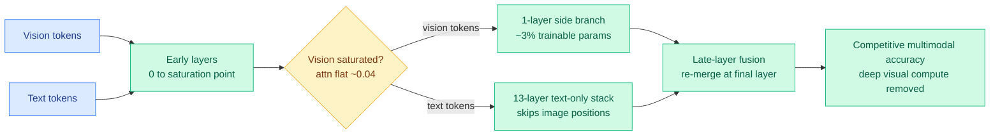

# DPVR: Dual-Path Vision Token Routing (Late-Layer Fusion)

**TL;DR.** Multimodal LLMs inherit the deep, symmetric transformer built for text and run the same computation on image tokens and text tokens at every layer. DPVR (arxiv 2606.09131) shows that is wasteful: in LLaVA-1.5, vision tokens *saturate* by the middle layers (text-to-image attention falls from 0.68 at layer 0 to 0.07 by layer 4, then flatlines near 0.04 after layer 18), while text tokens keep benefiting from deep processing. Its instantiation DPVR-LF routes vision tokens at the saturation point into a one-layer side branch, runs a 13-layer *text-only* deep stack that skips image positions, and re-fuses vision and text only at the final layer. With ~3% trainable parameters it preserves multimodal accuracy while cutting deep-stack visual computation.

## What it is

DPVR (Dual-Path Vision Token Routing) is a modality-asymmetric routing framework for efficient MLLMs, built on a layer-wise measurement: image tokens stop receiving meaningful attention early, so forcing them through every deep language-model layer is redundant computation and may even cause perceptual drift during task adaptation. The core instantiation, **DPVR-LF (Late-Layer Fusion)**, routes vision tokens at the saturation point into a one-layer trainable side branch, runs the deep transformer as a text-only forward that skips image positions, and fuses the visual and textual streams back together only at the final layer. The result challenges the assumption that vision tokens must traverse the whole depth: a single late fusion layer is enough to keep strong perceptual competence in LLaVA-style models.

## Why it matters / relation to prior wiki pages

- **Routing by modality, a new axis on the routing surface.** The [LLM routing](llm-routing.md) concept page tracks routing across models (Conductor), tasks (CaRE), heads ([MISA](../inference-efficiency/2026-05-11-misa-mixture-of-indexer-sparse-attention.md)), token budgets (CLEAR), per-token operators ([Chiaroscuro](2026-06-09-chiaroscuro-attention-spectral-routing.md)), and per-prompt expert sets ([Apple AFM 3](../llms-foundation-models/2026-06-09-apple-afm3-foundation-models.md)). DPVR adds **per-modality depth routing**: text gets the full deep stack, vision gets a short path plus late fusion. The shared thesis the page has built all spring, routing is compute allocation conditioned on the input, now extends to "which *modality* needs which *depth*."
- **Saturation as the routing signal.** Where Chiaroscuro routes by per-token spectral entropy and CLEAR routes by a batch-level shadow price, DPVR's signal is the empirical layer at which cross-modal attention flattens. It is a measured, architecture-level signal rather than a learned per-token gate, which is why the routing is coarse (one decision, applied to all vision tokens at one depth) but cheap.
- **Same compress-vision-harder logic as today's Latent Memory.** [Latent Memory](../inference-efficiency/2026-06-10-latent-memory-one-token-evidence.md) (06-10) reduces an entire image to one latent token for retrieval; DPVR removes images from the deep stack entirely after saturation. Both rest on the claim that vision tokens carry less *deep-reasoning* load than text tokens, so they can be cut from expensive paths sooner. This is a cleaner mechanistic version of the "vision tokens are redundant in deep layers" intuition behind earlier visual-token pruning work like [EarlyTOM](../inference-efficiency/2026-05-30-earlytom-early-token-compression-video.md).

## Gaps

The saturation profile is measured on LLaVA-1.5; whether the same early-saturation curve holds for newer MLLMs with stronger vision encoders or interleaved image-text reasoning (where a deep image read may matter mid-sequence) is untested. A single fixed saturation depth cannot adapt to prompts that genuinely need late visual detail (fine-grained OCR, counting), the regime where skipping the deep stack should hurt; the abstract reports aggregate benchmark parity, which can hide that tail.

## Source

- Paper: https://arxiv.org/abs/2606.09131
- Raw: [raw/huggingface/2026-06-10-late-layer-fusion-is-enough-dual-path-vision-token-routing-f.md](../../raw/huggingface/2026-06-10-late-layer-fusion-is-enough-dual-path-vision-token-routing-f.md)
- Concept page: [LLM Routing](llm-routing.md)
