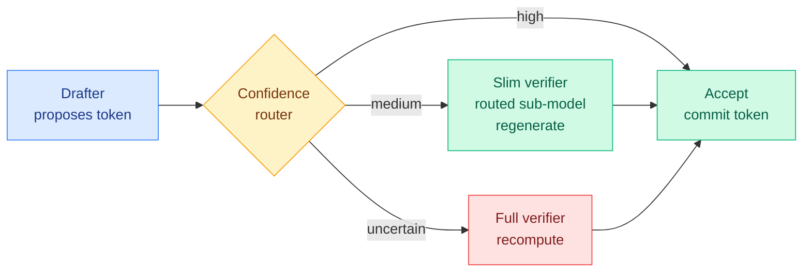

# VIA-SD: Verification via Intra-Model Routing for Speculative Decoding

**Date:** 2026-06-12
**Source:** HuggingFace Daily Papers
**Links:** [Paper (arxiv 2606.12243)](https://arxiv.org/abs/2606.12243) · [Project page](https://zju-xyc.github.io/VIA-SD-Project-Page/)
**Authors:** Yuchen Xian, Yang He, Yunqiu Xu, Yi Yang (Zhejiang University · A*STAR Singapore · NUS)

## TL;DR

Speculative decoding (the lossless trick where a cheap drafter proposes tokens and a big verifier accepts or rejects them in parallel) has always been binary: a drafted token is either accepted, or the full verifier recomputes it. VIA-SD's insight is that many rejected tokens sit in a "middle zone" — wrong as drafted, but fixable by a model far smaller than the full verifier. It carves a **slim verifier out of the full verifier itself via intra-model routing** (no new model, no retraining) and inserts it as a middle tier. Tokens now route three ways: accept on high confidence, regenerate with the slim verifier on medium confidence, escalate to the full model only when genuinely uncertain. The result is 10–20% on top of strong SD baselines and 2.5–3x over plain decoding, with rejection rates cut by 0.10–0.22.

## What it is

VIA-SD reframes speculative decoding from a two-tier (draft → verify) pipeline into a **multi-tier** one. The middle tier is not a separately trained intermediate model (as in hierarchical SD), but a slim submodel extracted on the fly from the full verifier through intra-model routing — think of it as activating a subset of the verifier's own computation to do a cheaper regeneration. The paper grounds the tiering in an information-theoretic decomposition of verification via KL divergence: the verification burden of a token can be split across tiers, so tokens only "pay" for as much of the verifier as they actually need.

## Key findings

- Reduces rejection rates by **0.10–0.22** across four tasks and multiple model families.
- **10–20% speedup** over strong SD baselines; **2.5–3x** over non-drafting autoregressive decoding.
- **No training changes** — drops into existing SD frameworks (EAGLE-style drafters, etc.) without touching their training procedure.

## Relation to prior wiki state

- **This is the first speculative-decoding paper in the wiki where routing IS the verification mechanism.** Prior SD work moved gains from architecture (Nemotron-3 Super's embedded MTP head, 04-21) to objective (Draft-OPD, 06-02, on-policy distillation for the drafter) to scheduling (SPD, 06-02, pipeline-parallel zero-bubble drafting). VIA-SD opens a fourth axis: graded verification cost. See [speculative-decoding.md](../inference-efficiency/speculative-decoding.md).
- **It is the verification-side mirror of [GRAFT](../inference-efficiency/2026-05-20-graft-draft-less-retrieve-more-speculative-decoding.md) (05-20), which made the *draft* side cheaper by retrieving instead of generating.** VIA-SD makes the *verify* side cheaper by routing instead of recomputing. Together they suggest the next SD frontier is "spend the minimum compute that preserves the target distribution at every step," on both sides.
- **Extends the intra-model routing thread.** The wiki has tracked routing inside a single model before: [MISA](../inference-efficiency/2026-05-11-misa-mixture-of-indexer-sparse-attention.md) (head-axis sparse-attention routing), [BEAM](2026-05-16-beam-binary-expert-activation-masking-moe.md) (binary expert activation), and [Chiaroscuro](2026-06-09-chiaroscuro-attention-spectral-routing.md) (spectral attention routing). VIA-SD applies the same "carve a cheaper path through the model you already have" idea to verification rather than to attention or experts.

## Gaps

- Speedups are reported on "four representative tasks"; no result yet at 100B+ scale or on long-context (the regime where verifier calls dominate cost most).
- The slim verifier's accuracy floor — when does middle-tier regeneration silently introduce a wrong token the router thought was medium-confidence? — is characterized only by aggregate rejection-rate drops, not by a worst-case quality audit.
- Losslessness: the abstract frames this as accept/regenerate/recompute, but whether the slim-verifier regeneration path preserves the target distribution exactly (true SD losslessness) or is an approximation needs the full paper to confirm.

## Industrial implication

If the slim-verifier-via-routing trick holds at frontier scale, inference servers gain a third gear between "trust the draft" and "pay full price." For routing-heavy stacks this matters: it is the same dial Cursor's Auto-review (06-11) applies to agent *actions* — a graded autonomy/cost decision instead of a binary one — applied here to *tokens*. Expect vLLM/SGLang-class servers to add multi-tier verification within a couple of release cycles if the losslessness guarantee survives review.

## Links

- Raw: `raw/huggingface/2026-06-12-via-sd-verification-via-intra-model-routing-for-speculative.md`
- Related: [speculative-decoding.md](../inference-efficiency/speculative-decoding.md) · [llm-routing.md](llm-routing.md) · [GRAFT 05-20](../inference-efficiency/2026-05-20-graft-draft-less-retrieve-more-speculative-decoding.md)
</content>
</invoke>
