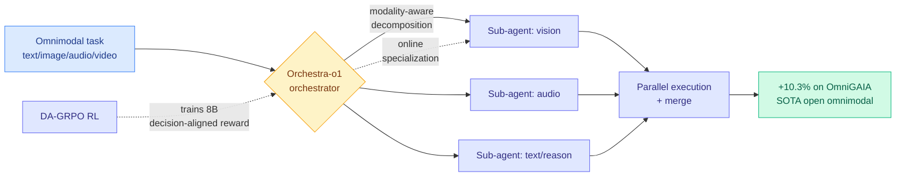

# Orchestra-o1: Omnimodal Agent Orchestration

**TL;DR.** Multi-agent "swarm" systems need an orchestrator to decompose a task and route sub-tasks to the right sub-agents. Existing orchestration frameworks assume a narrow set of modalities (mostly text) and fall apart when text, image, audio, and video coexist in one task. Orchestra-o1 is an orchestration framework built for that omnimodal setting. It does modality-aware task decomposition, spins up specialized sub-agents online, and runs sub-tasks in parallel. On the OmniGAIA benchmark it beats the second-best system by 10.3% accuracy. The 8B trained variant is optimized with DA-GRPO (decision-aligned group relative policy optimization), an agentic RL method that aligns the reward with orchestration decisions, and it sets state of the art among open-source omnimodal agents.

**Source:** HuggingFace · [Paper](https://arxiv.org/abs/2606.13707) · arxiv 2606.13707

## What it is

An orchestrator for multi-agent systems where the inputs span modalities. It unifies three things under one mechanism: decomposing a task in a way that is aware of which modalities each sub-task touches, creating specialized sub-agents on the fly, and executing independent sub-tasks in parallel.

## What problem it solves

Agent-swarm orchestration matured on text tasks. Real tasks increasingly mix modalities (a video with audio plus a text instruction plus reference images), and text-only orchestrators either ignore non-text inputs or hand them to a single generalist that handles each modality poorly. There was no orchestration layer designed for heterogeneous modalities interacting in one task.

## Core novelty

A unified orchestration mechanism with modality-aware decomposition plus online sub-agent specialization, and DA-GRPO, a GRPO variant whose reward is aligned to the orchestrator's *decisions* rather than only final-answer correctness, so the 8B model learns to orchestrate, not just to answer. The decision-aligned reward is the technically interesting part: it credits good routing/decomposition choices, not only good outcomes.

## Key takeaways

- +10.3% accuracy over the second-best system on OmniGAIA (omnimodal agent benchmark).
- Three coordinated capabilities: modality-aware decomposition, online sub-agent specialization, parallel execution.
- DA-GRPO trains Orchestra-o1-8B to SOTA among open-source omnimodal agents.
- Decision-aligned reward credits orchestration choices, not just final-answer correctness.

## Gaps

OmniGAIA is one benchmark; generalization to other omnimodal task suites is unverified. No latency/cost accounting for running specialized sub-agents per modality in parallel, which is the practical cost of orchestration. Whether "online specialization" creates sub-agents that meaningfully differ, or just re-prompts the same backbone, is not dissected.

## How it relates to prior wiki knowledge

- This is orchestration-as-routing, the same frame as the [llm-routing](llm-routing.md) concept page's "routing IS the policy" thread: [Conductor](2026-05-11-conductor-sakana-orchestrating-frontier-models.md) (05-11, RL orchestrator over frontier models) and [Maestro](2026-05-23-maestro-rl-orchestrated-model-skill-ensemble.md) (05-23, RL-orchestrated model/skill ensemble). Orchestra-o1 extends that line into the omnimodal regime and adds a decision-aligned reward (DA-GRPO), the orchestration analogue of those RL orchestrators.
- The modality-aware decomposition connects to [DPVR](2026-06-10-dpvr-vision-token-routing.md) (06-10, routing vision tokens by usefulness): both route by modality-specific signal, DPVR within a model, Orchestra-o1 across agents.
- DA-GRPO joins today's GRPO cluster with [S2L-PO](../llms-foundation-models/2026-06-15-s2l-po-small-explorer-grpo.md) and [AdaSR's HRPO](../inference-efficiency/2026-06-15-adasr-streaming-reasoning-hrpo.md): three same-day papers each modifying GRPO's advantage assignment for a different structure (orchestration decisions, small-model exploration, streaming phases).

## Research angle

The decision-aligned reward is the lever to watch: if you can RL-train an orchestrator on *routing quality* directly, orchestration stops being a hand-built prompt graph and becomes a learned policy, which is exactly where the routing literature has been heading. The omnimodal angle raises a sharper question, whether modality-aware decomposition learns a genuine cost model (audio sub-tasks are expensive, batch them) or just a modality classifier, which would determine whether this scales to cost-constrained production.

→ Raw: `raw/huggingface/2026-06-15-orchestra-o1-omnimodal-agent-orchestration.md`
